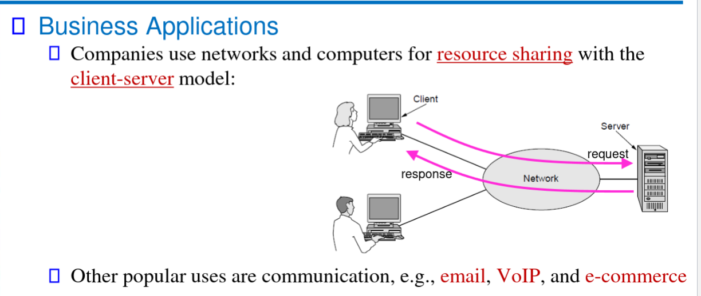

## Syllabus notes:

*Office hours:*
- Tuesday: 6-7 PM
- Thursday: 2-3 PM

*Both Textbooks are OK to use*

**QUIZZES:** Must be done in class !

**FINAL IS PASS OR FAIL !!!**

---

# Chapter 1. Introduction

Networks sync Computers, lotta data for each computer, that needs to be shared

Business Applications are usually server-based 

