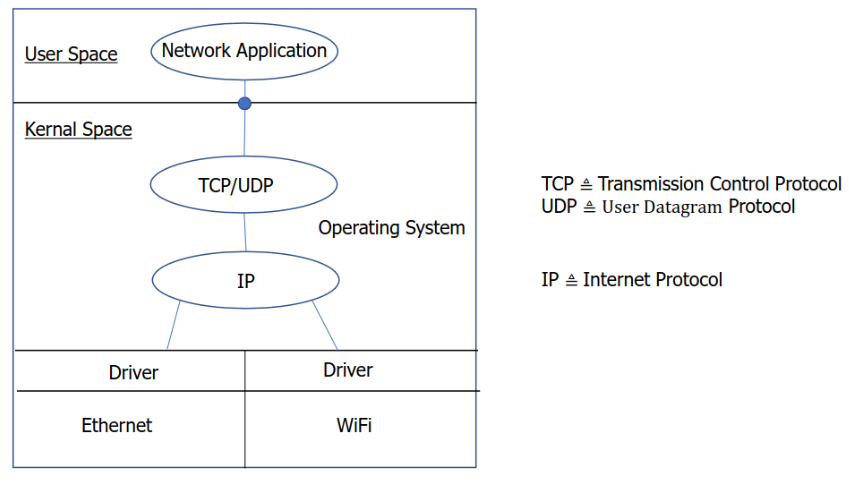
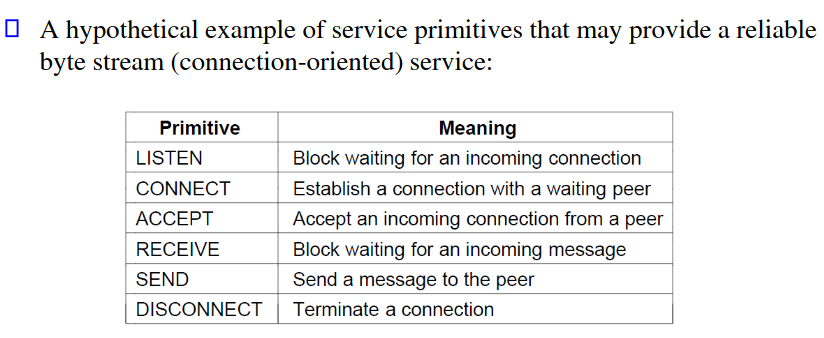
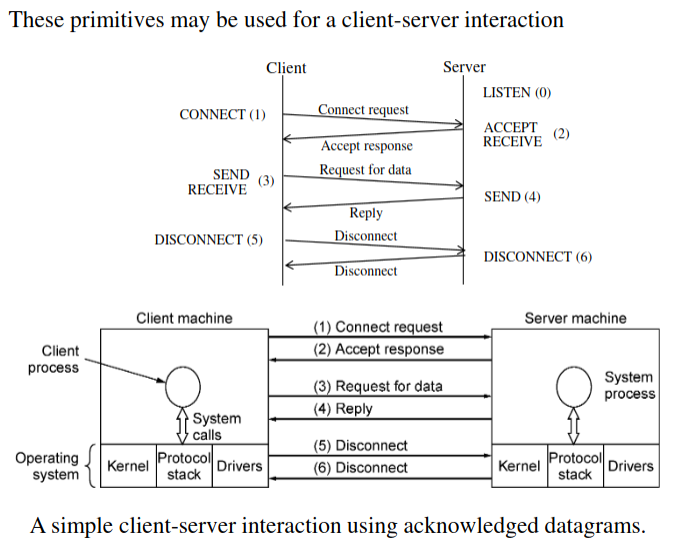
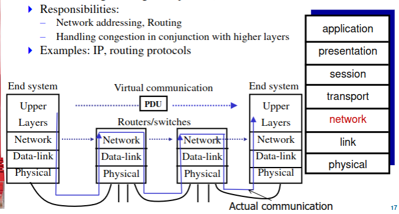
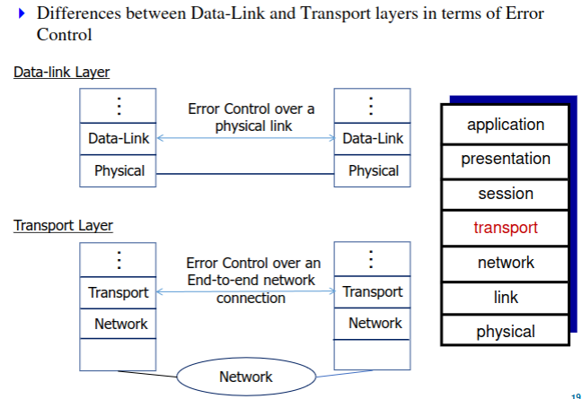

Protocol layering in computer networks is a structured approach to network design, where the communication processes are organized into a series of layers. Each layer performs specific functions and communicates with the layers directly above and below it. Here's an overview of the typical layers in a network protocol stack:

1. **Physical Layer (Layer 1)**: 
   - **Function**: Responsible for the physical connection between devices, including the transmission of raw bits over a communication medium (like copper cables, fiber optics, or wireless).
   - **Example Technologies**: Ethernet (copper cable), Wi-Fi (wireless), Fiber optics.
   - **Communication**: Transmits raw bit streams over the physical medium.

2. **Data Link Layer (Layer 2)**:
   - **Function**: Handles the transfer of data between adjacent network nodes and provides error detection and possibly correction. It defines the protocol for the MAC (Media Access Control) address.
   - **Example Technologies**: Ethernet, Wi-Fi, PPP (Point-to-Point Protocol).
   - **Communication**: Manages point-to-point frame transmission with error detection and potentially correction.

3. **Network Layer (Layer 3)**:
   - **Function**: Manages device addressing, tracks the location of devices on the network, and determines the best way to move data. This layer includes routing through different paths in a network.
   - **Example Technologies**: IP (Internet Protocol), ICMP (Internet Control Message Protocol).
   - **Communication**: Transfers variable length data sequences (packets) from a source to a destination, possibly via multiple networks (routing).

4. **Transport Layer (Layer 4)**:
   - **Function**: Provides reliable data transfer services to the upper layers. This layer is responsible for ensuring complete data transfer.
   - **Example Technologies**: TCP (Transmission Control Protocol), UDP (User Datagram Protocol).
   - **Communication**: Ensures complete data transfer and manages error detection and recovery. TCP is known for providing reliable communication, while UDP offers faster but less reliable transmission.

5. **Session Layer (Layer 5)**:
   - **Function**: Manages sessions between applications. It establishes, manages, and terminates connections between local and remote applications.
   - **Example Technologies**: NetBIOS, RPC (Remote Procedure Call).
   - **Communication**: Controls the dialogues (connections) between computers.

6. **Presentation Layer (Layer 6)** and **Application Layer (Layer 7)**:
   - These layers deal with the format and syntax of the data. They ensure that data is presented correctly to the end user or the application. They are responsible for data encryption/decryption, data conversion, and interpretation.

In communication, each layer at the sending host adds its own header (control information) to the data. 

**Low to High level Networking Functions:**  

---

## Connection-Oriented VS. Connection-Less

- **Con-Oriented**: Connection MUST be set up for ongoing use *(and deleted after)* EX: Phone calls
   - *Advantages:*
      - Reliable data transfer.
      - Error checking and correction.
      - Sequence maintenance of data packets.

- **Con-Less**:  Each message is treated separately and carries full destination information. e.g Postal Delivery, *Each Message, carries the Full Destination & Identifying Info*
   - *Advantages:*
      - No need for pre-established communication path.
      - Lower latency than connection-oriented services.
      - Ideal for broadcast and multicast type of network communication.

## Service Primitives

- For Protocol Stacks, located at O.S level, it has **System Calls** as primitives!
   - These calls *Trap* the kernel, effectively sending a software interrupt, 
   - Which then runs the interrupt routine of doing Networking System Calls

 

 

A **service** is a set of primitives *(operations)* that a layer provides to the layer above it.  
A **protocol** in contrast, is a set of rules governing the format and meaning of the packets, or messages that are exchanged by the peer entities within a layer.

## OSI Reference Model

- **OSI** (Open Systems Interconnection)
- Developed by the International Standard Organization *(ISO)*
- **Purpose:** To standardize the networking framework and ensure interoperability among different systems and devices.

- **Layers**:
  1. **Physical Layer**: Deals with the physical connection between devices and the transmission of raw bit streams over a physical medium.
  2. **Data Link Layer**: Responsible for node-to-node data transfer and error detection and handling. *(MAC , Media Access Control)*
  3. **Network Layer**: Manages the routing of data packets across multiple networks.
  4. **Transport Layer**: Ensures complete data transfer, error correction, and flow control.
  5. **Session Layer**: Manages sessions between applications, establishing, managing, and terminating connections.
  6. **Presentation Layer**: Translates data between the application layer and the network format, handling data encryption, compression, and other transformations.
  7. **Application Layer**: Closest to the end user, this layer interacts with software applications that implement a communicating component.

---

## Layer Elaborations

### Physical Layer:
- Bits over the Wire, Determines the specs for all physical components used in Netowrking
- Cabling: *Twisted Pair, Fiber Optic, Coax Cable*
- Interconnect methods *(Topologies / Devices)*

- **Examples**: Ethernet, Token Ring, Wireless *All of which are IEEE 802.X*
- your computer has an NIC *(Network Interface Card)* and a *MAC* address, physical computer address

### Data-Link Layer
- **Functionality**: Responsible for node-to-node transfer and error detection at the physical layer. It ensures that the data intended for one device on the network is not grabbed by another device.
- **Components**:
  - **MAC (Media Access Control) Address**: A unique identifier assigned to network interfaces for communications at the data link layer. Each piece of network hardware has a *unique MAC address*, which helps in controlling access to the media and in the delivery of frames to their destination.
  - **LLC (Logical Link Control)**: Part of the IEEE 802.2 standard, it manages protocol multiplexing, data frame error checking, and frame synchronization.
- **Protocols and Standards**:
  - **IEEE 802.3 (Ethernet)**: Defines standards for wiring, signals, frame formats, and medium access control methods.
  - **IEEE 802.11 (Wi-Fi)**: Governs wireless LAN technology.
- **Operation**: The data link layer takes raw bits from the physical layer, packages them into frames, and provides error checking and flow control. When a frame is received, the layer checks for errors, strips the headers and trailers, and then passes the data to the upper layer.
- Can detect some transmission errors using a Cyclic Redundancy Check (CRC)
- **Real-World Example**: Consider the data link layer as a traffic officer at an intersection, directing the flow of data packets, ensuring they go to the right address, and checking for any errors or corruption in the packets.

### Network Layer
- **Functionality**: Manages the delivery of packets across multiple networks and defines the routing paths for network traffic.
- **Key Components**:
  - **IP Addressing**: Every device on a network has an IP address which defines its location on the network. This layer uses these addresses to route data packets to their destination.
  - **Routing Protocols**: Protocols like OSPF, BGP, and RIP define how routers communicate with each other to forward data packets across networks.
- **Protocols and Standards**:
  - **IPv4/IPv6**: Protocols for IP addressing. IPv6 was developed to deal with the eventual exhaustion of IPv4 addresses.
  - **ICMP (Internet Control Message Protocol)**: Used for diagnostic and error-reporting purposes.
- **Operation**: The network layer adds source and destination IP addresses to the data packet's header. Routers operate at this layer, making decisions based on the packet's network-layer header to send it towards its destination.
- Provides network-wide addressing and a mechanism to move packets between networks *(routing)*
- **Real-World Example**: Think of the network layer as a postal service, which handles the addressing and routing of letters (data packets) to ensure they are delivered to the correct address, even if it involves multiple postal services (networks).
  - Find's Best Path for Networking Packets
  - Check's whats inside a Packet, and correctly routes it

### Transport Layer: TCP / UDP
- **Functionality**: Responsible for end-to-end communication, ensuring complete data transfer with reliability and proper sequencing.
- **Key Protocols**:
  - **TCP (Transmission Control Protocol)**: Provides reliable, ordered, and error-checked delivery of a stream of data between applications. It ensures that data is received as sent, resending lost packets and assembling received packets in the correct order.
  - **UDP (User Datagram Protocol)**: Offers a simpler, connection-less communication model with minimal protocol mechanism. It is used for time-sensitive transmissions where speed is preferred over reliability.
- **Operation**: The transport layer takes data from the application layer, breaks it into smaller units *(segments for TCP, datagrams for UDP)*, ensures these units are properly sequenced and error-free, and then passes them to the network layer.
- **Real-World Example**: Consider TCP as a guaranteed delivery service, ensuring that all packages (data segments) are delivered in order and without loss. UDP, on the other hand, is like standard mail, faster but without guarantees of delivery or order.

 

**Agree on a Protocol** : For Error Control, like TCP, UDP or even Packet Check-Summing

### Session Layer
- **Functionality**: Manages and controls the connections between computers. It is responsible for establishing, managing, and terminating connections between applications.
- **Key Aspects**:
  - **Session Management**: This includes initiation, maintenance, and termination of connections.
  - **Synchronization**: Provides mechanisms for adding checkpoints into a data stream, so if a session is interrupted, it can be resumed from the last checkpoint.
  - **Remote Procedure Calls (RPC)**: Allows a program to request a service from a program located on another computer in a network.
- **Real-World Example**: Think of the session layer as a moderator in a meeting, controlling who speaks (transmits data), when they speak, and when the meeting (session) begins and ends.

### Presentation Layer
- **Functionality**: Ensures that the data is in a usable format and is where data encryption and decryption occurs.
  - Could be Big or Little Endian data transformed, etc...
- **Key Aspects**:
  - **Data Translation**: Transforms data from the application layer into an intermediate format. It also manages data compression and encryption.
  - **Character Encoding**: Converts data from one encoding to another, e.g., from ASCII to EBCDIC.
- **Real-World Example**: The presentation layer is like a translator, converting data from a format used within the computer (binary) to a format that can be understood and used by the application layer, such as ASCII for text.

### Application Layer
- **Functionality**: Enables applications to access network services. It is the closest layer to the end user and provides network services directly to applications.
- **Key Protocols**:
  - **HTTP (Hypertext Transfer Protocol)**: Used for web browsing.
  - **FTP (File Transfer Protocol)** and **SFTP (Secure File Transfer Protocol)**: For file transfers.
  - **SMTP (Simple Mail Transfer Protocol)**: For email transmission.
  - **SSH (Secure Shell)**: For secure access to remote computers.
  - **VoIP (Voice over Internet Protocol)**: For transmitting voice and multimedia.
- **Operation**: The application layer provides protocols that allow software to send and receive information and present meaningful data to users. It does not transport data, but instead, it uses the transport layer to send and receive data.
- **Real-World Example**: Consider the application layer as a variety of office applications. Each application (like a web browser, email client, or file transfer software) uses the network to perform specific tasks that benefit the user.

---

- **Switches** work at 2nd Layer, (Data Link) 
- **Network Devices** Only implement first 2 layers (Physical & Data Link)
- **Routers** Implement first 3 layers *(Phy, Data, Network)*

---

# TCP/IP Reference Model

* Four Layer Model, uses the **IP** as the network layer
* IP **Internet Protocol**
* ICMP **Internet Control Message Protocol**

## TCP

Three-Way Handshake

## UDP

Data includes Sender & Receiver IP *(Info)*

---

