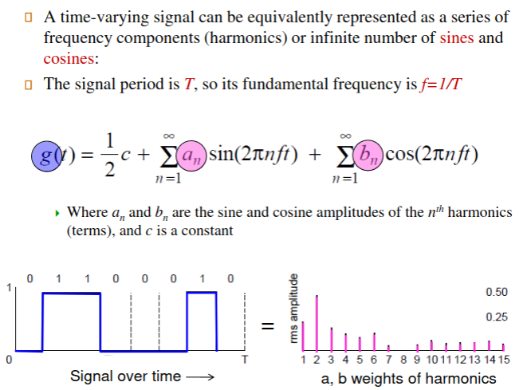
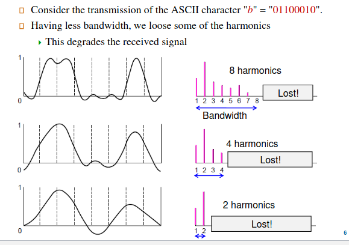

# Physical Layer & Basis of Data Communication

Physical Layer is the foundation on which other layers are built
- Properties of wires, fiber, wireless affect the networks limitations.
- It determines **throughput, latency,** and **error rate** of a network communication link.
- **KEY PROBLEM** Sending Digital Bits, using only Analog Signals, called *Modulation*
    - Voltage, Current, Frequency and Phase are general properties that need consideration

- **Bandwidth** In Analog, it's a Quantity measured in **Hertz** (Hz), In the discrete Digital world, we recognize it as a Data-rate of **bps** 

## Guided Transmission Media vs. Unguided

**Guided**
- Copper Wires, Twisted Pairs, Coaxial Cables, etc..

Twisted-Pair (Cat 5,6,7) Reduce Noise in Data

---

# 4B/5B

The 4B/5B encoding scheme is used to ensure reliable data transmission, particularly in environments where signal integrity might be a concern. Here's an overview and an example to help clarify:

### 4B/5B Encoding Scheme

#### Principle
- **Basic Idea**: Convert every 4 bits of data into 5 bits for transmission.
- **Purpose**: Increase the number of transitions (changes from 0 to 1 or 1 to 0) in the signal, which helps maintain synchronization and allows for better error detection.

#### How It Works
- There are 16 possible combinations of 4 bits (from `0000` to `1111`).
- In 4B/5B, each 4-bit group is mapped to a unique 5-bit sequence.
- Not all 5-bit sequences are used; only 16 out of the 32 possible 5-bit combinations are selected for the mapping.
- The selected 5-bit sequences are chosen to ensure sufficient bit transitions.

#### Example

- **4-bit Data**: `1010`
- **4B/5B Mapping**: Let's assume `1010` maps to `11010` in our scheme.

In actual systems, the mappings are predefined, and each 4-bit sequence has a specific 5-bit counterpart.

#### Advantages
- **Redundancy**: The extra bit adds redundancy, which helps in detecting errors.
- **Signal Integrity**: The encoding ensures more frequent transitions, which helps the receiver maintain synchronization with the sender's signal.

#### Application
- **Use Case**: 4B/5B encoding is commonly used in network protocols like Fast Ethernet.

#### Note on Frame Delimiting
In the context of your earlier question about frame delimiting:
- **Unused 5-bit Sequences**: Since not all 5-bit sequences are used for data encoding, some can be reserved for special purposes like frame delimiting.
- **Advantage**: This means that certain 5-bit codes can signal the start or end of a frame without the need for additional data alteration, like stuffing.

This encoding method optimizes data transmission by balancing the need for data integrity with efficient use of bandwidth.

### The 4B/5B encoding scheme is indeed useful for addressing the issue of long streams of identical bits (like a long sequence of 1's or 0's), which can cause synchronization problems in data transmission. Here's how it helps:

### Problem with Long Streams of Identical Bits
- **Clock Synchronization**: Digital data transmission often relies on both the sender and receiver maintaining synchronized clocks. This synchronization is achieved through the transitions (changes from 1 to 0 or 0 to 1) in the transmitted data stream.
- **Loss of Synchronization**: A long sequence of identical bits (like `1111 1111 1111` or `0000 0000 0000`) lacks these transitions, making it difficult for the receiver's clock to stay synchronized with the sender's clock.

### Role of 4B/5B Encoding
- **Introducing Transitions**: By converting each 4-bit block of data into a 5-bit block, the 4B/5B scheme ensures that each 5-bit block has enough transitions.
- **Avoiding Long Streams of Identical Bits**: The specific 5-bit codes used in 4B/5B are chosen to prevent long sequences of the same bit. This is achieved by ensuring that each 5-bit code has at least two transitions (e.g., from 0 to 1 or 1 to 0).

### Example
- Suppose you have a data sequence: `1111 0000 1111`.
- In simple binary transmission, this would be sent as is, potentially causing synchronization issues due to the long sequences of identical bits.
- In 4B/5B encoding, each 4-bit group (`1111`, `0000`, `1111`) is mapped to a corresponding 5-bit code with sufficient transitions, breaking up these long uniform sequences.

### Advantages
- **Improved Synchronization**: The added transitions help maintain clock synchronization, as the receiver can use these transitions to align its clock with the sender's.
- **Error Detection**: The presence of unexpected long sequences of identical bits can indicate a transmission error, as these would not occur in properly encoded 4B/5B data.

Thus, 4B/5B encoding is not only useful for data integrity but also crucial for maintaining the synchronization necessary for reliable data transmission.

---