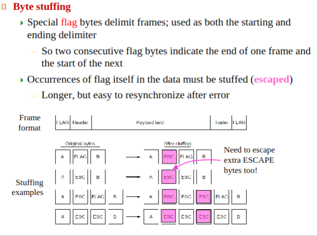

# Data-Link Layer

*Important for today's quiz:*

dtrans: transmission delay:
▪ L: packet length (bits)
▪ R: link bandwidth (bps)
▪ dtrans = L/R

dprop: propagation delay:
▪ d: length of physical link (m, km)
▪ s: propagation speed in medium
(~2x108 m/sec)
▪ dprop = d/s

## Framing
- Discrete set of bytes, usually with a chomputed checksum for each frame
    - Check sum ensures frame isn't corrupt

#### 1. Byte Count Framing Method
- **Principle**: The first byte of the frame specifies its length, allowing the receiver to segment the bit stream accordingly.
- **Issue**: Transmission errors can corrupt the length count, leading to synchronization problems.

#### 2. Flag Bytes with Byte Stuffing Framing Method
- **Principle**: Frames start and end with special bytes *(flag bytes)*, often using the same byte for both purposes.
- **Functionality**: Consecutive flag bytes indicate the end of one frame and the beginning of the next, aiding in error resynchronization.
- **Problem**: Flag bytes may naturally occur within the data, particularly with binary data (e.g., photos, music).
- **Solution**: Byte Stuffing.
  - **Byte Stuffing Technique**: 
    - When the flag byte occurs in the actual data, the sender's data link layer inserts a special escape byte (ESC) right before each accidental flag byte.
    - This allows differentiation between framing flag bytes and data flag bytes.
    - The receiver's data link layer removes these escape bytes before passing the data to the network layer.

#### Example of Byte Stuffing
- **Scenario**: Suppose the flag byte is `FB` and the escape byte is `EB`.
- **Data to be Transmitted**: `... FB ...`
- **Byte-Stuffed Data for Transmission**: `... EB FB ...`
- **Receiver's Interpretation**: The receiver identifies `EB FB` as data, not a frame boundary, and removes `EB` before processing, restoring the original data.

In byte stuffing, the presence of an escape byte (`EB`) before a flag byte (`FB`) in the data signals to the receiver that this particular `FB` is part of the data, not a frame boundary.

In a byte-stuffed transmission:

- **EB FB**: Interpreted as a flag byte (`FB`) that is part of the data.
- **Single FB**: Interpreted as a frame boundary.

The escape byte (`EB`) is essentially a marker to differentiate between a flag byte that is a frame delimiter and a flag byte that is part of the transmitted data. So `EB FB EF FB FB`, this would be read as `FB FB FB`, and the last FB is known to be end of frame due to the lack on preciding `EB`.

#### 1. Bit and Byte Stuffing
- **Effect on Frame Length**: The length of a frame varies depending on the data content due to stuffing.
   - **Byte Stuffing**: If data contains many flag bytes, each will be escaped, potentially doubling the frame size *(e.g., 100 bytes of flag bytes become roughly 200 bytes).*
   - **Bit Stuffing**: Adds about 1 bit for every 8 bits of data, leading to an approximate 12.5% increase in frame size.

#### 2. Using Physical Layer Redundancies
- **Principle**: Some encoding schemes *(like 4B/5B)* have unused signal combinations due to built-in redundancies.
- **Application**: Reserved signals or "coding violations" can indicate frame boundaries.
- **Advantage**: No data stuffing required, making frame start and end easily detectable.

#### 3. Combination of Methods in Protocols
- **Common Practice**: Data link protocols often combine different methods for robustness.
   - **Example**: Ethernet and 802.11 protocols.
      - They start frames with a preamble (a specific pattern, like 72 bits in 802.11) for receiver synchronization.
      - Then, they use a length field in the header to indicate the end of the frame.
- **Benefit**: This approach allows for precise frame delineation without needing to alter the data payload.

---

# Async vs. Sync Transmission

### Synchronous

- Clock synchronization is established between transmitter and receiver
- Block of data *(a frame)* is transmitted without start and stop bits
- Used in all high-speed transmission *(CLOCKS ARE SYNCED)*
- Approach 1.) Seperate Clock Channel between **Receiver** and **Transmitter**
- Approach 2.) Clock signal is embedded in within data

### Asynchronous
- Clocks aren't synchronized at all *(recv & transm have independent clocks)*
- Data is transmitted one character a time
- Start and stop bits are used to provide bit and character synchronization
- The clock frequency is 16 times of the data rate

- No bit synchronization error if the difference between the transmitter and receiver clocks is no more than 5%

---

# USB-2 Frame Sync

Good video on NRZ-I : https://youtu.be/Kxndom8GaUQ

Physical layer: NRZI encoding *(Differential coding with NRZ pulse)*

* K = negative polarity
* J = positive polarity

**Clock & Frame Sync**: Before the transmission of a frame, the transmitter transmits **15 K-J** pairs
*(bit synchronization)* followed by 1 **K-K pair** *(frame synchronization)*

In USB 2.0, the terms "K" and "J" refer to specific signal states used for synchronization and data encoding. Understanding their roles requires a bit of background on how USB 2.0 handles data transmission.

- **Polarity**: USB 2.0 uses a differential signaling method. "K" represents a state with negative polarity, and "J" represents a state with positive polarity. These states are essentially two different voltage levels or signal conditions on the data lines.

### Clock and Frame Synchronization
- **Bit Synchronization (15 K-J Pairs)**: 
  - This is about aligning the transmitter and receiver at the bit level. 
  - Before actual data transmission, the transmitter sends a sequence of 15 K-J pairs. 
  - Each pair represents a transition between the K and J states. These transitions are crucial for the receiver to lock onto the signal's timing, ensuring that it correctly interprets each bit.
- **Frame Synchronization (1 K-K Pair)**: 
  - After bit synchronization, the transmitter sends a K-K pair, which is unusual because it doesn't represent a transition (it's a pair of the same state).
  - This unique pattern signals the beginning of a new frame of data. It's a way of telling the receiver, *"Okay, we're synchronized at the bit level; now get ready for a new packet of data."*

### Difference Between Bit Sync and Frame Sync
- **Bit Synchronization**: Ensures that for every individual bit transmitted, the receiver can accurately determine whether it's a 0 or a 1. It's about timing precision at the level of single bits.
- **Frame Synchronization**: Marks the start of a new frame or packet of data. Frames are larger units of data that contain multiple bits. Frame synchronization ensures that the receiver understands when a new packet of data begins.

End of Packet (EOP) byte indicates the end of the packet
> EOP ≡ 01111111

* Data transparency solution: a zero is inserted after 6 consecutive ones
* Bit stuffing is also used to provide clock synchronization during the transmission of data

### Bit Stuffing in USB 2.0

#### Purpose
- **Clock Synchronization**: Bit stuffing ensures there are enough transitions in the signal to keep the transmitter and receiver clocks synchronized.
- **Data Transparency**: It prevents the data stream from mimicking control sequences like the End of Packet (EOP) signal.

#### How It Works
- **Rule**: In USB 2.0, after 6 consecutive '1' bits in the data stream, a '0' bit is inserted (stuffed) by the transmitter.
- **Example**:
  - Original Data: `111111`
  - After Bit Stuffing: `1111110`
- **EOP (End of Packet)**: The EOP byte `01111111` is a special sequence used to indicate the end of a packet. Bit stuffing ensures that this sequence doesn't accidentally appear within the data.

#### Impact on Clock Synchronization
- **Transitions**: The presence of a '0' after 6 consecutive '1's creates a transition in the signal, which is essential for maintaining clock synchronization.
- **Preventing Long Sequences**: Without bit stuffing, a long sequence of '1's might occur, which would lack transitions, potentially causing the receiver's clock to lose synchronization with the transmitter's clock.

#### Difference from Byte Stuffing
- **Bit-Level**: Bit stuffing operates at the level of individual bits, not bytes.
- **No Escape Characters**: Unlike byte stuffing, there are no special escape characters. Instead, a '0' is inserted according to a defined rule (after 6 consecutive '1's).

#### Example with Bit Stuffing for Clock Synchronization
- **Data to be Transmitted**: `1111111111`
- **Bit-Stuffed Data**: `111111011111`
- **Receiver's Interpretation**: The receiver recognizes the stuffed '0' bit as part of the bit stuffing rule and removes it, restoring the original data.

In summary, bit stuffing in protocols like USB 2.0 is crucial for maintaining clock synchronization and ensuring data transparency. It prevents the formation of patterns in the data that could be mistaken for control signals, and it ensures enough signal transitions to keep the clocks of the transmitter and receiver in sync.

---

TODO: Slides 17+ (70 slides left bruh)