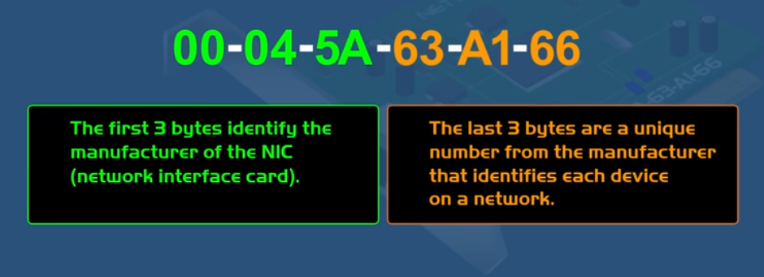
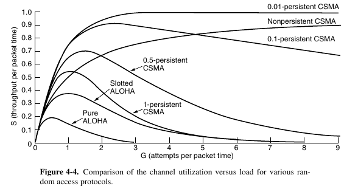
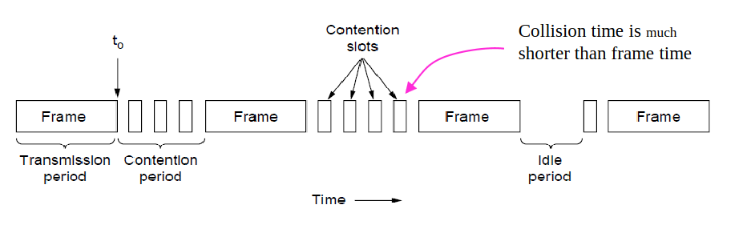
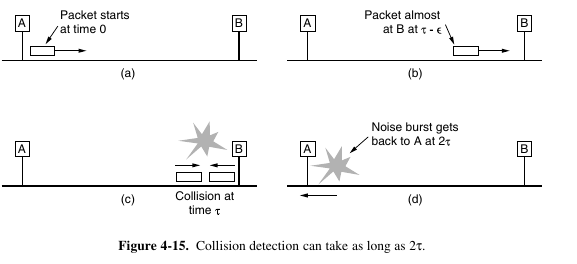
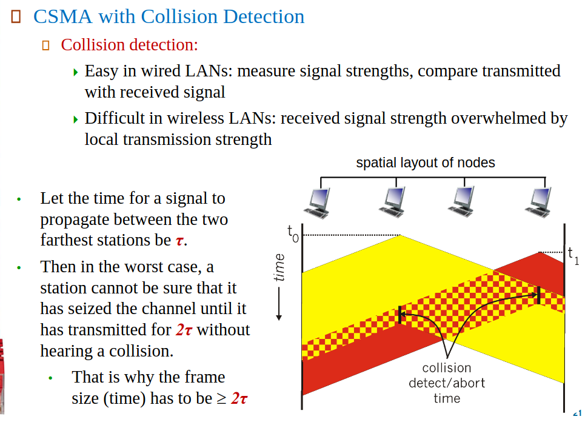

# Lecture 05, LAN (Local Area Networks)

 MAC (Medium Access Control) Sub-Layer 

- Identifier every Network Device uses *(Unique Hardware Addresses)*
- 6 Byte HEX Number *(Burned into Every NIC)*

Purpose of MAC? 
- Responsible for deciding who sends next on a multi-access link
- Important Part of Link Layer, especially for routing in LANs 

**Bandwith Delay Product**: Number of frames that fit on the channel.
    - Only small number fits for LANs

### Channel Allocation Problem

- **Context**: In scenarios with a single shared broadcast channel.
- **Issue**: Simultaneous transmissions by two or more nodes lead to interference and collisions. A collision occurs when a node receives two or more signals at the same time.

### Multiple Access Protocols

- **Purpose**: Serve as a distributed algorithm that determines how nodes share the channel, i.e., when a node is allowed to transmit.
- **Challenge**: The communication about channel sharing must use the same channel, with no separate (out-of-band) channel available for coordination.

### MAC Protocols: Taxonomy

**1. Channel Partitioning (Static)**

- **Principle**: The channel is divided into smaller "pieces" (such as time slots, frequencies, or codes).
- **Allocation**: Each node is allocated a piece of the channel for its exclusive use.
- **Characteristics**:
  - Prevents collisions by design.
  - Each node has a guaranteed bandwidth but may lead to underutilization if the node has little to no data to send.

**2. Random Access (Dynamic)**

- **Principle**: The channel is not divided, allowing for the possibility of collisions.
- **Recovery**: Mechanisms are needed to recover from collisions (e.g., by retransmitting the data).
- **Characteristics**:
  - Offers flexibility and potentially efficient use of the channel.
  - Requires protocols to detect and resolve collisions, such as CSMA (Carrier Sense Multiple Access) or CSMA/CD (Collision Detection).

**3. Taking Turns**

- **Principle**: Nodes take turns in a predefined order to use the channel.
- **Flexibility**: Nodes with more data to send can take longer turns.
- **Characteristics**:
  - Aims to combine the efficiency of dynamic access with the collision-free operation of static partitioning.
  - Examples include polling (where a central controller invites nodes to transmit) and token passing (where possession of a token grants the right to transmit).

 Carrier Sense Multiple Access Protocols (CSMA)  

* Protocols in which stations listen for a carrier *(i.e., a transmission)* and act accordingly are called carrier sense protocols.

## **1-Persistent CSMA** 

- because the station transmits with a probability of 1 when it finds the channel idle.
- First Listens to the Channel *Is anyone else sending RN?*
- If Channel is Idle, Station sends data.
- If Channel is Busy, Station waits until Channel is Idle.

## **Nonpersistent CSMA Protocol**

- **Initial Action**: When a station wants to send a frame, it first senses the channel to check if it's free.
  - **If Free**: The station starts transmitting its frame.
  - **If Busy**: The station does not continuously monitor the channel to immediately transmit once it becomes free.

- **Handling Busy Channel**:
  - Instead of persistently checking the channel, the station waits for a randomly chosen period of time before sensing the channel again.
  - After the wait, the station repeats the sensing process to determine if it can transmit.

- **Advantages**:
  - **Reduced Greediness**: Makes a conscious effort to be less aggressive than 1-persistent CSMA, by not attempting to immediately capture the channel after it becomes available.
  - **Improved Channel Utilization**: Leads to better overall use of the channel since it reduces the chances of collisions by not having multiple stations jumping to transmit immediately after the channel is free.
  - **Fairness**: By waiting a random period before attempting to retransmit, it provides a fairer chance for all stations to access the channel.

- **Disadvantages**:
  - **Increased Delay**: Can result in longer delays for a station to send its data, since it must wait a random time before trying again if the channel is initially found to be busy.

In essence, nonpersistent CSMA aims to strike a balance between efficiently utilizing the channel and minimizing collisions, by introducing randomness in retransmission attempts after finding the channel busy. This approach is less aggressive and potentially more fair than 1-persistent CSMA, which immediately attempts to transmit as soon as the channel is perceived as free.

## **p-Persistent CSMA**

- **Context**: This protocol is specifically designed for slotted channels, where time is divided into discrete slots.

- **Operation Steps**:
  1. **Sensing the Channel**:
     - When a station is ready to send a frame, it first senses the channel at the beginning of the next slot.
  2. **If Channel is Idle**:
     - **Transmit with Probability p**: The station transmits its frame with a certain probability (p).
     - **Defer with Probability q**: With the complementary probability (q = 1 - p), the station defers its transmission to the next slot.
  3. **Repeating the Process**:
     - If the station deferred, it senses the channel again in the next slot and decides whether to transmit or defer again, using the same probabilities (p for transmitting, q for deferring).
     - This process is repeated until the frame is transmitted or another station begins transmitting.
  4. **Handling Busy Channel**:
     - **Immediate Action**: If the initial sensing shows the channel is busy, the station waits until the next slot to apply the p-persistent algorithm.
     - **Post-Collision**: If another station starts transmitting while a station is in the process of deciding, the latter acts as if a collision occurred. It then waits a random time before attempting to transmit again, starting the whole process over.

- **Features**:
  - **Slotted Operation**: Requires the division of time into slots for the sensing and transmission decisions.
  - **Probabilistic Transmission**: Introduces randomness in the decision to transmit immediately or wait, aiming to reduce collisions.
  - **Collision Handling**: Mimics collision behavior by waiting and retrying, even if an actual collision hasn't occurred yet.

- **Advantages**:
  - Balances between aggressive transmission attempts and cautious deferral to optimize channel utilization and reduce collision likelihood.
  - Provides a structured yet flexible approach to channel access in slotted environments.

- **Usage**: The IEEE 802.11 wireless networking standard employs a refined version of p-persistent CSMA, indicating its practical relevance and effectiveness.

p-persistent CSMA combines elements of time-slotting with probabilistic decision-making to efficiently manage access to a shared communication channel, particularly in environments where channel time is discretely organized.

# Channel Utilization VS. Load (traffic)

* Persistent and nonpersistent CSMA protocols are definitely an improvement over ALOHA because they ensure that no station begins to transmit while the channel is busy.

* Another improvement is for the stations to quickly detect the collision and abruptly stop transmitting, *(rather than finishing them)* since they are irretrievably garbled anyway. This strategy saves time and bandwidth.

## CSMA with Collision Detection

**Collision Detection:**
- An analog process where transmitting stations listen to the channel to detect any discrepancies between the transmitted and received signal, indicating a collision.
- Challenges include ensuring the received signal is strong enough relative to the transmitted signal, especially in wireless contexts where signals can weaken significantly.
- Requires careful modulation selection to enable reliable collision detection.

* The transmitter sends a **jam signal** to let the receiver and other stations to know that there was a collision
* Reduces Contention times, which improves performance of Protocol!

In the context of CSMA/CD, "contention slots" refer to the time periods when multiple network stations may attempt to access the communication channel to transmit data. Here's what they represent in the diagram you've provided:

1. **Transmission Period**: This is the time when a station is actively sending a frame over the network.

2. **Contention Period**: Following a transmission, there is a period where the channel is sensed by stations to see if it is free for use. During this period, multiple stations might detect the channel as idle and attempt to transmit, leading to contention—essentially a "competition" for channel access.

3. **Contention Slots**: These slots are specific intervals during the contention period when a station decides whether to transmit or wait based on the protocol's rules. In p-persistent CSMA (applied to slotted channels), for example, a station will either transmit with probability p or defer with probability q during each slot.

4. **Collision**: If two or more stations transmit during the same contention slot, their signals collide, and this collision is detected by the stations involved. The diagram notes that the collision time (the time it takes to detect a collision) is much shorter than the frame transmission time.

5. **Idle Period**: If no station attempts to transmit (either because they all defer or have no data to send), the channel is considered idle. This idle period can occur when all stations are quiet.

In essence, the contention slots are designated times when stations make the decision to either attempt transmission or wait, which is a critical part of managing a shared communication medium like Ethernet. The "contention time" would refer to the entire duration of the contention period, encompassing multiple contention slots.

1. **Collision Detection and Minimum Frame Length**: The text outlines a scenario where two stations, A and B, on a network can potentially transmit frames that collide with each other. The collision detection mechanism is highlighted, showing how a station can detect a collision and respond by sending a noise burst to indicate the occurrence of a collision. This is important in a shared medium like Ethernet, where multiple devices can attempt to transmit data simultaneously.

2. **The Problem with Short Frames**: The main issue addressed is the potential for a frame transmitted by station A to complete its transmission before a collision's noise burst (initiated by station B) returns to A. This scenario could lead station A to incorrectly assume that its frame was successfully transmitted without any collision.

3. **Solution - Minimum Frame Length**: To mitigate this problem, the network enforces a minimum frame length requirement. This ensures that any frame in transmission takes longer than the round-trip time (denoted as ***2T**) for signals in the network. This time includes the delay introduced by the medium itself and any repeaters in the path. By doing this, the network ensures that if a collision occurs, the transmitting station (A in this example) is still transmitting the frame when the collision's noise burst returns. This allows the station to recognize the collision and react accordingly (e.g., by aborting the transmission and attempting to retransmit later).

4. **Calculation of Minimum Frame Size**: For a specific example of a 10-Mbps LAN with a maximum cable length and number of repeaters, a worst-case round-trip time is calculated (50 microseconds). Based on this timing and the data rate, the minimum frame size is determined to be 512 bits (or 64 bytes), rounded up from 500 bits to provide a safety margin.

In essence, the approach involves using a minimum frame length to ensure ongoing transmission during potential collision detection times, thereby avoiding false assumptions of successful transmissions without collisions.

*"Cannot be sure that it has seized the channel"* means after **2T** time passes, the node that sends the message is sure that it's now his turn to send forsure, and it took control of the Bandwidth to send !

---

