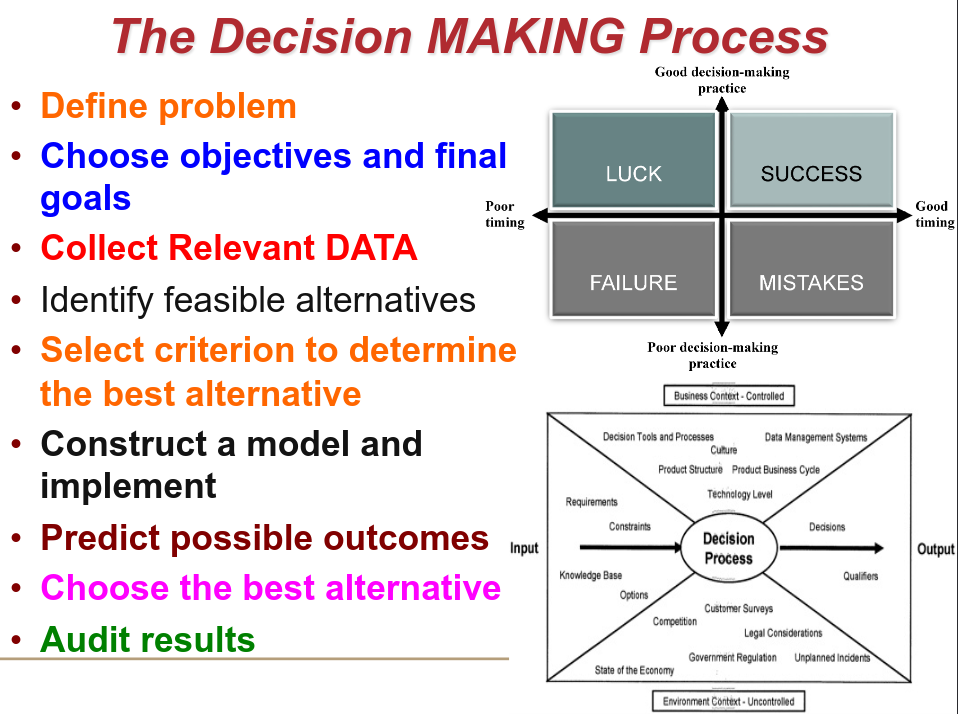

# Introduction to Eng Economics
* Start with Slides 22 / 100

Countries that are going down, are decreasing energy production

"Best" = "Best Economically"

---

**Module 1** : Economic Decisions, Engineering Costs, and Cost Explanation:
*Economic Criteria, Ethical Issues, Cost Estimations using Math*

## Decision Making Process
- *MAJOR Aspect of Everyday Life*
- Tools used for analyzing and solving *Economic Problems* faced by engineers.
- **Knowing** your process, and using the *Right* Tools to make comparisons between options, **Leads to better decisions**

---

### Interest Rate & Return
- *Interest* is **paid** when a person or organization borrowed money *(obtained a loan)* and repays a larger amount over time. 
- *Interest* is **earned** when a person or organization saved, invested, or lent money and obtains a return of a larger
amount over time. 

**Principal** = The money that you originally agreed to pay back.

`Interest = Amount Owed Now - Principal`

**AT** = Interest Accured per Time Unit.

`Interest Rate (%) = AT / Principal * 100%`

---

