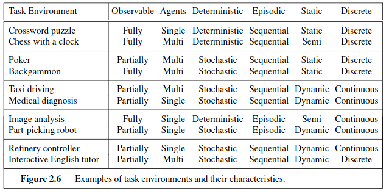
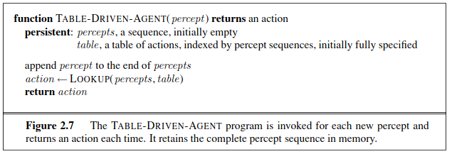
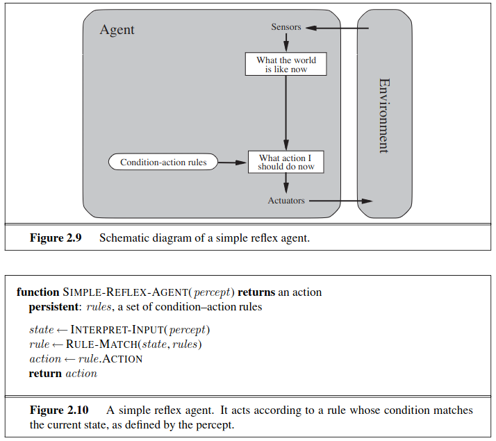

# Intelligent Agents

**Agent** is anything that can be viewed as perceiving it's environment, thru **Sensors**, and acting upon that environment thru **Actuators**  

**Percept** refers to the agent's perceptual inputs, at any given instant.
- **Percept Sequence** is a complete history of everything the agent has ever perceived. *(Memory & Semantics)*

The notion of an agent is meant to be a tool for analyzing systems, not an absolute characterization that divides the world into agents and non-agents.

**Agent Function**: If the current square is dirty, then suck; otherwise, move to the other square.  

### Agent Program

---

## Good Behavior, what defines it?

- Agent preforms a sequence of actions according to it the percepts it gets, If the sequence is desirable, then the agent has performed well.
- Notion of desirability is captured within **Performance Measure** based on *ENVIRONMENT* states
    - As Agent's might delude themselves to believe their performance is perfect ! *(Which it might not be)*
    - Us Humans *"Cope"* and believe we don't really want something if we can't get it... **Ahhh who needs a million dollar Yacht anyways?** Known as *Sour Grapes*

*" As a general rule, it is better to design performance measures according to what one actually wants in the environment, rather than according to how one thinks the agent should behave "*
 

**So in our Vaccum Cleaner World example:**  A more suitable performance measure would reward the agent for having a clean floor. For example, one point could be awarded for each clean square at each time step *(perhaps with a penalty for electricity consumed and noise generated)*
 

However this is still "vague", as let's say the "Clean Floor" measure is based on an Average: Yet the **same average cleanliness** can be achieved by two different agents, one of which does a mediocre job all the time while the other cleans energetically but takes long breaks.

---
## Rationality

- **Rationality** maximizes *Expected* performance, whilst **Perfection** maximizes *Actual* performance... We can't build Perfect Agents...
- Maximize Rationality in Agents is good, increases performance! *Agent should look-both ways before crossing the street, and if they observe a big ah truck zooming towards them, dont cross!* 
 - Doing actions in order to modify future percepts—sometimes called **information gathering**

---

## Nature of Environments

**Task Environments** are the "problems" to which rational agents are the "sollutions" 

### PEAS 
- `P`erformance Measure
- `E`nvironment 
- `A`ctuators *(outputs, stuff the agent can actually do)*
- `S`ensors *(inputs, perspects incoming)*

* **Performance Measure** :  
- minimizing fuel consumption and wear and tear; 
- minimizing the trip time or cost; minimizing violations of traffic laws and disturbances to other drivers; 
- maximizing safety and passenger comfort; maximizing profits.
- *Assess Trade-offs for conflicting desired qualites as needed*

* **Enviroment** : 
- 12 lane freeways
- Roads containing traffic, pedestrians, animals, police, puddles, potholes
- Alaska, with lots of snow, or Cali without any snow

* *Actuators & Sensors are trivial*

## Complexity of Relationship to an Enviroment

Let's say an Agent is a robot doing image classification for defect anomally, it can be at a fixed position in the Factory, assumed to have perfect lighting, the only thing on the conveyer belt, is what the robot is concerned with. This really *SIMPLIFIES* the environment !

 

In contrast, some enviroments can be **Complex**

- Software agents or softbots can exist in complex, unlimited domains.
- Example: A softbot as a Web site operator scanning Internet news sources.
- Purpose: Display interesting news items to users; sell advertising space for revenue.
- Required capabilities:
  - Natural language processing skills.
  - Ability to learn user and advertiser preferences.
  - Dynamic planning and adaptability.
- Challenges:
  - Adjusting to changes, like fluctuating news source availability.
  - Handling the complexity of the Internetd environment.
  - Interacting with various artificial and human agents online.
---

### Properites of Task Environments:

**Fully Observable** vs. **Partially Observable**
- A task environment is effectively *fully observable* if the sensors detect all aspects that are relevant to the choice of action; relevance, in turn, depends on the performance measure. 
- *Fully Observable* environments are nice, as the Agent doesn't need to keep an internal state abt. the Environment
 

-  An environment might be *partially observable* because of noisy and inaccurate sensors or because parts of the state are simply missing from the sensor data
  - **EX:** Vacuum Agent with a Dirt Sensor within the Square, can't tell if there's dirt in other Squares

- An *Unobservable* Enviroment is where the Agent has no sensors at all. In such cases, the agent must rely entirely on preprogrammed instructions or inherent behaviors.

**Single-Agent** vs. **Multi-Agent**
- A *single-agent* environment involves only one agent operating in the environment, without the influence or competition of other agents. The agent's actions do not directly impact or are not impacted by other agents.
  - An example is a person solving a crossword puzzle independently, where the environment remains static and unaffected by others.

- In a *multi-agent* environment, multiple agents interact, and the actions of one agent can affect the state of the environment for other agents. This interaction can be either competitive or cooperative.
  - A **competitive multi-agent** environment is exemplified by games like chess, where each player's goal is to win over the other.
  - A **cooperative multi-agent** environment could involve scenarios like traffic systems, where multiple agents (drivers) must cooperate to some extent (e.g., following traffic rules) while also having individual goals (reaching a destination).
  - Partially cooperative scenarios are also possible, where agents may cooperate on some aspects while competing on others.

**Deterministic** vs. **Stochastic** vs. **Non-Deterministic**
- *Deterministic*: The next state of the environment is completely predictable based on the current state and the agent's action. *Example:* A simple puzzle game where each move leads to a predictable outcome.
- *Stochastic*: The environment includes elements of randomness and unpredictability. Even with complete information about the current state and actions, outcomes can vary. But Probabilities of outcomes are known *Example:* Playing a card game where shuffling introduces randomness, but we still know I've got a 4/52 chance of pulling a 3 of anything...
- *Non-Deterministic*: The outcomes of actions are not strictly random but are also not entirely predictable. *Probabilities for outcomes are not defined.* *Example:* Negotiating in a business scenario where outcomes are uncertain and not quantifiable.

**Episodic** vs. **Sequential**
- *Episodic*: The agent's experience is divided into distinct episodes, where each episode is independent of others. The agent's action in one episode does not affect future episodes. *Example:* Image classification tasks where each image is processed independently.
- *Sequential*: The agent's decisions have long-term consequences, where current actions affect future states and decisions. *Example:* Strategy games like chess where each move impacts the game's progression.

**Static** vs **Dynamic** *(and Semi-Dynamic)*
- *Static*: The environment does not change while the agent is deliberating. *Example:* Solving a mathematical problem on paper.
  - Easy to deal with because the agent need not keep looking at the world while it is deciding on an action, nor need it worry about the passage of time.
- *Dynamic*: The environment changes as time passes, even while the agent is making decisions. *Example:* Playing a real-time video game where the game state continuously evolves.
- *Semi-Dynamic*: The environment itself is static, but the agent's performance score might change with time. *Example:* Competitive exams with a time limit.

**Discrete** vs **Continuous**
- *Discrete*: The environment, actions, and percepts are distinct and separate. Example: Turn-based board games with a finite set of moves.
- *Continuous*: The environment changes smoothly over a range of values, and actions/percepts can vary in a continuum. Example: Driving a car where speed and steering can have a wide range of continuous values.

**Known** vs **Unknown**
- *Known*: The agent is aware of the "laws" of the environment and understands the outcomes of actions. Example: Playing a familiar video game where the player knows the rules and mechanics.
- *Unknown*: The agent lacks knowledge about the environment's functioning and must learn through interaction. Example: Exploring a new city without prior knowledge of its layout or rules.

---

## Structure of Agents

In general, the **architecture** makes the percepts from the sensors available to the program, runs the program, and feeds the program’s action choices to the actuators as they are generated.

**Agent Architecture**: `agent = architecture + program`

**Agent Program Layout**
- Take in Input from Sensors
- Output actions for the Actuators
- *Agent Program* Takes in the Current Percept, whereas the *Agent Function* takes the entire history

 

*Why is the Table Driven Approach to Agent Construction Doomed to Fail?*

* Let `P` be the set of possible percepts and let `T` be the lifetime of the agent (total n. of percepts recieved)
* The Look Up Table, will consist of the `Summation, from t = 1, to T of P(t)` entries, *(way to big of a table)*
* Consider Taxi Example, a 30 second clip at 640 x 480 pixels, RGB info (24 bits) let's say as a **single input**
  - That's 10^250,000,000,000 entries, wayyyy to much

1. **Space Limitation**: No physical agent in the universe has the capacity to store a complete decision table due to its immense size.
2. **Time Constraint**: The time required for a designer to create such an exhaustive table is prohibitively extensive.
3. **Learning Limitation**: It is impossible for any agent to learn and assimilate all the correct entries of such a table purely from its experiences.
4. **Design Guidance**: Even in cases where the environment is simple enough for a feasible table size, the designer lacks clear guidance on how to accurately populate the table entries.

Our goal is to have a relatively small program, that can do the same Non-trivial decision making as these Huge Tables!  
**For EX:** the huge tables of square roots used by engineers and schoolchildren prior to the 1970s have now been replaced by a five-line program for Newton’s method running on electronic calculators.

---

## 4 Types of Agents

### **Simple Reflex Agent**

* Simple reflex agents operate based solely on the current percept, disregarding any historical context. For instance, a vacuum cleaner robot acting as a simple reflex agent decides its actions only based on its immediate location and whether there is dirt there, without considering past percepts.

* This approach significantly simplifies the agent's decision-making process. In the vacuum example, it reduces the complexity from considering a potentially vast history of percepts *(4^T possibilities)* to just dealing with **4** immediate scenarios. The simplicity is evident in the agent's program being much smaller and more manageable compared to a comprehensive decision table.

* Simple reflex actions are not just limited to basic agents but also exist in more complex environments, including human behavior. For example, an automated taxi braking in response to the car in front indicates a condition–action rule *("if car in front is braking, then initiate braking")*. 

* Infinite loops are often unavoidable for simple reflex agents operating in partially observable environments.
  - Escape from infinite loops is possible if the agent can randomize its actions. For example, if the vacuum agent perceives [Clean], it might flip a coin to choose between Left or Right.
  - In single-agent environments, randomization is usually not rational.

---

### Model-base reflex Agents

todo

### Goal-based Agents

todo

### Utility-based Agents

todo

### Learning Agents

todo

