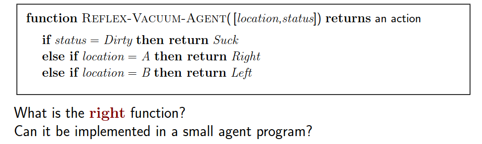

# Intelligent Agents

**Agent** is anything that can be viewed as perceiving it's environment, thru **Sensors**, and acting upon that environment thru **Actuators**  

**Percept** refers to the agent's perceptual inputs, at any given instant.
- **Percept Sequence** is a complete history of everything the agent has ever perceived. *(Memory & Semantics)*

The notion of an agent is meant to be a tool for analyzing systems, not an absolute characterization that divides the world into agents and non-agents.

**Agent Function**: If the current square is dirty, then suck; otherwise, move to the other square.  

### Agent Program

---

## Good Behavior, what defines it?

- Agent preforms a sequence of actions according to it the percepts it gets, If the sequence is desirable, then the agent has performed well.
- Notion of desirability is captured within **Performance Measure** based on *ENVIRONMENT* states
    - As Agent's might delude themselves to believe their performance is perfect ! *(Which it might not be)*
    - Us Humans *"Cope"* and believe we don't really want something if we can't get it... **Ahhh who needs a million dollar Yacht anyways?** Known as *Sour Grapes*

*" As a general rule, it is better to design performance measures according to what one actually wants in the environment, rather than according to how one thinks the agent should behave "*
 

**So in our Vaccum Cleaner World example:**  A more suitable performance measure would reward the agent for having a clean floor. For example, one point could be awarded for each clean square at each time step *(perhaps with a penalty for electricity consumed and noise generated)*
 

However this is still "vague", as let's say the "Clean Floor" measure is based on an Average: Yet the **same average cleanliness** can be achieved by two different agents, one of which does a mediocre job all the time while the other cleans energetically but takes long breaks.

---
## Rationality

- **Rationality** maximizes *Expected* performance, whilst **Perfection** maximizes *Actual* performance... We can't build Perfect Agents...
- Maximize Rationality in Agents is good, increases performance! *Agent should look-both ways before crossing the street, and if they observe a big ah truck zooming towards them, dont cross!* 
 - Doing actions in order to modify future percepts—sometimes called **information gathering**

---

## Nature of Environments

**Task Environments** are the "problems" to which rational agents are the "sollutions" 

### PEAS 
- `P`erformance Measure
- `E`nvironment 
- `A`ctuators *(outputs, stuff the agent can actually do)*
- `S`ensors *(inputs, perspects incoming)*

* **Performance Measure** :  
- minimizing fuel consumption and wear and tear; 
- minimizing the trip time or cost; minimizing violations of traffic laws and disturbances to other drivers; 
- maximizing safety and passenger comfort; maximizing profits.
- *Assess Trade-offs for conflicting desired qualites as needed*

* **Enviroment** : 
- 12 lane freeways
- Roads containing traffic, pedestrians, animals, police, puddles, potholes
- Alaska, with lots of snow, or Cali without any snow

* *Actuators & Sensors are trivial*

## Complexity of Relationship to an Enviroment

Let's say an Agent is a robot doing image classification for defect anomally, it can be at a fixed position in the Factory, assumed to have perfect lighting, the only thing on the conveyer belt, is what the robot is concerned with. This really *SIMPLIFIES* the environment !

 

In contrast, some enviroments can be **Complex**

- Software agents or softbots can exist in complex, unlimited domains.
- Example: A softbot as a Web site operator scanning Internet news sources.
- Purpose: Display interesting news items to users; sell advertising space for revenue.
- Required capabilities:
  - Natural language processing skills.
  - Ability to learn user and advertiser preferences.
  - Dynamic planning and adaptability.
- Challenges:
  - Adjusting to changes, like fluctuating news source availability.
  - Handling the complexity of the Internet environment.
  - Interacting with various artificial and human agents online.
---

