# Solving Problems by Searching

**Problem-solving agents**
- Goal based, and use *Atomic* Representations
- Goal-based agents that use more advanced factored or structured representations are usually called planning agents

### 1. Uniformed Search Algorithms
Uniformed search algorithms operate without any domain-specific information. They treat all nodes in the search space equally and have no additional information about the state space or the goal beyond the problem's definition. Key examples include:

- **Breadth-First Search (BFS)**: This algorithm explores all the nodes at the present depth before moving on to the nodes at the next depth level. It's widely used in scenarios like finding the shortest path in unweighted graphs or tree data structures.

- **Depth-First Search (DFS)**: DFS explores as far as possible along each branch before backtracking. It's often used in puzzle solving, maze navigation, and in situations where we need to explore the entire solution space, like syntax tree generation in compilers.

- **Uniform Cost Search**: It's a variation of Dijkstra’s algorithm. Here, the cost of each path is considered, and the next path to explore is chosen based on the lowest cost. This is particularly useful in pathfinding and graph traversal, especially when the cost of each step varies.

### 2. Informed Search Algorithms
Informed search algorithms, also known as heuristic search algorithms, use specific knowledge (heuristics) about the problem to find solutions more efficiently. These algorithms are faster and more efficient as they can estimate the "goodness" of each node and prioritize nodes that are more likely to lead to a solution. Examples include:

- **A* Algorithm**: Perhaps the most famous informed search algorithm, A* uses heuristics to estimate the cost of the cheapest path from the current node to the goal. It's widely used in pathfinding and graph traversal problems, like in GPS navigation systems.

- **Greedy Best-First Search**: This algorithm selects the path that appears best at the moment by using a heuristic function. It’s fast but doesn’t always find the shortest path. It's often used in real-time problem solving, like in some game AI.

- **Iterative Deepening A-Star (IDA)**: This algorithm combines the depth-first search’s space-efficiency and breadth-first search’s optimality. It’s used in puzzles like the sliding tile puzzle and other problems where the solution path is not known a priori.

In summary, uniformed search algorithms are generally simpler and more general-purpose but can be inefficient for complex problems. In contrast, informed search algorithms are more efficient for specific problems but rely on additional information or heuristics related to the problem domain.

---

## Definitions

**Goals** help organize behavior by limiting objectives that the agent is trying to achieve *(Hence actions under consideration)*
    - I'm flying to Bucharest, so any flight not going there, I'm not taking...
    - Set of world states, Agent needs to find out how to act now, and in the future, to Achieve Goals

**Goal Formulation**: Based on current situation & agent's performance measure, first step in problem solving!

**Problem Formulation**: Is the process of deciding what actions and states to consider, given a goal.
-  *(Defined Granularity!)* Let us assume that the agent will consider actions at the level of driving from one major town to another.

In general, *An agent with several immediate options of unknown value can decide what to do by first examining future actions that eventually lead to states of known value*

 Romania Problem CH.3 

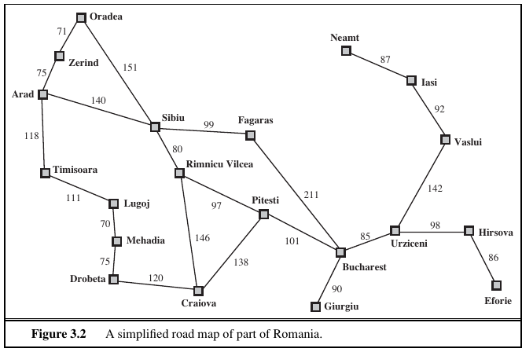

 

**Romania Problem Analysis**
- If we can see the map of Romania, we deem the environment as **Observable**, it's also **discrete**, as in any given city, we have a Finite amount of actions that can be taken. *(From Bucharest we can either go to Urziceni, Fagaras or Giurgiu)*
- Environment is also **Known** as we can track which states (cities) have already been visited, and **Deterministic** as each action has exactly one outcome! *(Drive to Urziceni, Arrive at Urziceni)*
- *Under these assumptions, the solution to any problem is a fixed sequence of actions*
- Goal here is to reach the city of **Arad** let's say, or in Chess, it's a **Checkmate**!
- Here the Agent want's to minimize Cost to destination, *Sum of Costs* this would be the **Optimal Sollution**
- Step Cost of Taking an Action `a` in state `s` to reach state `s'` is denoted `c(s, a, s')`

The process of looking for a *sequence of actions* that reaches the goal is called **search**. A *search algorithm* takes a problem as input and returns a solution in the form of an action sequence.

 

#### Thus, we have a simple *“formulate, search, execute”* design for the agent (Fig below) 
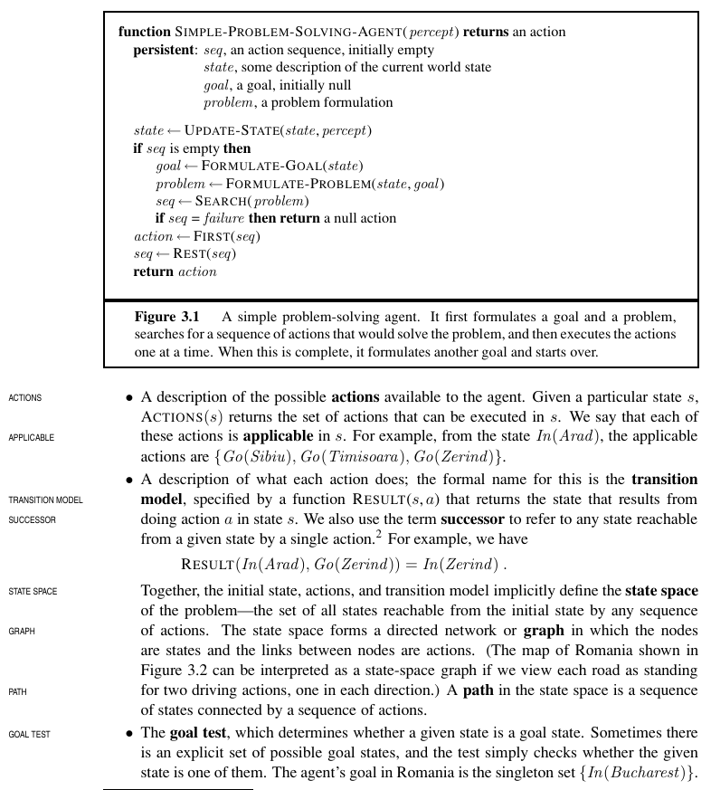

## Formulating Problems *(Practically)*

1. **Necessity of Relevant Abstraction**: For effective problem-solving, it's crucial to abstract away irrelevant details while retaining essential elements relevant to the task. This allows for focusing on key aspects without getting overwhelmed by unnecessary information.

2. **Practicality and Validity of Abstraction**: The chosen abstraction must be valid, meaning it should accurately represent the necessary steps to achieve a goal, and practical, meaning the abstracted actions should be simple enough to execute without needing additional complex planning.

 Example Problem Formulations 

### Example Problem Formulations

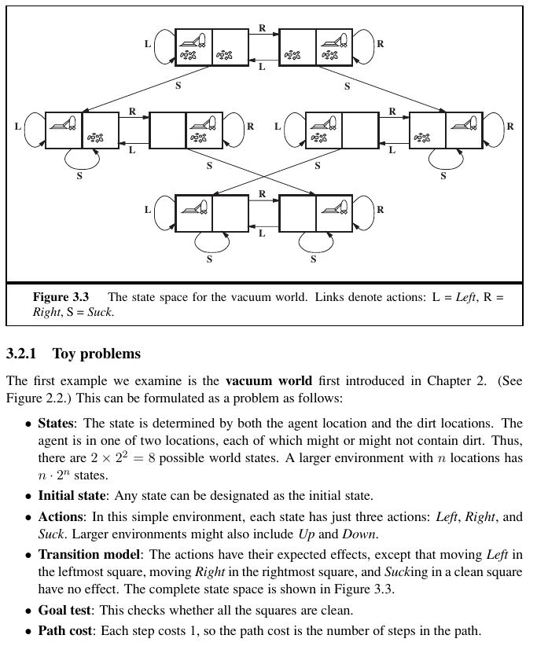

Compared with the real world, this **toy problem** has discrete locations, discrete dirt, reliable cleaning, and it never gets any dirtier, this is very abstracted & simplified !

---

- A tile adjacent to the blank space can slide into the space. 
- **Goal**: The object is to reach a specified goal state, such as the one shown on the right of the figure. *The standard formulation is as follows:*

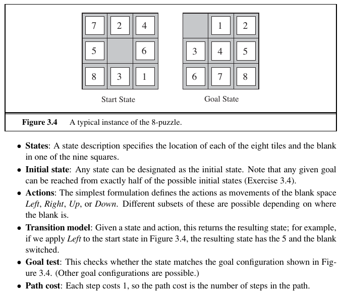

 

**Abstractions included:**
- Abstracted to beginning & final states, ignoring intermediate locations of blocks.
- Abstracted physical possibilites like a Block getting stuck somewhere, so we need to shake the board arround
- Our "Rules" avoid physical manipulations

**Difficulty of Problem:**
- *Sliding Block Puzzles* are a Family of problems which are known to be NP-Complete *(Therefore NP-Hard)*
- 8 Puzzle has `9!/2 = ~182 K` States, which is still reasonable **(3x3 Board)**
- 15 Puzzle has `16!/2 = 1.3 Trillion` States, which is not do-able... **(4x4 Board)**
- 5x5 board takes 10+ hours to solve... not feasible
- Clearly we see this isn't solvable in polynomial time, and therefore is **NP**

### Another Example, 8-Queens Problem

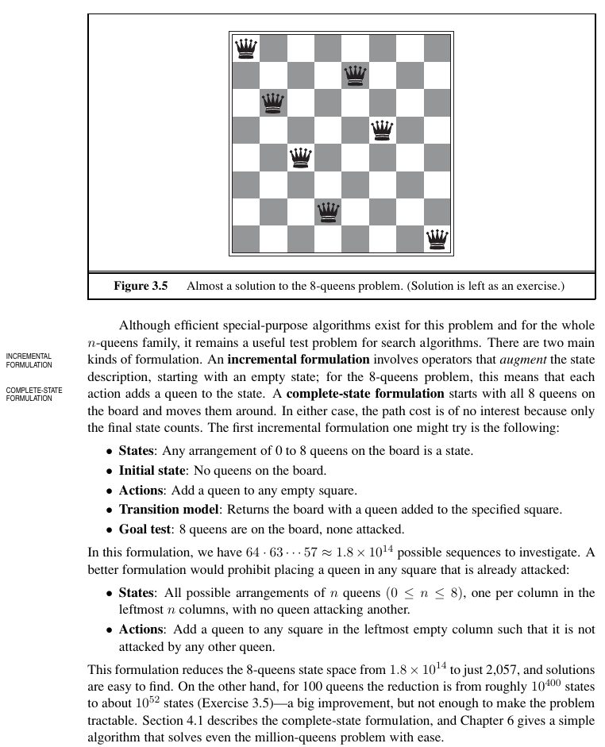

**Difficulty of Problem:**
- *Sliding Block Puzzles* are a Family of problems which are known to be NP-Complete *(Therefore NP-Hard)*
- 8 Puzzle has `9!/2 = ~182 K` States, which is still reasonable **(3x3 Board)**
- 15 Puzzle has `16!/2 = 1.3 Trillion` States, which is not do-able... **(4x4 Board)**
- 5x5 board takes 10+ hours to solve... not feasible
- Clearly we see this isn't solvable in polynomial time, and therefore is **NP**

### Another Example, 8-Queens Problem

 
 
 

# Un-Informed Algorithms

*Fringe, Open List, Frontier List* : Jargon words for just *"The Queue or Stack used in Algorithm"*

## Depth First Search : LIFO (Stack)
- Tries to expand a `node` (on top of the frontier list) to it's *Deepest path*, The search proceeds immediately to the deepest level of the search tree, till the nodes have no successors.

- TIME COMPLEXITY: `O(b^m)` , terrible if *m* >> *d* *(m much larger than d)* where **m** is max depth, **d** is optimal sol. depth

-  DFS Search needs to store only a single path **from the root to a leaf node**, along with the remaining unexpanded sibling nodes for each node on the path. 

- After path is fully expanded, this current path can be **Deleted** from memory, and the next starts silling up the Stack. It's **SO GOOD** on Space complexity, unlike BFS

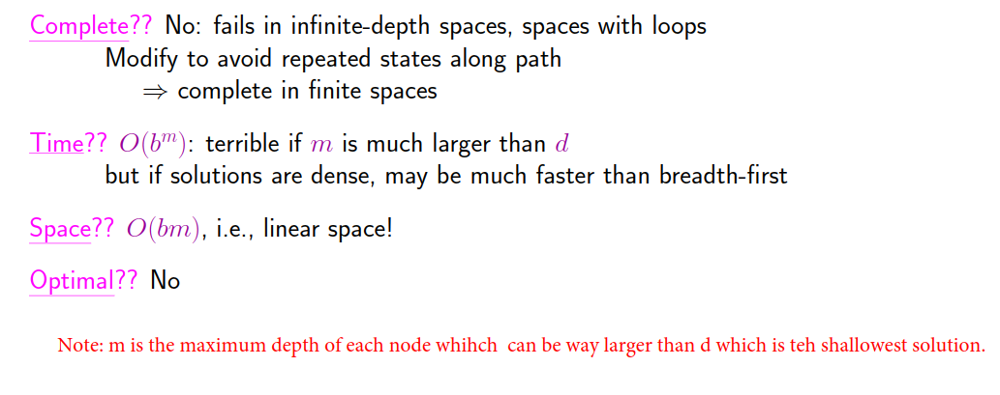

---

## Uniform-Cost Search
- Expands the node `n` with the lowest path cost `g(n)`.
    - Done via Priority Queue structure, ordered by `g` in decreasing order.
- Goal test is applied to a node when it is selected for expansion. *(As the node may be on the sub-optimal path!)*
    - A test is added in case a better path is found then a node currently on the frontier. *(Goes back, and checks lower costs paths, before moving on down a path)*
- Uniform-cost search does not care about the number of steps a path has, but only about their total cost.

 

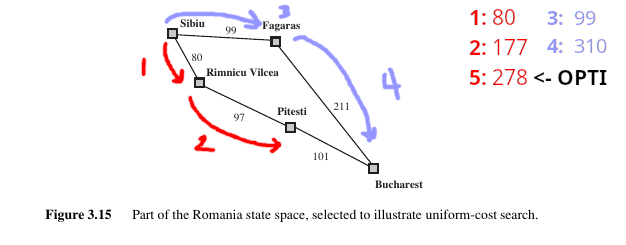
- After Step 2: the Algorithm backtracks, and tests Fagaras path, as the sub-path at *2* is currently lower!

 

*Optimality*: Optimal, with any step-cost function, as it finds the "cheapest" path.

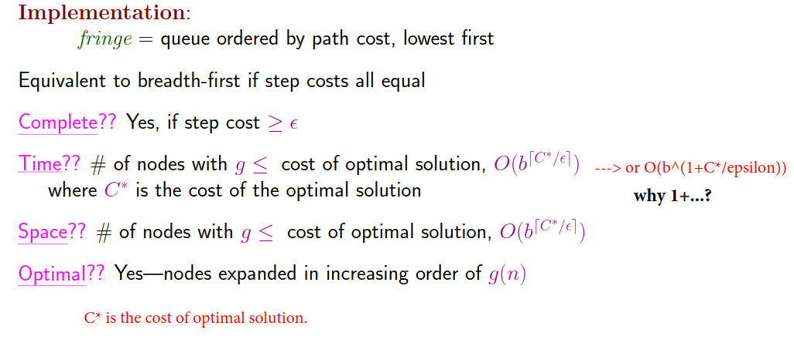

---

## Breath First Search: FIFO (Queue)
- Root node expanded to it's *successors*, then every successor is expanded, before it goes deeper.

*Completeness:* If there is a Solution, this Algorithm will find it... *(Finds shallowest goal)*
- Complete with **b**, N. branches is finite
- Let's say the shallowest goal is at depth **Z**, this algorithm will find the shallowest goal
    - As shallower nodes didn't pass the **Goal Test**

*Optimality:*  The *shallowest* goal node is not necessarily the *optimal* one...
- Technically, breadth-first search is optimal if the path cost is a nondecreasing function of the depth of the node.

**Complexity**:  
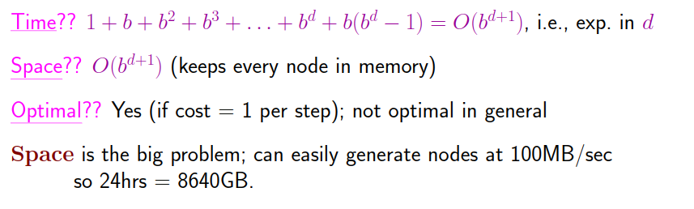

---

## Iterative Deepening DFS
- At every level, it does a DFS Search and then increases by 1 depth
- Plus side: Space complexity is Linear *(Like DFS)*
- EXERT: *In general, iterative deepening is the preferred uninformed search method when the search space is large and the depth of the solution is not known.*
- It iteratively deepens the depth at which it searches, ensuring that it finds the shallowest (or least-cost) goal node first, similar to BFS.

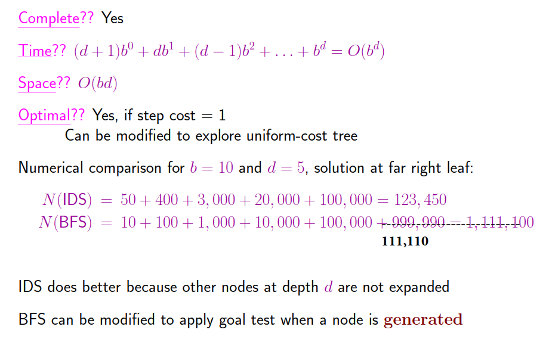

**Application**: For many real-world problems, especially in AI and puzzle solving, the solution depth is unknown, and the search space can be vast. IDDFS's ability to provide depth-limited searches without the memory overhead of BFS makes it particularly useful. It's a more practical choice for applications running on hardware with limited memory resources.

---

## LEGEND:

- **b** : N. Branches 
- **d** : Depth of Optimal Solution
- **n** OR **m** *(used interchangbly)*: Maximal Depth of Solution

---

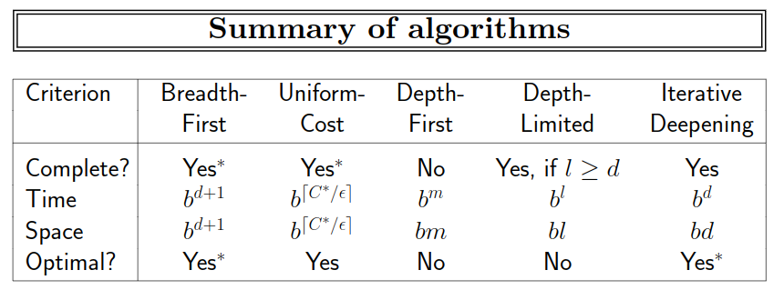