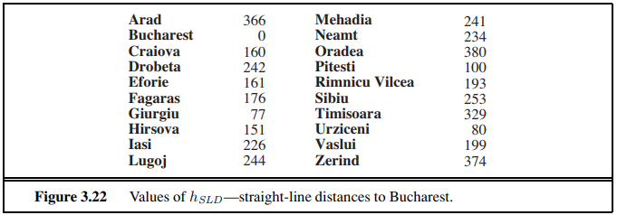
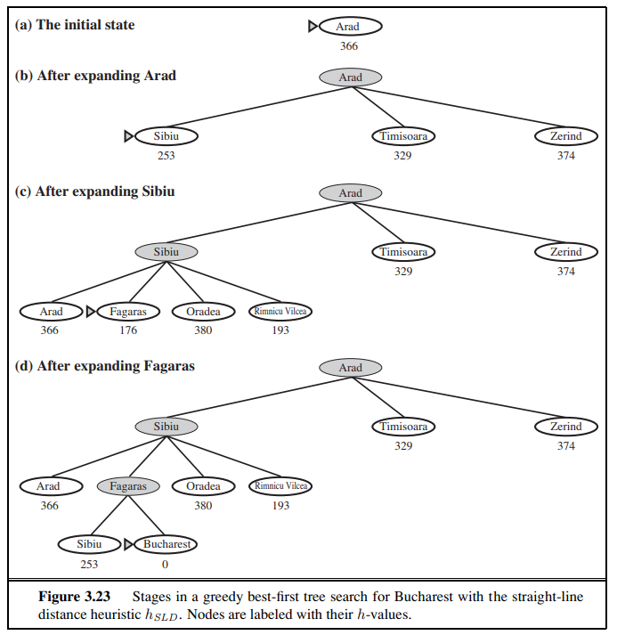
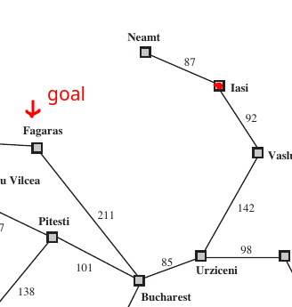

# Informed Search

## Greedy-Best-First Search

* `f(n) = h(n)` where **h(n)** Is the estimated cost to the goal, from node **n**
* Fringe List: Queue, sorted in decreasing order of desirability

If our Goal is Bucharest, we compute the straight-line Heuristics for each Village, leading up to sollution `h SLD(n)`

Greedy Search will pick the next node, that is at **lowest estimated cost**
- Because of this direct "greed" of picking the immediate lowest cost, it's **NOT** an *Optimal Algorithm*

A search algorithm is complete if it is guaranteed to find a solution if one exists, no matter the state space. Completeness is desirable because it ensures that the algorithm can always solve a problem given enough time and resources.

#### Greedy Best-First is not Complete!

### Example Explanation: From Iasi to Fagaras

In the example given, you're trying to travel from Iasi to Fagaras. The heuristic used by the greedy best-first search suggests which city to go to next based on which one is closest to Fagaras. 

1. **Initial Step**: Starting from Iasi, the heuristic might suggest going to Neamt because, according to the heuristic function, it seems closer to Fagaras.

2. **Dead End at Neamt**: Neamt turns out to be a dead end. This is the first indication of why greedy best-first search can fail; it makes decisions based solely on the heuristic's current state without considering the overall path. 

3. **Returning to Iasi**: After hitting the dead end, the algorithm puts Iasi back into the frontier because it's evaluating based on immediate heuristic values without global path awareness.

4. **Infinite Loop**: The greedy nature of the algorithm makes it choose Iasi again over Vaslui because, according to the heuristic, Iasi is closer to Fagaras than Vaslui. However, the correct path to Fagaras is actually through Vaslui. This cycle can continue indefinitely, leading to an infinite loop and demonstrating the algorithm's incompleteness.

5. **Why Vaslui is Correct**: Although Vaslui is further from Fagaras according to the heuristic, it leads to a path (Vaslui -> Urziceni -> Bucharest -> Fagaras) that actually reaches the goal. This highlights a critical flaw in greedy best-first search: it can get "trapped" by local optima (in this case, the heuristic's incorrect suggestion) and fail to find the global optimum (the actual shortest path to the goal).

### Completeness in Finite vs. Infinite Spaces

The example demonstrates that greedy best-first search can be incomplete even in finite spaces due to its myopic decision-making process. In infinite spaces, the algorithm's limitations are even more pronounced due to the potential for endlessly expanding paths that never reach the goal.

### Complexity and Heuristics

The worst-case time and space complexity of greedy best-first search is `O(b^m)`, where `b` is the branching factor (the average number of successors per state), and `m` is the maximum depth of the search space. However, with a well-designed heuristic, the practical complexity can be much lower, as the heuristic can guide the search more efficiently towards the goal. The effectiveness of this reduction depends significantly on the quality and appropriateness of the heuristic to the problem at hand.

---

## A* search (A-Star)

`f(n) = g(n) + h(n)`
- **g(n)** Cost to reach node directly *(gives the path cost from the start node to node n)*
- **h(n)** Is the estimated cost to the goal, from node **n** *(Cheapest path)*

Identical to *Uniform-Cost-Search*, only difference is it uses `g+h` instead of just `g`

- A* uses an **Admissible Heuristic** as h(n) ; Straight-Line to Destination heuristic is good and makes sense in our case `h SLD(n)`. The shortest path between any 2 points is a straight-line, so it's admissble.

- **Admissible heuristics** are by nature optimistic because they think the cost of solving the problem is less than it actually is!

The values of **g** are computed from the step costs in Figure 3.2 *(above in greedy section)*