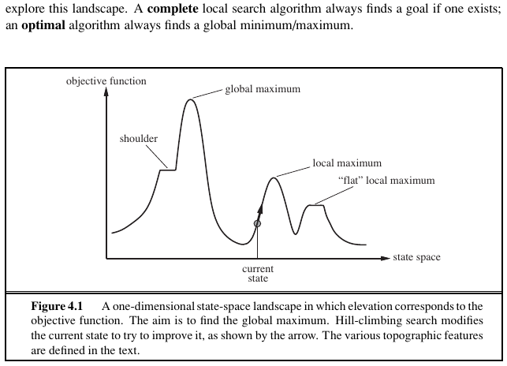
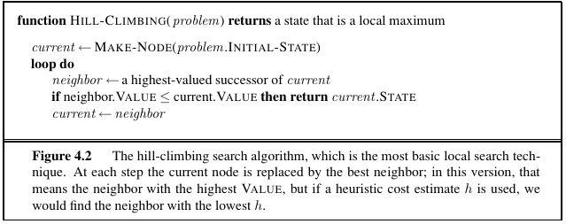
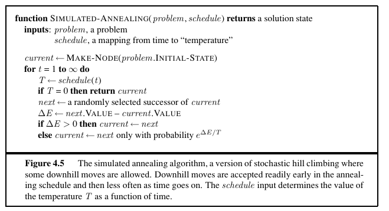

# Local Search Algorithms & Optimization Problems

* Path to the goal matters less than the goal itself!

* **Local Search** algorithms operate using a single current node *(rather than multiple paths)* and generally move only to neighbors of that node.
    - They use very little Memory *(Usually constant amount)*
    - They can find reasonable solutions in very large state sapces, where systematic algorithms aren't useful *(Converge quick in large spaces to a decent sol)*
    - Ideal choice for solving **Pure Optimization Problems**, where we need to find the "best" state according to an **Objective Function**

## Hill-Climbing

The **State-Space Landscape**
- Includes Location, defined as the state on *X Axis*
- Includes Elevation, defined as the heurisitc cost at state **Objective Function** on *Y Axis*
- If elevation corresponds to **cost**, then the aim is to find the lowest valley—**a global minimum**
- If elevation corresponds to an **objective function**, then the aim is to find the highest peak—**a global maximum**

Impl:

Hill climbing is sometimes called **greedy local search** because it grabs a good neighbor state without thinking ahead about where to go next. Here are some problems with it tho:

- Get's stuck in **Local Maxima's**
- Get's stuck on **ridges**
- **Plateaux** or **Shoulder** points are also dangerous

---

## Simulated Annealing

As the Temperature is High -> Shake Alot, as it cools down minimize Shaking

- Every step, It takes a random move, If the move improves the situation, it's always accepted !
- If Not: Algorithm accepts the move with **some probability less than 1** (e.g 70%)

-  The probability decreases exponentially with the “badness” of the move—the amount **ΔE** by which the evaluation is worsened.

- The probability also decreases as the **“temperature” T** goes down: 
    * “bad” moves are more likely to be allowed at the start when T is high, and they become more unlikely as T decreases.

- **High Temperature Phase:** At the start, the "temperature" of the system is high, allowing the algorithm to explore a wide range of solutions, including accepting worse solutions ("shaking a lot"). This step helps in escaping local minima and exploring the solution space more broadly.

- **Acceptance of Moves:**
    - If a new move improves the situation (i.e., leads to a better solution), it is always accepted.
    - If the move worsens the situation, it is accepted with a certain probability. This probability is not static; it changes based on two factors:
        1. **Badness of the Move (ΔE):** The extent to which the new move worsens the situation. The worse the move (higher ΔE), the lower the probability of acceptance.
        2. **Temperature (T):** The current "temperature" of the system. At higher temperatures, the algorithm is more likely to accept worse moves, allowing it to explore freely. As the temperature decreases, the probability of accepting worse moves decreases, making the algorithm more conservative in its choices.

- **Cooling Down:** As the temperature decreases, the algorithm gradually becomes more focused on refining the best solutions found, reducing the exploration of significantly worse solutions. This shift from exploration to exploitation is crucial for the algorithm to converge on an optimal or near-optimal solution.

 

# Local Beam Search

- Keeps K States in Memory rather than just 1.
- *K* Randomly gen. states

- At every step, all successors for every *K* state is generated
    - If any successor is the goal, halt
    - Otherwise, selects **K-Best successors**, and repeats

*In a local beam search, useful information is passed among the parallel search threads.*

Local Beam Search is a heuristic search strategy where instead of maintaining a single state, the algorithm keeps track of multiple states `K` simultaneously. This approach aims to increase the chances of finding the optimal solution by exploring several paths in parallel. Here's a more detailed breakdown:

### Core Concept:
- **Multiple States**: Unlike traditional search strategies that keep only one state at a time, Local Beam Search maintains `K` states in memory. This set of states is often referred to as the "beam."

### Initialization:
- **Starting States**: The search begins with `K` randomly generated states. These initial states are the starting points of parallel exploration paths.

### Iterative Process:
- **Generation of Successors**: For each of the `K` states currently in the beam, the algorithm generates all possible successors. This step broadens the search space explored in each iteration.
- **Goal State Check**: The algorithm checks if any of the newly generated successors is the goal state. If the goal is found, the search terminates.
- **Selection of K-Best**: From the pool of all successors generated from all `K` states, only the top `K` successors are chosen based on some evaluation criteria. This ensures that the beam always contains the most promising states.

### Key Characteristics:
- **Information Sharing**: The parallel exploration paths can share useful information since the selection of the next set of `K` states is based on the collective evaluation of all current states and their successors.
- **Focus on Promising Areas**: By only keeping the best `K` states in each iteration, the search is concentrated on the most promising areas of the search space.

### Drawbacks:
- **Concentration Risk**: A significant drawback of Local Beam Search is the risk of the search becoming overly concentrated in a small region of the state space. This can lead to a lack of diversity in the search paths and potentially missing the optimal solution.

    - k states—they can quickly become concentrated in a small region 
of the state space, making search redundant and expensive
- **Cost of Redundancy**: Maintaining and evaluating multiple states and their successors can be computationally expensive, especially if the search converges on non-diverse states.

### Stochastic Variant:
To mitigate some drawbacks, a stochastic variant of Local Beam Search can be used:
- **Stochastic Selection**: Instead of always selecting the top `K` successors, the stochastic beam search selects `K` successors at random. However, the probability of selecting a particular successor is weighted by its quality or value. This introduces randomness and diversity into the selection process, potentially avoiding the concentration problem.
- **Analogy to Natural Selection**: This approach is analogous to natural selection in biology, where the "fitness" (value) of an organism influences its chances of reproduction (being selected as a successor), introducing variation and evolution over generations.

By maintaining a balance between exploration and exploitation, Local Beam Search aims to efficiently navigate large search spaces. The stochastic variant further enhances this balance by introducing randomness, akin to natural evolutionary processes.

---

# Genetic Algorithms

- begin with a set of k randomly generated states, called the population.

-  Each state, or individual, is represented as a string over a finite alphabet—most commonly, a string of 0s and 1s.

https://youtu.be/gxGe2v7c5E8