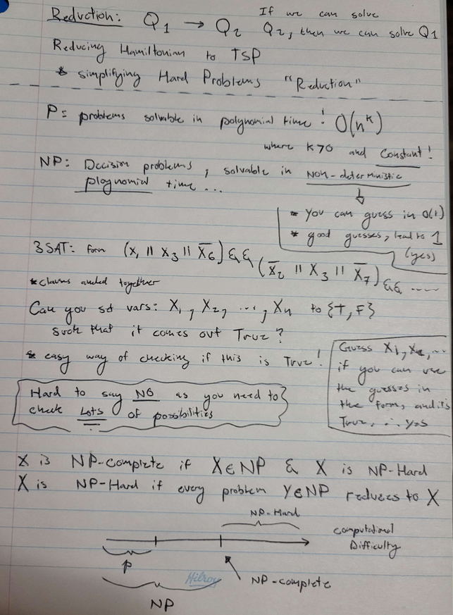
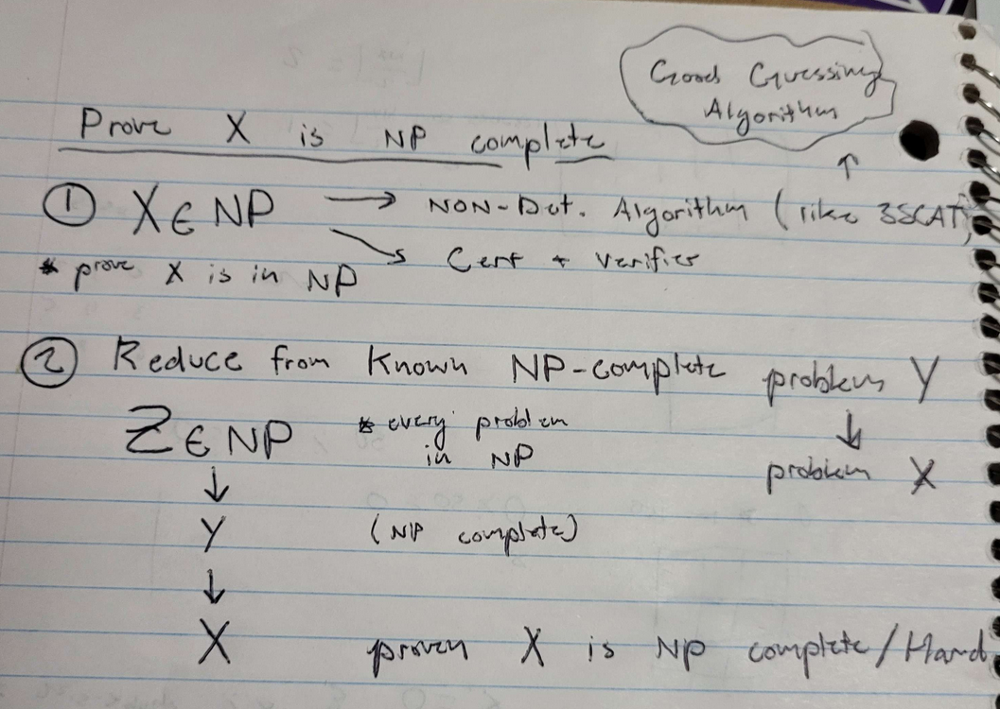

**NP Complete**: This problem is edxactly as hard, as everything in **NP**
- In other words, a Problem Y which is *NP-Complete* can be the reduction of any problem within **NP**

 

If a problem is **NP Hard** it's not Polynomially Solvable, `P != NP`
- If your problem is **NP Hard**, it's atleast as hard as *EVERY* problem in **NP**
- Atleast as hard? Let's define it, Reduction

**Reduction**
- Tells me that if I know how to solve `Problem B`, I how to solve `Problem A`
- **A** & **B** have equivalent decision outputs *(yes/no)*
- If **B** has `P` *(polynomial time algorithm)* , so does **A**
- If **B** has `NP` *(Non-Determinstic polynomial time algorithm)* , so does **A**

---

### How to Prove NP Completeness ?

---