# Operation Systems - Introduction

# 1.2

 --- Comp-Sys Organization 

- Device Controllers are connect thru a common **BUS**
- Each Device is handled by their Controller! (Disk, Audio, Graphics)
- CPU, ^^ Controllers, etc... are also connected to this **BUS**

A Device Controller maintains a local buffer storage & set of special-purpose registers  
A Device Controller is in charge of moving the data between the peripheral devices that it controls aswell as it's own local buffer.
-  Example: Moving Data from Keyboard Input data into it's own Local Buffer, and generate signal to Device Driver so it can Interrupt

Operation Systems have **Device Drivers** for each **Device Controller**
- Device driver understands the Controller, and provides a *UNIFORM* Interface to the device 
- CPU & Device Controller execute in parallel, whilst splitting *Memory Cycles* (RAM Clock cycles)
- Synchronization of Memory Access from all these devices, are actually managed by **Memory Controller**

**System Bus**: Main communications path between Major Components.

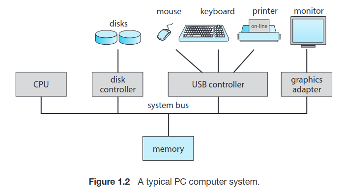

---

In a typical I/O operation, the device driver is responsible for generating the interrupt to inform the operating system about the completion of the operation, and the device controller reads its own registers, performs necessary manipulations on the data, and manages the data within its own local buffer.

**Device Driver:**
- Interacts with the operating system.
- Initiates and manages I/O operations on behalf of the program or application.
- Configures the device controller by loading necessary registers.
- Generates an interrupt to notify the operating system when the I/O operation is complete.
- May provide the operating system with information about the status or results of the I/O operation.

**Device Controller:**
- Interacts with the physical device (e.g., keyboard, disk drive).
- Monitors and examines its own registers to determine the action required.
- Manages data transfer between the device and its local buffer.
- May perform manipulations or processing on the data as needed (e.g., error checking).
- Generates an interrupt to signal the device driver when the I/O operation is finished.

 --- Interrupts  

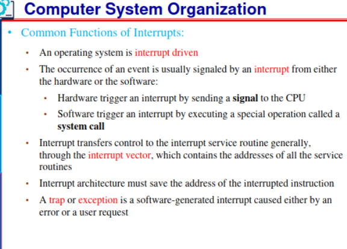

* **Hardware** can trigger an interrupt at any moment, by signalling to the CPU via the System Bus
* Upon Interrupt, the CPU is 'interuppted' and immediately executes the interrupt service, then resumes it's regular computation *(FIGURE 1.3)*
* Interrupts gotta be handled quick as they ALWAYS happen!!
* Generally Low Mem. Address hold Interrupt Service Routines for various devices, this parition in Mem is called **Interrupt Vector**
* Must safe "Before Interruption" State, and restore it, I'm talking Instruction Number & Registers as they might get modified by Interrupt routine

**Implementation Notes**
- CPU has an *"interrupt-request line"* that it checks after each instruction. 
- When a device controller asserts a signal on the interrupt-request line, the CPU detects it.
- CPU reads the interrupt number and jumps to the corresponding **"interrupt-handler routine."** *(Sends NUM of Interrupt Vector, so we know what device)*
- The handler saves state, identifies the cause of the interrupt, processes it, restores state, and returns control to the CPU.
- Device controller initiates an interrupt, CPU handles it via an **interrupt handler**, and the handler clears the interrupt by servicing the device.
- This mechanism allows the CPU to respond to asynchronous events, like a ready device controller.
- Modern operating systems incorporate more advanced interrupt-handling features.

## Note About Modern Interrupt Systems in OS

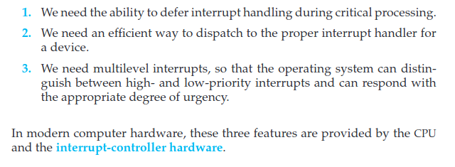  
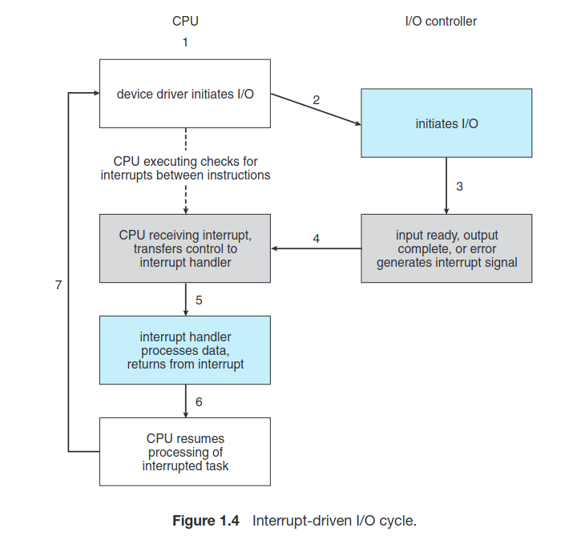

 --- Storage Structure  

**Bootstrap Program** : Loads Operation System upon power-on, is stored in EEPROM *(erasable programmable read-only memory)* as it's NON-volatile !  
- Loads operating system kernel and starts execution
- The kernel then starts providing services to the system and its users.
- ROM or EEPROM also known as **firmware**
- *firmware* isn't changed / rewriten frequently, and shouldn't be anyways...
- *firmware* is commonly used for lighweight & static programs *(iPhone stores serial numbers & hardware info in it)*

### General Storage Notes
- Von Neumann architecture: Fetch, decode, execute, store.
- Memory unit handles a sequence of memory addresses, oblivious to their generation.
- Secondary storage extends main memory for large and permanent data storage.
- Common secondary storage devices: HDDs and NVM (non-volatile mem).
- Secondary storage slower than main memory, vital for computer systems.
- Various storage components: cache, CD-ROM, magnetic tapes, etc.
- Tertiary storage for special purposes, slower and larger.
- All storage systems store and hold data but differ in speed, size, and volatility.

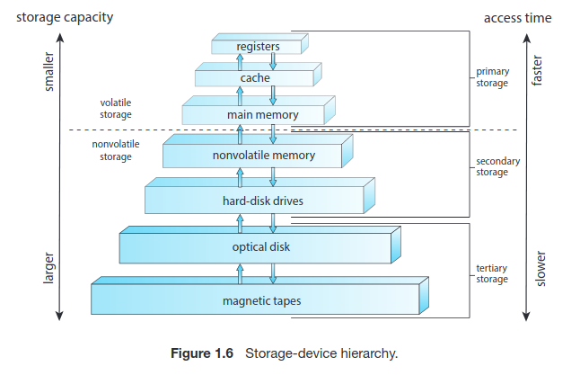

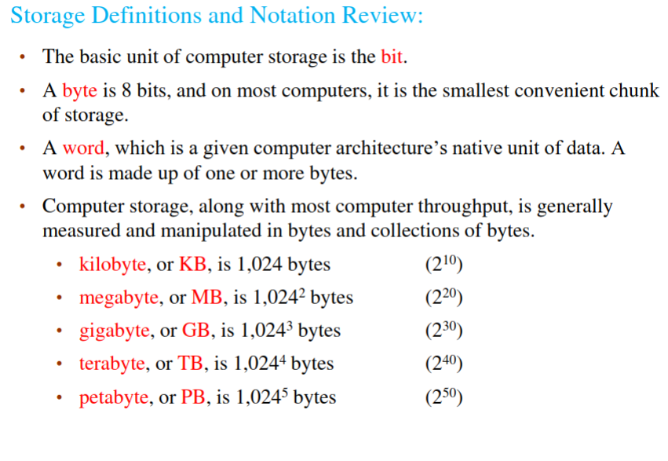

 --- I/O Structure (DMA)  

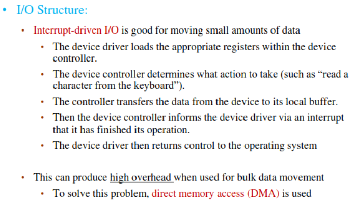

Device Controllers using local buffers and interrupts to the CPU can be slower for complex I/O operations with large data volumes. DMA (Direct Memory Access) is preferred as it allows data to be transferred directly between devices and memory without CPU intervention, resulting in faster data I/O.

### **DMA** | **Direct Memory Access**
- Initially setting up of Buffers, pointers, and counters for the I/O device.
- Device Controller transfers *ENTIRE BLOCK*(s) directly into Memory *(No CPU intervention)*
- Only **one interrupt per block** is sent to Device Driver *(rather than traditional interrupt per byte)*
- While the device controller is performing these operations, the CPU is available to accomplish other work

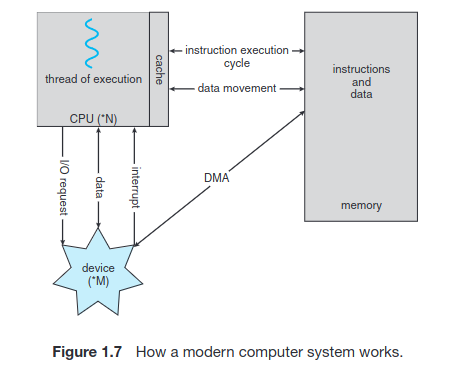

# 1.3

 --- Single-Processor & Multiprocessor Systems  

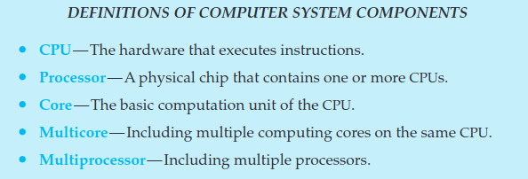

### Single Processor
- Single CPU Core, that manages Disk-controller microprocessor, etc.. 
- Receives a sequence of requests from the main CPU core and implements its own disk queue and scheduling algorithm.
- If there is only one general-purpose CPU with a single processing core, then the system is a single-processor system.

### Multiprocessor Systems: Growing in Use and Importance

Multiprocessor systems, also known as parallel systems or multicore systems, have two or more processors in close communication, sharing computer resources.

Multiple Processors have Single-Core CPU's that often share Computer bus, Memory, Peripherals, Clock and IO Devices *(Occasionally)*

**Advantages of Multiprocessor Systems:**
1. **Increased Throughput:** More work can be done in less time due to parallel processing.
2. **Economy of Scale:** Multiprocessor systems often cost less than equivalent multiple single-processor systems.
3. **Increased Reliability:** They offer graceful degradation or fault tolerance, enhancing system reliability.

---

### Symmetric Multiprocessor (SMP)
- In SMP, each CPU performs all tasks, including OS functions and user processes.
- SMP architecture includes multiple processors, each with its own CPU, registers, and local cache.
- All processors share physical memory via the system bus.
- SMP allows many processes to run simultaneously, equal to the number of CPUs.
- Inefficiencies may occur when one CPU is idle while another is overloaded.
- Sharing data structures can prevent inefficiencies and balance workload among processors.
- This dynamic sharing of processes and resources enhances system performance.

Windows, macOS, and Linux, as well as Android and iOS mobile systems—support multicore SMP systems

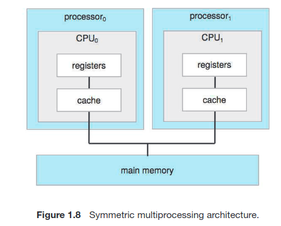

### Multi-Core CPUs
- They are more efficient than multiple chips with single cores
- ON-chip communication *(faster)* > BETWEEN-chip communication
- Uses significantly less power than multiple single-core chips
- Appear to OS as *N* standard processors !

**Dual-Core Design**
- Multi-core Processor Architecture
- CPU Cores share the L2 Cache
- Both CPU Cores have their own registers, and L1 caches
- Common in Industry

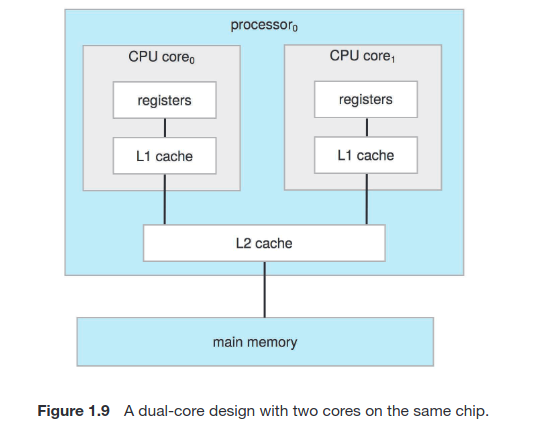

 --- Clustered Systems  

- **Clustered Systems**: Collection of multiple CPUs or nodes, each typically a multicore system.
- **Loosely Coupled**: Nodes are individual systems joined together, often through LAN or faster interconnects like InfiniBand.
- **Shared Storage**: Nodes in a cluster usually share storage resources. *(Using SAN, Storage Area Network)*
- **High Availability**: Aimed at ensuring service continuity even if one or more systems fail.
- **Redundancy**: Achieved by adding redundancy in the system for higher reliability.
- **Cluster Software**: Runs on nodes, enabling them to monitor each other and take over tasks if a node fails.
- **Minimal Service Interruption**: Users experience only brief service interruptions during failover.
- **Graceful Degradation**: Ability to continue providing service with reduced capacity in the event of hardware failure.
- **Fault Tolerance**: Some systems are designed to tolerate any single component failure and continue operating, Fault-tolerant systems have mechanisms for failure detection, diagnosis, and correction.

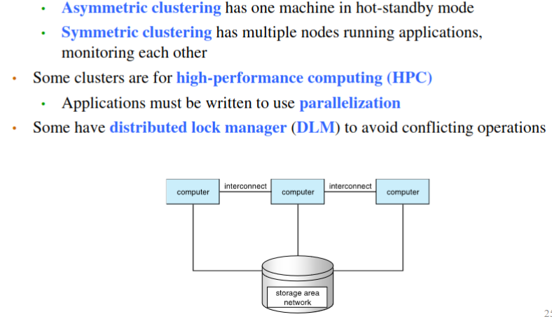

Example: **Oracle Real Application Cluster**
- Version of Oracle's DB designed for parallel cluster
- Each machine runs Oracle, and a layer of software that tracks access to the shared disk
- Each machine has full access to all data in the database
- Implements Access Control & Locking to ensure no conflicting operations **DLM, Distributed Lock Manager**

# 1.4

 --- Operation System Operations  

1. **Bootstrap Program** must locate the operating-system kernel program, and load it into memory
2. Once the kernel is loaded and executing, it can start providing services to the system and its users
- Starts in Kernel Mode (Mode bit == 0)
3. Services provided outside the kernel by system programs are loaded into memory namely **System Daemons**
- These have the same lifetime as the Kernel program itself
- Example: Linux's `systemd` or `systemctl` daemons

4. After the system is fully booted, it waits for events !
- Events are signalled via Interrupt *(90% of the time)*

---

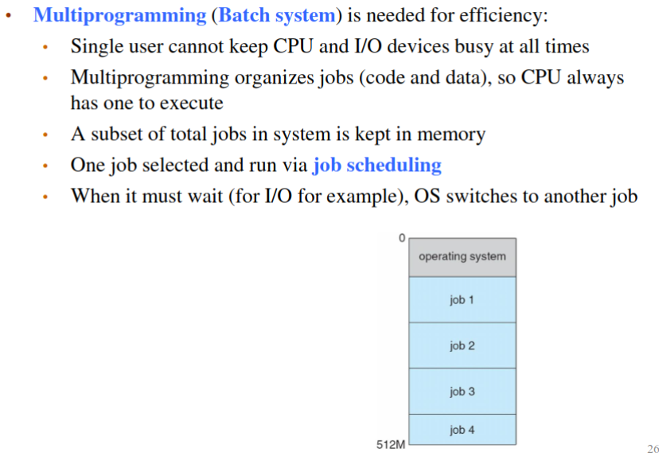

**Multitasking** is a logical extension of **multiprogramming**. In multitasking systems, the CPU executes multiple processes by switching among them, but the switches occur frequently, providing the user with a fast response times. In a **multitasking system**, the operating system must ensure reasonable response time.

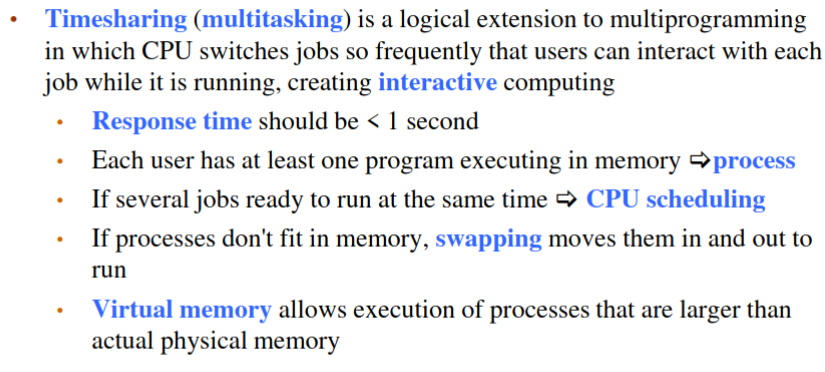

**Virtual Memory** is when a partition of secondary storage is used as RAM

 --- Dual-Mode and Multimode Operations

We must be able to distinguish between the execution of operating-system code and user-defined code.
- Need for 2 different modes; **USER MODE** & **KERNEL MODE** *(aka system mode, priviledged mode,etc.)
- **Mode bit** in hardware determines the mode, kernel (0) , user (1)
- Whenever the operating system gains control of the computer, it is in kernel mode. *(EX; upon exception handle)*

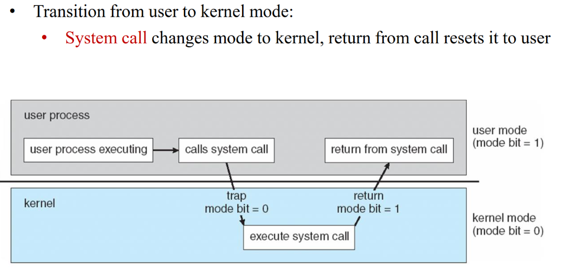

**Priviledged Instructions (only done in Kernel Mode)**
- The instruction to switch to kernel mode is an example of a privileged instruction. 
- Some other examples include I/O control, timer management, and interrupt management, etc...

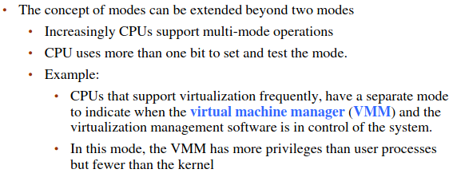

- CPU modes can extend beyond two modes.
- For example, Intel processors have four protection rings, with ring 0 as kernel mode and ring 3 as user mode.
- ARMv8 systems offer seven modes for various purposes.
- In practice, not all available modes are frequently used.

**Virtual Machine Manager (VMM)** is common for CPU's with Virtualization Support
- USER < VMM < KERNEL Modes, so it's not as powerful as Kernel mode, but more powerful than User Mode

**DUAL-MODE** is crucial for greater protection for OS
- *System Calls* are a means of User Programs asking the OS to preform tasks
- *System Calls* are treated as software interrupts
-  A system call usually takes the form of a **trap** to a specific location in the interrupt vector.

## Timer

A timer in the context of operating systems is a mechanism used to ensure that the operating system maintains control over the CPU and prevents user programs from getting stuck in infinite loops or failing to return control. It works by setting a specific time interval, after which an interrupt is triggered. This interval can be fixed or variable.

For example, on Linux systems, the kernel's timer interrupts can be configured with a parameter called HZ, which specifies the frequency of interrupts. An HZ value of 250 means that the timer generates 250 interrupts per second, or one interrupt every 4 milliseconds. These timer interrupts help the operating system regain control periodically.

Linux also uses a variable called "jiffies," which counts the number of timer interrupts since the system was booted. This allows the operating system to keep track of time and manage processes effectively.

In summary, timers ensure that the operating system maintains control by periodically interrupting the CPU to prevent user programs from monopolizing it. Linux, for instance, uses timer interrupts to manage timing and process control.

# 1.5

 --- Process, Memory, Storage & Cache Management

# --- Process Mgmt

**Process** = **Active** Entity, Program IN Execution *(for now, more general later)*
- Unit of work in the system

**Passive** Entities are Programs sitting in FS or RAM, but not executing...  

**Single-Threaded Processes** have 1 program counter, specifying next instruction, so sequential execution.
- 2 Processes might be associated with a program, but are seperate execution sequences

**Multithreaded Processes** have multiple program counters, each pointing to next the instruction for a *given Thread*!

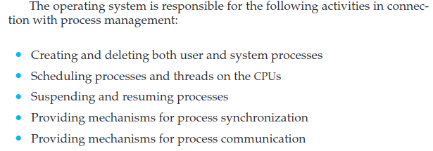

# --- Memory Mgmt

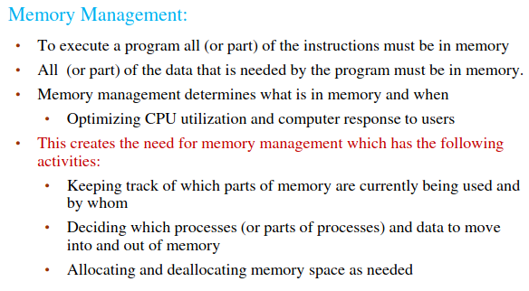

# --- Storage Mgmt

- Operating systems provide a logical view of information storage through files, abstracting from physical storage devices.
- Files represent various types of information, such as programs and data, with different formats and characteristics.
- The OS manages files and directories, including creation, deletion, and access control.
- Mass-storage management is crucial for backing up main memory, with HDDs and NVM devices as primary storage media.
- The OS handles mounting, free-space management, allocation, disk scheduling, partitioning, and protection for secondary storage.
- Tertiary storage, like tape drives and optical media, is used for backups and long-term archival; OS may manage or leave it to applications.
- Efficient storage management is vital for system performance, as secondary storage is frequently used.
- Some functions of tertiary storage management can be handled by the OS, such as media mounting and migration from secondary storage.

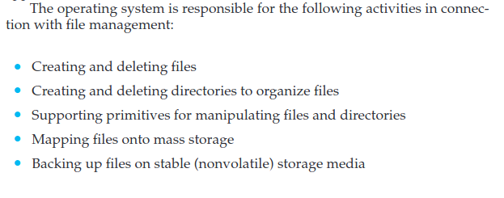

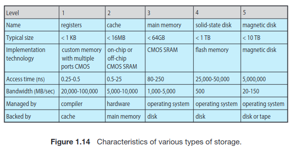

# --- Cache Mgmt

**Programmer / Compiler** implements the register-allocation & replacement algorithms to decide what's in what Register, and what to keep in main Memory.
- LRU Caches are a hardware implementation however, no OS intervention ! *(Set & Block Associative, Direct Mapping)* 
- Without this cache, the CPU would have to wait several cycles while an instruction was fetched from main memory
- In contrast, transfer of data from **disk to memory** is usually controlled by the operating system.

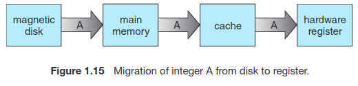

### Multi-processor Environments
- Distributed systems deal with multiple copies (replicas) of data distributed across different locations or servers.
- Maintaining consistency across replicas is vital to prevent data discrepancies.
- Techniques like replication protocols and distributed transactions are used to synchronize updates and ensure consistency in a distributed environment.
- Achieving **cache coherency** in multiprocessor environments is typically a hardware-level issue handled below the operating system level.
- In multitasking environments, care must be taken to ensure that processes obtain the most recent updates to shared data.

# --- I/O Mgmt

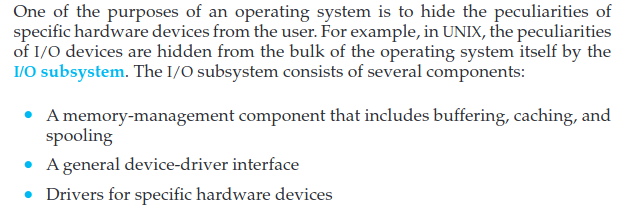

---

# *Kernel Data Structures are Trivial, look at the Slides*

 --- Computing Environments

**Traditional Computing:**
- Stand-alone general-purpose machines.
- Blurred boundaries as systems increasingly interconnect with others, especially via the Internet.
- Portals provide web access to internal systems.
- Network computers *(thin clients)* resemble web terminals.
- Mobile computers, like smartphones and tablets, interconnect via wireless networks.
- Networking is becoming ubiquitous, with even home systems using firewalls for protection.

**Mobile Computing:**
- Involves handheld devices like smartphones and tablets.
- Functional differences compared to traditional laptops include additional OS features *(e.g., GPS, gyroscope).*
- Enables new types of applications like augmented reality.
- Utilizes IEEE 802.11 wireless or cellular data networks for connectivity. *(3G / 5G)*
- Dominated by Apple iOS and Google Android platforms.

**Distributed Computing:**
- Comprises a collection of separate, possibly heterogeneous systems networked together.
- Network serves as a communications path, with **TCP/IP** being the most common protocol.
- Various types of networks, including **LAN, WAN, MAN, and PAN**.
- Network Operating System facilitates features between systems across the network.
- Communication scheme allows systems to exchange messages, creating the illusion of a single system.

**Client-Server:**
- Transition from dumb terminals to smart PCs.
- Many systems now act as servers, responding to requests from clients.
- Compute-server systems provide interfaces for clients to request services (e.g., database access).
- Example: A server running a database that responds to client requests for data.
- File-server systems provide interfaces for clients to store and retrieve files.
- Example: A web server delivering files to clients using web browsers.

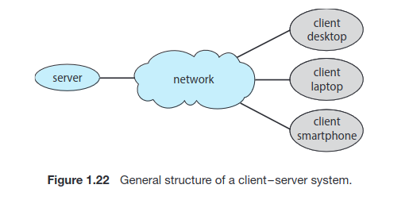

**Peer-to-Peer:**
- An alternative model of distributed systems.
- P2P doesn't distinguish between clients and servers; all nodes are considered peers.
- Each node may act as a client, server, or both.
- Nodes join the P2P network by registering their service with a central lookup service or broadcasting service requests.
- Examples include Napster and Gnutella for file sharing, as well as Voice over IP (VoIP) services like Skype.

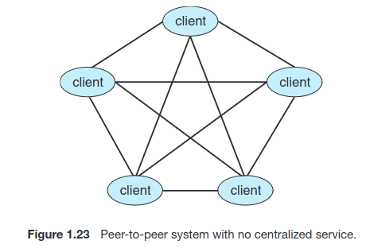

**Cloud Computing:**
- Composed of Traditional OSes (Linux based usually) with VMMs & Cloud Management Tools
- Internet connectivity and traffic routing thru load-balancing & firewall
- Load balancing and other scaling techniques is a characteristic of Cloud Compute

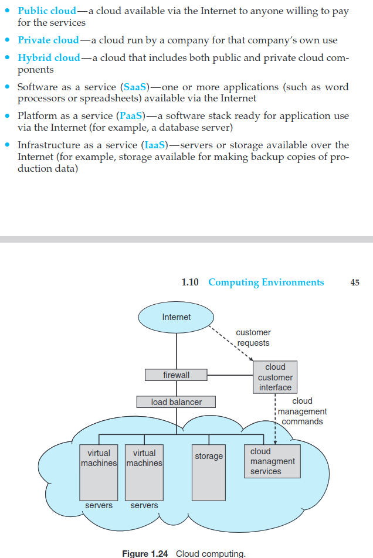

---

## Virtualization

**Virtualization:**
- Enables operating systems to run as applications within other OS environments.
- *Emulation* is used when the source CPU type differs from the target CPU type (e.g., PowerPC to Intel x86).
- *Emulation* is generally the slowest method.
- **Interpretation** is used when computer language is not compiled to native code.
- **Virtualization** involves running OSes natively compiled for the CPU, which can then run guest OSes also natively compiled.
- Example: VMware running Windows 10 guests, each running applications, all on a native Windows 10 host OS.
- Virtual Machine Manager (VMM) provides virtualization services.

**Use Cases for Virtualization:**
- Laptops and desktops running multiple OSes for exploration or compatibility.
- For instance, an Apple laptop running macOS as the host and Windows as a guest.
- Developing applications for multiple OSes without requiring multiple physical systems.
- QA testing applications without the need for multiple systems.
- Executing and managing compute environments within data centers.
- VMM can run natively, where they also serve as the host.
- Specific-purpose hosts like VMware ESX and Citrix XenServer exist, serving as the host.

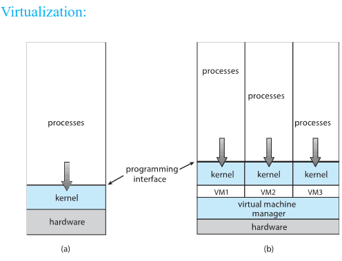

