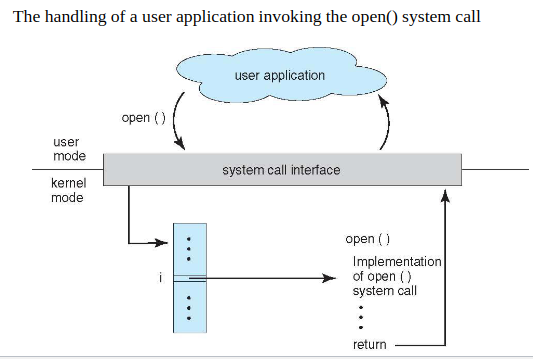

## Operation System Services:

1. **Communications**: Processes exchange information either within the same system or across networked computers. This is achieved through shared memory or message passing.

2. **Error Detection**: The OS constantly monitors and corrects errors in the CPU, memory, I/O devices, and user programs. Actions vary from halting the system to process termination or error reporting.

3. **Resource Allocation**: The OS allocates resources like CPU cycles, memory, and I/O devices to multiple concurrent processes. Allocation strategies consider factors like CPU speed, process needs, and peripheral device management.

4. **Logging**: Tracks resource usage by programs for billing or usage statistics. Helps system administrators in system reconfiguration for improved services.

5. **Protection and Security**: Involves controlling access to system resources and preventing process interference. Security measures include user authentication and defending against external access, especially in networked environments.

---

### System Calls

- System-call interface maintains a table indexed according to these numbers *(Interrupt Vector Table?)*

- The system call interface invokes the intended system call in OS kernel and returns status of the system call and any return values needed. *( getpid() returns *PID of process )*

- Parameters placed, or pushed, onto the stack by the program and popped off the stack by the operating system. *(Low level Param Passing, how it works)*
    - Block and stack methods do not limit the number or length of parameters being passed

#### Parameter Passing via Table *(via Register Table)*

---

# System Calls Overview

System calls provide an essential interface between a process and the operating system. They can be grouped into six major categories:

## 1. Process Control

These calls are related to the management of processes, including their creation, execution, and termination.

- **Example Calls:**
  - `fork()`: Creates a new process.
  - `exec()`: Replaces the current process image with a new process image.
  - `exit()`: Terminates a process.
  - `wait()`: Waits for a process to change state.

## 2. File Management

These system calls are used for file operations like creation, deletion, reading, and writing.

- **Example Calls:**
  - `open()`: Opens a file descriptor.
  - `read()`: Reads data from a file into a buffer.
  - `write()`: Writes data from a buffer into a file.
  - `close()`: Closes a file descriptor.

## 3. Device Management

Device management calls are used for requesting and releasing devices, and for reading, writing, or repositioning a device.

- **Example Calls:**
  - `ioctl()`: Control device.
  - `read()`, `write()`: Read from or write to a device.

## 4. Information Maintenance

These calls involve managing system and process information.

- **Example Calls:**
  - `getpid()`: Returns the process ID.
  - `getuid()`: Returns the user ID of the calling process.
  - `time()`: Get system time.
  - `sysinfo()`: Returns information about the system.

## 5. Communications

Communication calls are used for interprocess communication (IPC) and network communication.

- **Example Calls:**
  - `socket()`, `bind()`, `listen()`, `accept()`: Used for network communication.
  - `msgget()`, `msgsnd()`, `msgrcv()`: For message queue operations.
  - `shmget()`, `shmat()`, `shmdt()`: For shared memory operations.

## 6. Protection

These calls are related to security and access permissions.

- **Example Calls:**
  - `chmod()`: Change the permissions of a file.
  - `chown()`: Change the owner of a file.
  - `umask()`: Set the file mode creation mask.

---

The C standard library does abstract away system calls. The C standard library provides a set of functions that are implemented on top of the operating system's system calls, offering a higher-level interface for programmers to interact with the operating system. This abstraction allows programmers to write portable code that can run on various operating systems without needing to directly use system-specific calls.

*For example:*

- **File Operations:** The C standard library offers functions such as `fopen()`, `fclose()`, `fread()`, and `fwrite()` for file manipulation. These functions internally use system calls like `open()`, `close()`, `read()`, and `write()` provided by the operating system but abstract away the complexity and details of these system calls.

---

