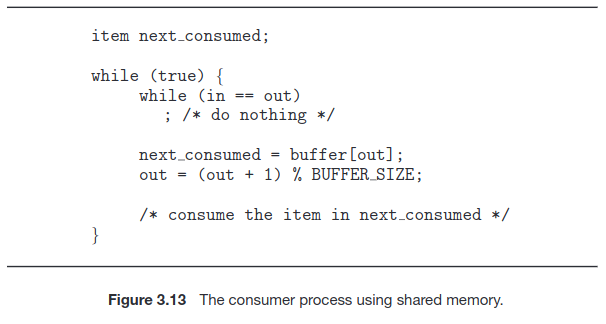

# Processes

- *Process*: Unit of Work in a Modern Computer System, __Program in Execution__
- *Job* Term is of Historical significance, as it was developed during a time when the major activity of operating systems was job processing.
    - *Job Scheduling* is still a used term

## Memory Layout of Process

* Text & Data Section are always *FIXED SIZE*
* "Activation Record" contains fn. params, local variables, etc.. upon Function Call.
* **Stack Goes Up** , **Heap Goes Down** but OS ensures they don't overlap.
* **Note:** that a process can itself be an execution environment for other code. The Java programming environment provides a good example, the JVM.

 

 

 

## Process Control Block *(AKA: Task Control Block)*

- **Process State**: New, Ready, Running, Waiting, Halted...
- **Program Counter**: Next Address of Instruction for Execution, for that specific Process
- **CPU Registers**: Vary in number and type, depending on the
computer architecture. They include accumulators, index registers, stack pointers, and general-purpose registers, plus any condition-code information.
- **CPU Scheduling Info**: Process Priority, Pointers to Scheduling Queues, etc...
- **Memory Management Info**: This information may include such
items as the value of the base and limit registers and the page tables, or the segment tables, etc...

- **Accounting information**: This information includes the amount of CPU and real time used, time limits, account numbers, job or process numbers, and so on...

- **I/O status information**: This information includes the list of I/O devices allocated to the process, a list of open files, and so on.

## Process Scheduling

 

 

The number of processes currently in Memory is known as **Degree of Multi-Programming**. 

- **I/O Bound** Processes spend more time doing I/O Computations
- **CPU-Bound** Processes doesn't generate that many I/O Requests, but uses more time doing general compute.

## Scheduling Queues

- **Ready Queue** Processes that are ready for executing, and are just in line to be executed. *(Queues are Linked Lists, Each PCB is pointing to the next PCB in the queue)*

- **Wait Queue** Let's say a Process is accessing I/O *(Something from Hard-disk)* it needs to Wait for that info to arrive, so it's placed in the Wait Queue, once that Info comes back, we can push it back to the end of the **Ready Queue** again, for execution

---

## CPU Scheduling

1. **CPU Scheduling**: The CPU scheduler selects processes from the ready queue to allocate CPU cores, frequently switching between them. This ensures that both I/O-bound processes, which need short CPU bursts, and CPU-bound processes, which require longer CPU usage, are managed effectively.

2. **Regular Execution Checks**: The scheduler actively manages process execution, typically checking every few milliseconds, to ensure efficient CPU usage. It may forcibly remove a CPU from a process to allow another process to run, maintaining a balance between different types of processes.

3. **Swapping Mechanism**: Operating systems may use swapping, where a process is temporarily removed from memory and saved to disk to free up memory resources. This process can later be "swapped in" and its execution continued. Swapping is used particularly when memory is overcommitted.

## Context Switching

**Context-switch** times are highly dependent on hardware support. For instance, some processors provide multiple sets of registers. A context switch here simply requires changing the pointer to the current register set.

 

**When an interrupt occurs:**
* The system needs to save the current context of the process running on the CPU core so that it can restore that context when its processing is done. **STATE SAVE**

* Essentially suspending (**STATE SAVE**) the process and then Resuming it **(STATE RESTORE / Reload)**.

## Operations on Processes

### Example for Knowing who is Parent, who is Child Proc.

 

- **Note** If the Parent Forks, the `pid_t pid` value will be the *PID* of the Child !

Process is Terminated once it finishes all it's Statements, it can call the `exit(<STATUS>)` sys.call to explicitly tell the OS: "I'm done, delete me"
- generally `exit(1)` Indicates an **Error**, 
- `exit(0)` indicates that the execution was **OK**.
 

**Cascading Termination** is when systems do not allow a child to exist if its parent has terminated.

### WAIT()

- A parent process may wait for the termination of a child process by using the `wait()` system call. 

 

 

- The `wait()` system call is passed a parameter that allows the parent to obtain the exit status of the child.

**ZOMBIE Processes**: A child process that has terminated, but whose parent has not yet called `wait()` , generally children briefly exists as zombies, between the time they are "Done" and the time `wait()` is called by parent.

 

**ORPHAN Processes**: A child process, in which their parent has died *(terminated)* before ever calling `wait()` so now the Child exists without the Parent, hench the name.

---

---

## Interprocess Communications *( I.P.C )*

* **Shared Memory** Allows processes to systematically share info via a Shared Memory Buffer, and so they need individually coordinate which addresses to use. *(But it's the same Shared Mem)*

    - Faster than message passing, since message-passing systems are typically implemented using system calls and thus require the more time-consuming task of kernel intervention approach.

    - Once Established, all accesses are treated
as routine memory accesses, and no assistance from the kernel is required.

* **Message Passing** Has Messaging System, with a Message queue, 
    - Is useful for exchanging smaller amounts of data, because no conflicts need be avoided. 

    - Is easier to implement in a distributed system than shared memory.

---

## IPC in Shared Memory Systems:

1. **Establishment of Shared Memory**: Processes must establish a region of shared memory within the address space of the process creating the shared-memory segment.

2. **Attachment to Address Space**: Other processes wishing to use the shared-memory segment must attach it to their own address space.

3. **Bypassing Normal Restrictions**: Normally, operating systems restrict processes from accessing each other's memory. Shared memory requires processes *(2 or more)* to agree to remove this restriction for communication.

4. **Data Exchange Mechanism**: Processes communicate by reading and writing data in the shared areas, with the form and location of data determined by the processes themselves, not the operating system.

5. **DANGEROUS: Concurrent Access Management**: Processes are responsible for managing concurrent access, ensuring they do not write to the same location simultaneously. *(CAN CAUSE MAJOR ISSUES)*

## Producer & Consumer Problem

**One solution to the producer–consumer problem:** Uses shared memory. To allow producer and consumer processes to run concurrently, we must have available a buffer of items that can be filled by the producer and emptied by the consumer.

- The producer and consumer must be synchronized, so that the consumer does not try to consume an item that has not yet been produced.

**Unbounded buffer** 
- No practical limit on the size of the buffer. 
- The consumer may have to wait for new items..
- The producer can always produce new items.

**Bounded buffer**
- Assumes a fixed buffer size. 
- The consumer must wait if this buffer is empty. 
- The producer must wait if the buffer is full.

### The shared buffer is implemented as a circular array with two logical pointers: **in and out.**

 

 

### Understanding `in` and `out` in Circular Buffer:

- **Circular Buffer Concept**: The shared buffer is implemented as a circular array. This means that the array is treated as if it loops back around to the start once it reaches the end.

- **Pointers `in` and `out`**:
  - **`IN` Pointer**: Indicates the next free position in the buffer where a new item can be placed by the producer.
  - **`OUT` Pointer**: Points to the first full position in the buffer, i.e., the next item that the consumer can consume.

### Buffer States:

- **Buffer Empty Condition**: `in == out`
  - When the `IN` pointer is equal to the `OUT` pointer, it means no items are in the buffer to consume, indicating the buffer is empty.

- **Buffer Full Condition**: `((in + 1) % BUFFER_SIZE) == out`
  - This condition checks if advancing the `IN` pointer by one position (while considering the circular nature of the buffer) would make it equal to the `OUT` pointer. If true, it means there is no free space left for the producer to add a new item, indicating the buffer is full.

### Example with BUFFER_SIZE = 5:

- Assume `BUFFER_SIZE` is 5 (positions are 0 to 4).
- **Scenario for Full Buffer**:
  - Let's say `in` is at position 4 (the last position in the buffer).
  - To check if the buffer is full, we calculate `(in + 1) % BUFFER_SIZE`.
  - This calculation becomes `(4 + 1) % 5`, which equals 0.
  - If `out` is also at position 0, this condition matches, indicating the buffer is full.

- **Scenario for Empty Buffer**:
  - If both `in` and `out` are at the same position, say both are at position 2, there are no items in the buffer, indicating it's empty.

This system allows for efficient and synchronized management of the buffer by producers *(adding items)* and consumers *(removing items)* without conflicts.

### Producer & Consumer Code for IPC Shared Memory

 

---

## IPC in Message-Passing Systems:

TODO: page 127 of os book

Mach mem passing?

---

## POSIX Examples:

TODO: 

---

## Communication in Client– Server Systems

Todo

---
