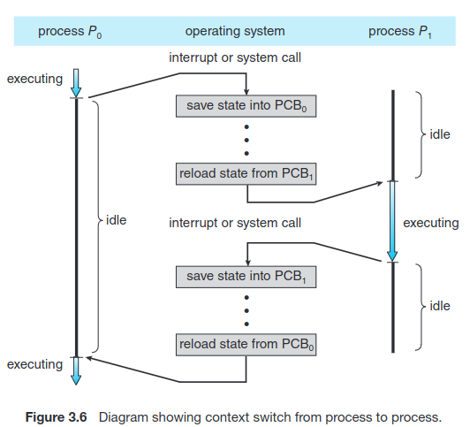

# Processes

- *Process*: Unit of Work in a Modern Computer System, __Program in Execution__
- *Job* Term is of Historical significance, as it was developed during a time when the major activity of operating systems was job processing.
    - *Job Scheduling* is still a used term

## Memory Layout of Process


* Text & Data Section are always *FIXED SIZE*
* "Activation Record" contains fn. params, local variables, etc.. upon Function Call.
* **Stack Goes Up** , **Heap Goes Down** but OS ensures they don't overlap.
* **Note:** that a process can itself be an execution environment for other code. The Java programming environment provides a good example, the JVM.

<br>


<br>


<br>


## Process Control Block *(AKA: Task Control Block)*


- **Process State**: New, Ready, Running, Waiting, Halted...
- **Program Counter**: Next Address of Instruction for Execution, for that specific Process
- **CPU Registers**: Vary in number and type, depending on the
computer architecture. They include accumulators, index registers, stack pointers, and general-purpose registers, plus any condition-code information.
- **CPU Scheduling Info**: Process Priority, Pointers to Scheduling Queues, etc...
- **Memory Management Info**: This information may include such
items as the value of the base and limit registers and the page tables, or the segment tables, etc...

- **Accounting information**: This information includes the amount of CPU and real time used, time limits, account numbers, job or process numbers, and so on...

- **I/O status information**: This information includes the list of I/O devices allocated to the process, a list of open files, and so on.

## Process Scheduling


<br>


<br>

The number of processes currently in Memory is known as **Degree of Multi-Programming**. 

- **I/O Bound** Processes spend more time doing I/O Computations
- **CPU-Bound** Processes doesn't generate that many I/O Requests, but uses more time doing general compute.

## Scheduling Queues


- **Ready Queue** Processes that are ready for executing, and are just in line to be executed. *(Queues are Linked Lists, Each PCB is pointing to the next PCB in the queue)*

- **Wait Queue** Let's say a Process is accessing I/O *(Something from Hard-disk)* it needs to Wait for that info to arrive, so it's placed in the Wait Queue, once that Info comes back, we can push it back to the end of the **Ready Queue** again, for execution

---

## CPU Scheduling

1. **CPU Scheduling**: The CPU scheduler selects processes from the ready queue to allocate CPU cores, frequently switching between them. This ensures that both I/O-bound processes, which need short CPU bursts, and CPU-bound processes, which require longer CPU usage, are managed effectively.

2. **Regular Execution Checks**: The scheduler actively manages process execution, typically checking every few milliseconds, to ensure efficient CPU usage. It may forcibly remove a CPU from a process to allow another process to run, maintaining a balance between different types of processes.

3. **Swapping Mechanism**: Operating systems may use swapping, where a process is temporarily removed from memory and saved to disk to free up memory resources. This process can later be "swapped in" and its execution continued. Swapping is used particularly when memory is overcommitted.

## Context Switching

**Context-switch** times are highly dependent on hardware support. For instance, some processors provide multiple sets of registers. A context switch here simply requires changing the pointer to the current register set.



<br>

**When an interrupt occurs:**
* The system needs to save the current context of the process running on the CPU core so that it can restore that context when its processing is done. **STATE SAVE**

* Essentially suspending (**STATE SAVE**) the process and then Resuming it **(STATE RESTORE / Reload)**.

## Operations on Processes


### Example for Knowing who is Parent, who is Child Proc.


<br>


- **Note** If the Parent Forks, the `pid_t pid` value will be the *PID* of the Child !

Process is Terminated once it finishes all it's Statements, it can call the `exit(<STATUS>)` sys.call to explicitly tell the OS: "I'm done, delete me"
- generally `exit(1)` Indicates an **Error**, 
- `exit(0)` indicates that the execution was **OK**.
<br>


**Cascading Termination** is when systems do not allow a child to exist if its parent has terminated.


### WAIT()

- A parent process may wait for the termination of a child process by using the `wait()` system call. 

<br>


<br>

- The `wait()` system call is passed a parameter that allows the parent to obtain the exit status of the child.

**ZOMBIE Processes**: A child process that has terminated, but whose parent has not yet called `wait()` , generally children briefly exists as zombies, between the time they are "Done" and the time `wait()` is called by parent.

<br>

**ORPHAN Processes**: A child process, in which their parent has died *(terminated)* before ever calling `wait()` so now the Child exists without the Parent, hench the name.

---


---

## Interprocess Communications *( I.P.C )*


* **Shared Memory** Allows processes to systematically share info via a Shared Memory Buffer, and so they need individually coordinate which addresses to use. *(But it's the same Shared Mem)*

    - Faster than message passing, since message-passing systems are typically implemented using system calls and thus require the more time-consuming task of kernel intervention approach.

    - Once Established, all accesses are treated
as routine memory accesses, and no assistance from the kernel is required.

* **Message Passing** Has Messaging System, with a Message queue, 
    - Is useful for exchanging smaller amounts of data, because no conflicts need be avoided. 

    - Is easier to implement in a distributed system than shared memory.


---

## IPC in Shared Memory Systems:

1. **Establishment of Shared Memory**: Processes must establish a region of shared memory within the address space of the process creating the shared-memory segment.

2. **Attachment to Address Space**: Other processes wishing to use the shared-memory segment must attach it to their own address space.

3. **Bypassing Normal Restrictions**: Normally, operating systems restrict processes from accessing each other's memory. Shared memory requires processes *(2 or more)* to agree to remove this restriction for communication.

4. **Data Exchange Mechanism**: Processes communicate by reading and writing data in the shared areas, with the form and location of data determined by the processes themselves, not the operating system.

5. **DANGEROUS: Concurrent Access Management**: Processes are responsible for managing concurrent access, ensuring they do not write to the same location simultaneously. *(CAN CAUSE MAJOR ISSUES)*

## Producer & Consumer Problem

**One solution to the producer–consumer problem:** Uses shared memory. To allow producer and consumer processes to run concurrently, we must have available a buffer of items that can be filled by the producer and emptied by the consumer.

- The producer and consumer must be synchronized, so that the consumer does not try to consume an item that has not yet been produced.

**Unbounded buffer** 
- No practical limit on the size of the buffer. 
- The consumer may have to wait for new items..
- The producer can always produce new items.

**Bounded buffer**
- Assumes a fixed buffer size. 
- The consumer must wait if this buffer is empty. 
- The producer must wait if the buffer is full.

### The shared buffer is implemented as a circular array with two logical pointers: **in and out.**

<br>


<br>

### Understanding `in` and `out` in Circular Buffer:

- **Circular Buffer Concept**: The shared buffer is implemented as a circular array. This means that the array is treated as if it loops back around to the start once it reaches the end.

- **Pointers `in` and `out`**:
  - **`IN` Pointer**: Indicates the next free position in the buffer where a new item can be placed by the producer.
  - **`OUT` Pointer**: Points to the first full position in the buffer, i.e., the next item that the consumer can consume.

### Buffer States:

- **Buffer Empty Condition**: `in == out`
  - When the `IN` pointer is equal to the `OUT` pointer, it means no items are in the buffer to consume, indicating the buffer is empty.

- **Buffer Full Condition**: `((in + 1) % BUFFER_SIZE) == out`
  - This condition checks if advancing the `IN` pointer by one position (while considering the circular nature of the buffer) would make it equal to the `OUT` pointer. If true, it means there is no free space left for the producer to add a new item, indicating the buffer is full.

### Example with BUFFER_SIZE = 5:

- Assume `BUFFER_SIZE` is 5 (positions are 0 to 4).
- **Scenario for Full Buffer**:
  - Let's say `in` is at position 4 (the last position in the buffer).
  - To check if the buffer is full, we calculate `(in + 1) % BUFFER_SIZE`.
  - This calculation becomes `(4 + 1) % 5`, which equals 0.
  - If `out` is also at position 0, this condition matches, indicating the buffer is full.

- **Scenario for Empty Buffer**:
  - If both `in` and `out` are at the same position, say both are at position 2, there are no items in the buffer, indicating it's empty.

This system allows for efficient and synchronized management of the buffer by producers *(adding items)* and consumers *(removing items)* without conflicts.


### Producer & Consumer Code for IPC Shared Memory


<br>


---

## IPC in Message-Passing Systems:

Commands:
- **send**(message)
- **receive**(message)
- Below code in Producer / Consumer format


### Direct Communication
In direct communication, processes must name each other explicitly to send and receive messages. 

- **Properties**:
  - Links are automatically established.
  - A link is associated with exactly one pair of communicating processes.
  - There is exactly one link between each pair of processes.
  - The link is usually bi-directional.

- **C Code Example**:
  ```c
  void send_message_to_process(Process *P, Message message) {
      // Send a message to process P
  }

  Message receive_message_from_process(Process *Q) {
      // Receive a message from process Q
      return message;
  }
  ```

### Indirect Communication
In indirect communication, messages are sent and received from mailboxes or ports. 

- **Properties**:
  - Links are established if processes share a common mailbox.
  - A link can be associated with many processes.
  - Each pair of processes may share several communication links, each corresponding to one mailbox.
  - The link can be unidirectional or bi-directional.

- **C Code Example**:
  ```c
  void send_message_to_mailbox(Mailbox *A, Message message) {
      // Send a message to mailbox A
  }

  Message receive_message_from_mailbox(Mailbox *A) {
      // Receive a message from mailbox A
      return message;
  }
  ```

### Blocking and Non-Blocking Communication

1. **Blocking Communication** (Synchronous)
   - **Blocking Send**: The sender is blocked until the message is received.
   - **Blocking Receive**: The receiver is blocked until a message is available.
   - **C Code Example**:
     ```c
     void send_message_blocking(Sender *sender, Message message) {
         // Blocking send implementation
         // Sender is blocked until the message is received
     }

     Message receive_message_blocking(Receiver *receiver) {
         // Blocking receive implementation
         // Receiver is blocked until a message is available
         return message;
     }
     ```

2. **Non-Blocking Communication** (Asynchronous)
   - **Non-Blocking Send**: The sender sends the message and resumes operation.
   - **Non-Blocking Receive**: The receiver receives either a valid message or a null message.
  - **C Code Impl. POSIX for non-blocking**:
Sure, I can modify the implementation to use processes instead of threads, and simplify it. In this case, I'll use `fork()` to create a child process for the non-blocking send and receive operations. Here's a shorter and process-based version:

### Non-Blocking Communication Example using Processes

```c
#include <stdio.h>
#include <unistd.h>
#include <string.h>
#include <sys/wait.h>

void send_message_non_blocking(const char *msg) {
    // Simulate sending message (non-blocking)
    printf("Sender: Sending message: %s\n", msg);
}

void receive_message_non_blocking() {
    // Simulate checking for a message (non-blocking)
    printf("Receiver: Checking for messages...\n");
}

int main() {
    pid_t pid = fork();

    if (pid == 0) {
        // Child process - Receiver
        receive_message_non_blocking(); //It's possible to receive a null msg in Non-blocking

    } else if (pid > 0) {
        // Parent process - Sender
        const char *msg = "Hello from Parent";
        send_message_non_blocking(msg);

        // Non-blocking, so Keep doing other things ...

        wait(NULL);  // Wait for child process to finish
    } else {
        // Fork failed
        printf("Fork failed!\n");
        return 1;
    }

    return 0;
}
```

In this example:
- The `fork()` system call is used to create a new process.
- The parent process (sender) calls `send_message_non_blocking` to simulate sending a message.
- The child process (receiver) calls `receive_message_non_blocking` to simulate checking for messages.
- The `wait(NULL)` in the parent process ensures that the parent waits for the child process to complete its execution.

This is a simplified demonstration. In an actual implementation, you would use inter-process communication mechanisms *(like pipes, shared memory, message queues, or sockets)* to facilitate message passing between processes. The non-blocking nature is simulated by the fact that the sender and receiver are in separate processes and do not wait for each other to complete their actions.

---

## Buffering

**RENDEZVOUS**: 
- If both send and receive are blocking, we have a *rendezvous* between the sender and the receiver.


- **Zero Capacity**: No buffer, waits for rendezvous.
- **Bound Capacity**: `FifoQueue queue = new FifoQueue[10]` *Queue with 10 elms capacity*, Sender waits if full, for reciever to Pop off queue
- **Unbounded Capacity**: `FifoQueue queue = new FifoQueue[Unlimited]` *Unlimited space, sender Never Waits, just adds to queue*

---

## POSIX Examples:


*Output of Posix Kirk & Spock Example, I re-wrote it for Rick and Morty xD*


---

## Communication in Client– Server Systems

Pipes, Sockets, In Java aswell, Systems Programming Redundancy, Go Review those notes lmao

---

# Exercise Questions:

**NOTE:** Forks will only call Forks below it, so when F1 is called, that child process will only fork F2, and F3

## Q1. How many processes are created?

```c
#include <stdio.h>
#include <unistd.h>

  int main(){
    /* fork a child process */
    fork(); //* F1
    /* fork another child process */
    fork(); //* F2
    /* and fork another */
    fork(); //* F3
    return 0;
  }
```

- **Main Thread:** (1)
  - **First fork (FF) from Main:** Creates two children, F2 and F3. (1)
    - **1st Child of FF:** Creates one child. (1)
      - **Child of Child of First (F3):** No further calls. (1)
    - **2nd Child of FF:** No further calls. (1)
  - **Second fork (SF) from Main:** Creates one child, F3. (1)
    - **1st Child of SF:** No further calls. (1)
  - **Third fork (TF) from Main:** No further calls. (1)


* **ANSWER** : 8 Processes Created

---

Here's a key point: When `fork()` is called, the entire state of the process, including the value of the loop control variable, is copied into the child process. So, at the point of fork, both the parent and the child have the same value for **i**.

## Q2. How many processes are created?

```c
#include <stdio.h>
#include <unistd.h>
int main(){
  int i;
  
    for (i = 0; i < 4; i++)
      fork();
  
  return 0;
}
```

Let's break it down, *(Also the code below i've added a print, so we can see the actual number of execs)*

```c
for(i=0;i<4;i++)
{
    printf("FORKED: [%d] [%d] i=%d\n", getppid(), getpid(), i);
    fork();
}
```

is equivalent to:

```c
fork();
fork();
fork();
fork();
```

We can also use `2^n-1` in this case **n=3**, so 2^3-1 = 15

### Answer: 15

### Intuitive / Visual Way


## Q3. What will be the output at LINE A ?

```c
#include <sys/types.h>
#include <stdio.h>
#include <unistd.h>
int value = 5;
int main(){
  pid_t pid;
  pid = fork();

  if (pid == 0) { /* child process */
    value += 15;
    return 0;
  }

  else if (pid > 0) { /* parent process */
    wait(NULL);
    printf("PARENT: value = %d", value); /* LINE A */
    return 0;
  }
}
```

So if pid == 0, it's the child process, but initial you'll fork, and get the PID of the child, then pid > 0 is true, and value is defined as 5 outside main fn, therefore it prints `value = 5`

## Q4. How many unique processes will be created? Assuming that the system will generate process IDs sequentially starting from 1000. what will be the output on the screen?


Note for this Question:

* `wait(NULL)` will block the parent process until any of its children has finished. 
* If the child terminates before the parent process reaches `wait(NULL)` then the child process turns to a **zombie process** until its parent waits on it and its released from memory.

```c
#include <sys/types.h>
#include <stdio.h>
#include <unistd.h>
#include <sys/wait.h>

int num = 15;
int main(){
  
  pid_t pid1, pid2;

  pid1 = fork(); /* assume fork not failed, if failed then pid1=-1*/

  if (pid1 == 0) { /* child process */
    num += 10;
    printf("PID = %d %d \n", (int)getpid(), num);
  }
  else { /* parent process */
    num -= 5;
    wait(NULL);
    printf("PID = %d %d \n", (int)getpid(), num);
  }

  pid2 = fork();
  if (pid2 == 0) { /* child process */
    num += 20;
    printf("PID = %d %d \n", (int)getpid(), num);
  }
  else { /* parent process */
    num -= 15;
    wait(NULL);
    printf("PID = %d %d \n", (int)getpid(), num);
  }

return 0;
}
```


**Answer**
```
PID = 1001, 25
PID = 1002, 45
PID = 1001, 10
PID = 1000, 10
PID = 1003, 30
PID = 1000, -5
```

## Q5 How many unique processes will be created? Assuming that the system will generate process IDs sequentially starting from 1000. what will be the output on the screen?

```c
#include <sys/types.h>
#include <stdio.h>
#include <unistd.h>
#include <sys/wait.h>

int num = 20;
int main(){

  pid_t pid1, pid2;
  int status =0;

  pid1 = fork(); /* assume fork not failed, if failed then pid1=-1*/
  printf("Process ID = %d %d \n", (int)getpid(), num+5);
  
  if (pid1 == 0) { /* child process */
    num += 40;
    printf("Process ID = %d %d \n", (int)getpid(), num);
  
  } else { /* parent process */
    num -= 10;
    wait(NULL);
    printf("Process ID = %d %d \n", (int)getpid(), num);
  }

return 0;
}
```


* Ran code, view in /L3_codes : q5_forker.c


**ANSWER**: 2 Unique Procceses created, output shown above

---

# Q6. How many unique processes will be created? Assuming that the system will generate process IDs sequentially starting from 1000. what will be the output on the screen?

TODO

```c
int num = 20;
int main(){
pid_t pid1, pid2;
int status =0;
pid1 = fork(); /* assume fork not failed, if failed then pid1=-1*/
printf("Process ID = %d %d \n", (int)getpid(), num+5);
pid2 = fork();
printf("Process ID = %d %d \n", (int)getpid(), num +10);
if (pid2 == 0) { /* child process */
num += 40;
printf("Process ID = %d %d \n", (int)getpid(), num);
}
else { /* parent process */
num -= 10;
wait(NULL);
printf("Process ID = %d %d \n", (int)getpid(), num);
}
return 0;
}
```