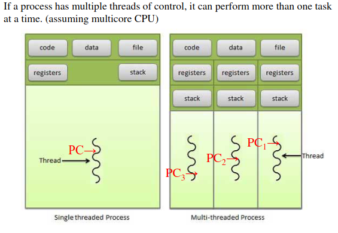
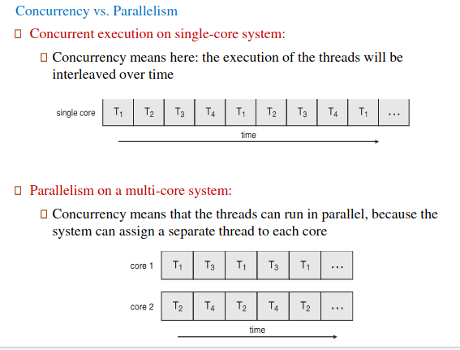
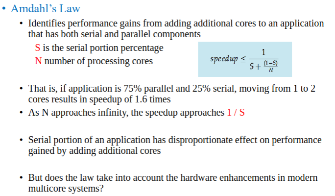
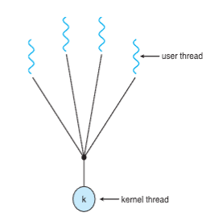
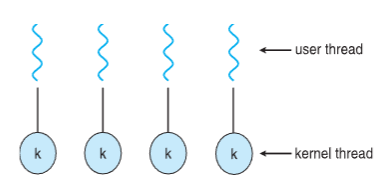
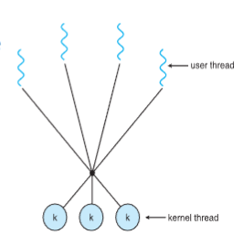
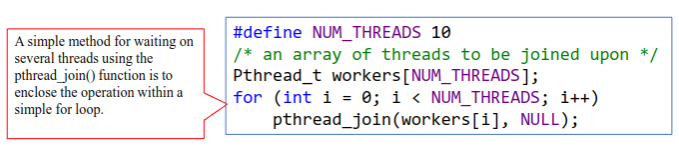

# Threading & Concurrency

<details>
<summary style="font-size: 30px; font-weight: 500; cursor: pointer;"> Threading & Concurrency  </summary>


### Thread Unit Holds:
* Thread ID
* Program Counter (PC)
* Register Set
* Stack

When Other Threads belong to the same Process, it shares **code** & **data** sections, aswell as stuff like Open files, signals, etc...



**Important**: It only makes a real difference for Multi-core, as if Threads split up 1 core, then it's *NOT* a performance boost !!!

# Processes V. Threads

| Aspect                          | Process                                        | Thread                                      |
|---------------------------------|------------------------------------------------|---------------------------------------------|
| Weight                          | Heavyweight, resource-intensive                | Lightweight, uses fewer resources          |
| Memory Sharing                  | Sharing memory is complex, often requires additional management schemes | Threads in the same process can easily share memory; separate allocation is rare |
| Creation and Execution Overhead | Creating, executing, and switching processes is time-consuming | Creating, executing, and switching threads is faster |
| Coupling and Resource Sharing   | Loosely coupled, limited resource sharing      | Tightly coupled, extensive resource sharing possible |
| Communication                   | Complex, often requires system calls           | Simpler and more efficient, as threads can directly communicate through shared memory |
| Isolation                       | Processes are isolated, reducing the risk of one process affecting another | Threads share the same process space, so a fault in one thread can affect others |
| Resource Allocation             | Each process has its own memory and file resources | Threads share resources of their parent process, leading to efficient resource usage |
| Synchronization                 | Inter-process synchronization is more complex due to separate memory spaces | Easier within the same process due to shared memory, but requires careful handling to avoid issues like deadlocks |
| Scalability                     | Less scalable due to higher overheads in creating and managing processes | More scalable in multi-threaded applications, can efficiently use multi-core processors |
| Use Cases                       | Suitable for applications requiring isolation and security, like database management systems | Ideal for tasks requiring frequent communication or shared resources, like web servers |

* Most modern applications are typically multithreaded !
    - Single Process, Several Threads of Control

### Multithreaded Programming in Applications
- **Example: Word Processor**
  - Multiple tasks within a word processor can be handled by separate threads, such as:
    - Updating display
    - Fetching data
    - Performing spell checking
    - Answering network requests
- **Key Points**
  - Process creation is heavy-weight, while thread creation is light-weight.
  - Threads simplify code and increase efficiency.
  - Kernels are generally multithreaded, handling tasks like device management, memory management, and interrupt handling.

### Benefits of Multithreaded Programming
1. **Responsiveness**
   - Allows continued execution if part of the process is blocked.
   - Crucial for user interfaces.
   - Example: In a single-threaded application, a time-consuming operation initiated by a user action (like clicking a button) can make the application unresponsive.

2. **Resource Sharing**
   - Threads share resources of their parent process, easier than shared memory or message passing between processes.

3. **Economy**
   - Creating and switching threads has lower overhead than processes.
   - Example: In Solaris, creating a process is about 30 times slower than creating a thread; context switching is about 5 times slower.

4. **Scalability**
   - Multithreading can exploit multiprocessor architectures.
   - Threads can run in parallel on different processing cores.

### Multithreading and Computing Cores
- **Improved Efficiency and Concurrency**
  - Multithreaded programming allows more efficient use of multiple computing cores.
- **Challenges in Multicore/Multiprocessor Systems**
  - Dividing activities into separate, concurrent tasks.
  - Ensuring balance: tasks should perform equal work of equal value.
  - Managing data splitting and data dependency.
  - Testing and debugging in a concurrent environment.

# Concurrency vs. Parallelism



**Concurrency**: Single Core is "Time-slicing" different threads, which isn't that efficient

**Parallelism**: Multi-core setup, where there is concurrency on each core, but less "time-slicing" per core, and more stuff is getting done *(More cores = faster compute)*

---



## Types of Parallelism

#### Data Parallelism
Data parallelism involves distributing subsets of the same data across multiple cores and performing the same operation on each core. 

**Example**: Summing the contents of an array of size N.
- **Thread A (on core 0)**: Sum the elements from index 0 to N/2 − 1.
- **Thread B (on core 1)**: Sum the elements from index N/2 to N − 1.

#### Task Parallelism
Task parallelism entails distributing threads across cores, with each thread performing a unique operation. This can be on the same data or different data.

**Example**: Perform two different operations on an array of size N.
- **Thread A (on core 0)**: Sum the elements in the array.
- **Thread B (on core 1)**: Find the maximum value among the elements in the array.

#### Hybrid Approach
- In practice, few applications strictly adhere to either data or task parallelism.
- Most applications use a hybrid approach, combining aspects of both data and task parallelism.

#### Architectural Support for Threading
- As the number of threads increases, so does the need for architectural support for threading.
- CPUs are designed with multiple cores and hardware threads to accommodate this need.

#### Hardware Threads
- Hardware threads, also known as hardware threading, involve the CPU core's ability to manage and execute multiple threads simultaneously.
- This is achieved through features like simultaneous multithreading (SMT), which allows multiple threads to be executed in parallel on a single core.
- The Oracle SPARC T4, for instance, exemplifies this with 8 cores and 8 hardware threads per core. Each core can handle 8 separate threads concurrently, enhancing the processor's ability to manage multiple tasks simultaneously and efficiently.

1. **Resource Utilization**: In hardware threading, a single core is designed with multiple sets of registers and execution units, allowing it to handle multiple threads at the same time. This leads to better utilization of the core's resources. For example, while one thread is waiting for a memory operation to complete, another thread can use the execution units of the core.

2. **Performance Improvement**: This parallelism at the hardware level can lead to significant performance improvements, especially in workloads where there are a lot of independent threads that can be processed in parallel.

3. **Limitations**: However, it's important to note that hardware threads on a single core share some of the core's resources, like cache memory and execution units. So, while two threads can run in parallel on a single core, they won't necessarily achieve double the performance of a single thread due to these shared resources.

In summary, hardware threads allow a single core to handle multiple threads truly in parallel to some extent, unlike traditional time-sliced threading, which only gives the appearance of parallelism by rapidly switching between threads.

---

# Multi-Threading Models

## Many-to-One Model:



The Many-to-One model in multithreading is a thread management approach where multiple user-level threads are mapped to a single kernel thread. Here's a more detailed explanation and a concrete example:

1. **User-Level Threads**: These are threads that are managed by a user-level thread library and are not visible to the kernel. They are lighter and more efficient to create and manage compared to kernel threads because they don't require kernel system calls.

2. **Kernel Thread**: This is a single thread that is recognized and managed by the operating system kernel.

3. **Mapping**: In the Many-to-One model, multiple user-level threads are mapped to one kernel thread. This means that all operations performed by the user-level threads are dependent on this single kernel thread.

4. **Blocking**: If the kernel thread is blocked (e.g., waiting for I/O), all the user-level threads mapped to it also become blocked. This is a significant drawback of this model as it can lead to poor performance, especially in I/O-bound applications.

### Concrete Example

Imagine a scenario where you have a server application that handles multiple client connections. Each client connection is managed by a separate user-level thread to keep the code simple and manageable.

In the Many-to-One model, all these user-level threads would be mapped to a single kernel thread. If this server application is running on a multicore system, it still wouldn't utilize the multiple cores efficiently because only the single kernel thread can execute in the kernel at any time. 

If one of these user-level threads starts an operation that blocks, such as waiting for a file to read from disk, all the other user-level threads would be unable to proceed because their sole underlying kernel thread is blocked. This means the server cannot process requests from other clients until the blocking operation is complete, leading to potential performance bottlenecks.

### In Practice

- Systems like *Solaris Green Threads* and *GNU Portable Threads* are examples where this model has been implemented.
- However, due to its limitations, especially in terms of not leveraging multicore processors effectively and the issue with blocking, the Many-to-One model is less favored in modern computing environments where concurrency and efficient use of multicore systems are crucial.

---

## One-to-One Model



The One-to-One model in multithreading is a thread management approach where each user-level thread corresponds to a single kernel thread. This model is widely used in modern operating systems like Windows, Linux, and Solaris (version 9 and later).

#### Detailed Explanation

1. **User-Level Threads**: These are threads managed at the user level, often through a thread library or directly through application code. They are lightweight and efficient to manage within the user space.

2. **Kernel Thread**: Each user-level thread in this model is directly associated with a kernel thread. A kernel thread is a thread that is visible and managed by the operating system's kernel.

3. **Mapping**: In the One-to-One model, every user-level thread has a corresponding kernel thread. This one-to-one correspondence allows user-level threads to be managed more directly by the OS.

5. **Drawback**: The main disadvantage of this model is the overhead associated with managing kernel threads. Creating a user-level thread in this model necessitates the creation of a kernel thread, which can be more resource-intensive and slower compared to user-level thread creation.

6. **Limitation on Number of Threads**: Due to the overhead of creating and managing kernel threads, the number of threads per process may sometimes be restricted. This limitation is to prevent excessive consumption of system resources.

#### Concrete Example

Consider a web server application that handles multiple incoming connections. In the One-to-One model, each connection is handled by a separate user-level thread, and each of these threads is mapped to a distinct kernel thread.

If the server is running on a multicore system, it can effectively leverage this architecture. Each user-level thread *(handling a client connection)* can run in parallel on different cores, as each has its own kernel thread. This leads to efficient handling of multiple simultaneous connections, enhancing performance and responsiveness. *(Unlike the Many-to-One, which is limited by 1 kernal thread)*

In scenarios where a large number of threads are created, the system might face performance issues due to the overhead of managing these kernel threads. This is particularly noticeable in systems with limited resources or those that are not optimized for handling a large number of concurrent threads.

#### In Practice

- Operating Systems like Windows, Linux, and Solaris (from version 9 onwards) utilize this model.
- The One-to-One model is well-suited for applications that require high concurrency and are running on systems with multicore processors.
- The model's design aligns well with modern computing needs, where leveraging multicore architectures and providing robust concurrency are key requirements.

---

## Many-to-Many Model



The Many-to-Many model in multithreading is a sophisticated approach that combines the benefits of the Many-to-One and One-to-One models. This model allows multiple user-level threads to be multiplexed over a smaller or equal number of kernel threads.

#### Detailed Explanation

2. **Kernel Threads**: Unlike the One-to-One model, the Many-to-Many model doesn't require a kernel thread for each user-level thread. Instead, it allows many user-level threads to be multiplexed (i.e., shared) across a smaller or equal number of kernel threads.

3. **Flexibility and Efficiency**: This model offers more flexibility and efficiency. The operating system can create a sufficient number of kernel threads for optimal utilization of the processor, while developers can still create as many user threads as necessary.

4. **Parallel Execution**: The corresponding kernel threads can run in parallel on a multiprocessor system, providing efficient use of multicore architectures.

5. **Adaptability**: This model is adaptable to the workload. If a user-level thread is blocked, other threads can continue running, as they are not all bound to a single kernel thread. *(Common in threading that blocking & locking threads upon updating shared ressources n such)*

#### Concrete Example in Video Games

Consider a multiplayer online video game where different aspects of the game environment need to be processed concurrently, such as AI behavior, physics simulations, player inputs, and rendering graphics.

- **User-Level Threads**: Each aspect of the game *(AI, physics, inputs, rendering)* could be handled by separate user-level threads, allowing for modular and maintainable code. A large number of these threads can be created to manage different elements and actions in the game world.

- **Kernel Threads**: The game engine, designed with the **Many-to-Many model**, would map these user-level threads onto a smaller number of kernel threads. For example, separate kernel threads might handle computation-intensive tasks *(like AI and physics)* and I/O-bound tasks *(like rendering and handling player inputs)* separately, here multiple kernel threads can support the User level threads.

- **Efficiency in Multicore Systems**: On a multicore gaming system, these kernel threads can run in parallel, ensuring that the game runs smoothly, efficiently utilizing the available cores for different tasks. This parallelism is critical for maintaining high frame rates and responsive gameplay.

- **Adaptability**: If one aspect of the game *(e.g., a complex physics calculation)* requires more processing time, the threading model can adapt by allocating more user-level threads to that task without affecting other aspects of the game.

#### In Practice

- Systems like Solaris (prior to version 9) and Windows (with the ThreadFiber package) have implemented versions of this model.
- The Many-to-Many model is particularly beneficial in scenarios where a large number of tasks need to be handled concurrently and efficiently, such as in complex video games, where it helps in balancing the load across multiple cores, ensuring smoother and more responsive gameplay.

---

### Synchronous vs Asynchronous Thread Creation

In multithreaded programming, thread creation can be broadly classified into two categories: Asynchronous Threading and Synchronous Threading. Understanding the differences between these two is crucial for designing effective multithreaded applications.

#### Asynchronous Threading

- **Definition**: In asynchronous threading, when a parent thread creates a child thread, the parent resumes its execution without waiting for the child to complete. The parent and child threads execute concurrently and independently.

- **Independence**: The parent thread does not need to know when its child terminates. Each thread performs its tasks separately, and their operations do not necessarily depend on each other.

- **Example**: Consider a web server handling multiple client requests. Each client request is handled by a separate thread. When a new request comes in, the server (parent thread) creates a new thread for that request and immediately goes back to listening for more requests. The processing of each client request (child thread) happens independently of the server's main operation.

#### Synchronous Threading (Fork-Join Strategy)

- **Definition**: Synchronous threading, often referred to as the fork-join strategy, occurs when a parent thread creates one or more child threads and then must wait for all of its children to complete before it can resume execution.

- **Waiting for Children**: The parent thread is suspended until all the child threads have finished executing. Only after all the children have "joined" back can the parent resume its execution.

- **Data Sharing**: This type of threading often involves significant data sharing among threads. The parent thread may need to combine or process the results calculated by its various child threads.

- **Example**: Imagine a scenario where a program needs to process a large dataset. The dataset is divided into smaller chunks, and each chunk is processed by a separate child thread (created by the parent). The parent thread waits for all child threads to complete their processing. Once all child threads have finished, the parent thread aggregates the results from each child to form the final output. *(Still concurrent, or even parallel on multi-core systems)* but needs to wait for the "Thread Workers" to complete their jobs !

### Summary

- **Asynchronous Threading**: Offers concurrency with independent operation of parent and child threads. It's suited for tasks that do not depend on each other, like handling multiple independent requests in a server.

- **Synchronous Threading**: Involves a coordinated effort where the parent thread waits for child threads to complete before proceeding. It's useful in scenarios where tasks are divided but the final outcome depends on the completion of all subtasks, like data processing split into parts.

---

* Synchronous Example of pthread calculating a sum (Thread is spawned, and passed a job method `runner`)
* Both: Main & Runner threads share the same data: `sum` as it's global variable

```c
#include <pthread.h>
#include <stdio.h>

int sum; /* this data is shared by the thread(s) */
void *runner(void *param); /* threads call this function */

int main(int argc, char *argv[]){
  pthread_t tid; /* the thread identifier */
  pthread_attr_t attr; /* set of thread attributes */

//! Assertions for the Main Program....
  if (argc != 2) {
  fprintf(stderr,"usage: a.out <integer value>\n");
  return -1;
  }
  if (atoi(argv[1]) < 0) {
  fprintf(stderr, "%d must be >= 0\n", atoi(argv[1]));
  return -1;
  }

  /* get the default attributes for thread */
  pthread_attr_init(&attr);
  /* create the thread */
  pthread_create(&tid, &attr, runner, argv[1]);

  /* wait for the thread to exit, then join back into main thread, Waiting; SYNC */
  pthread_join(tid, NULL);
  printf("sum = %d\n", sum);
}
```

```c
/* The thread will begin control in this function */
void *runner(void *param){
  
  int i, upper = atoi(param);
  sum = 0;
  
  for (i = 1; i <= upper; i++)
    sum += i;

  pthread_exit(0);
}
```



---

### Implicit Threading

Implicit threading represents a paradigm where the responsibility for managing thread creation, synchronization, and lifecycle is shifted away from the developers and placed upon compilers and runtime libraries. This approach is gaining popularity in modern programming environments, including those for languages like Java, because it simplifies the development process and makes concurrent programming more accessible and less error-prone for developers.

#### Thread Pools

Thread pools are a crucial concept within the realm of implicit threading, addressing several challenges associated with ad-hoc thread creation, especially in high-demand, concurrent applications like web servers.

- **Concept**: A thread pool initializes a fixed number of threads at application start-up and keeps them in a pool, ready to perform work. Instead of spawning a new thread for each incoming task *(e.g., a web request)*, tasks are handed off to an existing thread in the pool. This mechanism significantly reduces the overhead associated with thread creation and destruction, especially under heavy loads.
- **Benefits**:
  1. **Efficiency**: Reusing threads from a pool is typically faster than creating and destroying threads for each task.
  2. **Resource Management**: By limiting the number of concurrent threads, thread pools help avoid the exhaustion of system resources, such as CPU and memory.
  3. **Task Management**: Decoupling task submission from execution allows for more flexible and efficient task scheduling strategies, like time-delayed execution or periodic task execution.

- **Adaptability**: Advanced thread pool implementations can adjust the number of threads based on current workload, optimizing resource usage across varying load conditions. This dynamic scaling helps in maintaining system performance and resource efficiency.

#### Example with Pthreads and Win32

To provide a clearer understanding, let's consider how thread pools might be implemented in two common threading libraries: POSIX Threads (Pthreads) for Unix-like systems and the Windows API for Windows systems.

#### Pthreads Example

While Pthreads itself does not directly support thread pools, implementing a basic thread pool with Pthreads involves creating a fixed number of worker threads and managing a queue of tasks. Worker threads continuously check the queue for new tasks and execute them. Here's a simplified outline of such an implementation:

1. **Initialization**: Create a fixed number of worker threads at the start of the application.
2. **Task Queue**: Maintain a synchronized queue of tasks. Each task is a function pointer and its arguments.
3. **Worker Threads**: Each worker thread waits for tasks to appear in the queue. Upon receiving a task, the thread executes it and then returns to waiting for the next task.
4. **Task Submission**: When a new task comes in, it is added to the queue. If all threads are busy, the task waits in the queue until a thread becomes available.

#### Win32 Example

The Windows API offers more direct support for thread pools through its ThreadPool API. Here's how you can use it:

1. **Create a Thread Pool**: Use the `CreateThreadPool` function to create a pool of threads.
2. **Work Items**: Submit tasks as work items using `SubmitThreadPoolWork`. Each work item is associated with a callback function that the thread pool will execute.
3. **Execution**: The thread pool automatically manages the execution of submitted work items using the available threads. When a thread completes a task, it retrieves the next task from the pool's queue, if available.

Both examples illustrate the core idea of thread pools: reusing a fixed set of threads to execute tasks, which improves efficiency and resource management in multithreaded applications. Implementing thread pools, whether in Pthreads or using the Windows API, requires careful consideration of synchronization mechanisms to manage access to shared resources, including the task queue.


### Threading Issues

#### Thread Cancellation:
Thread cancellation involves terminating a thread before it has completed. For example, if multiple threads are concurrently searching through a database and one thread returns the result, the remaining threads might be canceled.


</details>

<details>
<summary style="font-size: 30px; font-weight: 500; cursor: pointer;"> Lecture 4: Questions  </summary>

## Q3.

```c
#include <pthread.h>
#include <stdio.h>
#include <stdlib.h>
#include <sys/wait.h>
#include <unistd.h>

//Execute like so: ./program <int value input>
// gcc L4_q3.c -o L4_Q3

int sum=10, count=0;

void *runner_add(void *param){   
    printf("COUNTER START: %d\n", count);
 count++;
    
    for(int j=0; j<3; j++){
        sum = j + atoi(param);
        printf("count = %d ADD Thread sum= %d \n", count, sum);
    }
 pthread_exit(0);
}

void *runner_sub(void *param){
    printf("COUNTER START: %d\n", count);
 count++;
    for(int k=0; k<3; k++){
        sum -= atoi(param);
        printf("count = %d SUB Thread sum = %d \n",count, sum);
    }
 pthread_exit(0);
}

int main(int argc, char *argv[]){
 pthread_t tid[4];
 pthread_attr_t attr[4];

    for(int i=0;i<4;i++)
        pthread_attr_init(&attr[i]);

 pid_t pid1, pid2;
 int stat,rc;

 pid1 = fork();
 if(pid1 == 0) { /* child process */
    
    for(int i=0; i<4; i++){
        if(i%2 == 0)
            rc = pthread_create(&tid[i], &attr[i], runner_add, argv[1]);
        else
            rc = pthread_create(&tid[i], &attr[i], runner_sub, argv[1]);
    }

    pid2 = fork();

    if(pid2 > 0) { // Still the PID 1 process
        waitpid(pid2, &stat,0);
        printf("PID2 | Sum Value = %d \n", sum);

    } else{ //Child of PID1 (grandchild)
        printf("PID2 Grandchild | Sum Value = %d \n", sum);
        
        for(int i=0;i<4;i++)
            pthread_join(tid[i], 0);
    }
 } else {
    waitpid(pid1, &stat,0);
 }
 
 fflush(stdout); // Ensure stdout is flushed before program exits
 return (0);
}
```

**input parameter**: 20
<br>

Note: This answer messes up at times, due to Thread Synchronization issues
<br>

```
20, 21, 22
2, -18, -38

20, 21, 22
2, -18, -38

PID2: -38
Grandchild PID2: -38
```


## Q4.
```c
#include <pthread.h>
#include <stdio.h>
#include <stdlib.h>
#include <sys/wait.h>
#include <unistd.h>

//Run with ./program <parameter>

int sum=100;

void *runner_add(void *param){
    sum += atoi(param);
    printf("ADD_thread sum = %d\n", sum);
    pthread_exit(0);
}

void *runner_sub(void *param){
    sum = sum - 2*atoi(param);
    printf("SUB_thread sum = %d\n", sum);
    pthread_exit(0);
}

int main(int argc, char *argv[]){
    pthread_t tid1, tid2;
    pthread_attr_t attr1, attr2;

    //Initializing Pthread attributes
    pthread_attr_init(&attr1);
    pthread_attr_init(&attr2);

    pid_t pid1, pid2;
    int stat, rc;
    
    pid1 = fork();
    if (pid1 > 0) { /* parent process */
        waitpid(pid1, &stat, 0);
        
        rc = pthread_create(&tid1, &attr1, runner_add, argv[1]);
        pthread_join(tid1, 0);
        
        rc = pthread_create(&tid2, &attr2, runner_sub, argv[1]);
        pthread_join(tid2, 0);
    }
    
    pid2 = fork();
    printf("sum = %d\n", sum);
    
    return(0);
}
```

###  Answer:

```
Sum 100
Sum 100
Add 110
Sub 90
Sum 90
Sum 90
```

</details>
