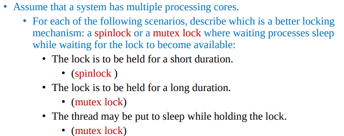

# Questions

<details>
<summary style="font-size: 30px; font-weight: 500; cursor: pointer;"> Q1  </summary>

```c
int number_of_processes = 0;
/* the implementation of fork() calls this function */
int allocate_process(){
    int new_pid;

    if(number_of_processes == MAX_PROCESSES)
        return -1;
    else{
        /* allocate necessary process resources */
        ++ number_of_processes;
        return new_pid;
}

}

/* the implementation of exit() calls this function */
void release_process(){
    /* release process resources */
    -- number_of_processes;
}
```

**A: Identify Race Condition(s):**

- Variable `number_of_processes` is subject to race conditions, due to unsafe handling in **allocate_process** and **release_process**  fns.

<br/>

---

<br/>


**B: Re-write Code to avoid race conditions: *Using acquire() and release()*:**

```c
int number_of_processes = 0;
/* the implementation of fork() calls this function */
int allocate_process(){
    acquire();
    int new_pid;

    if(number_of_processes == MAX_PROCESSES)
        release(); //This is also required, as we've already acquired rsrc
        return -1;
    else{
        /* allocate necessary process resources */
        ++ number_of_processes;
        release();
        return new_pid;
    }

}

/* the implementation of exit() calls this function */
void release_process(){
    acquire();
    -- number_of_processes;
    release();
}
```

<br/>

---

<br/>

**C: Could we replace the integer variable `int number_of_processes = 0`
with the following atomic integer to prevent the race condition(s)?
`atomic_t number_of_processes = 0`**

The use of an atomic integer, like `atomic_t number_of_processes = 0`, might initially seem like a solution to the race condition problem because atomic operations ensure that individual operations on the variable (such as increment or decrement) are executed atomically. This means these operations are completed in a single step without interruption, preventing other threads from seeing the variable in an inconsistent state during the operation. However, while atomic operations prevent race conditions on individual reads/writes, they do not inherently prevent race conditions that arise from check-then-act sequences, which are sequences where the action taken depends on a previous check (or read).

### The Core Issue

The core issue in the `allocate_process()` function is not just about incrementing `number_of_processes` safely; it's about the sequence of operations:

1. **Check** if `number_of_processes` equals `MAX_PROCESSES`.
2. **Act** based on that check by either returning an error or incrementing `number_of_processes`.

Even with `number_of_processes` as an atomic variable, the sequence of checking its value and then acting (incrementing it) based on the check cannot be guaranteed to be atomic as a whole. Between the check and the increment, another thread could change `number_of_processes`, leading to situations where more processes are allocated than `MAX_PROCESSES`. This is because the atomicity provided by `atomic_t` does not extend to multiple operations collectively.

### Illustrating the Problem

Imagine `MAX_PROCESSES` is 255, and `number_of_processes` is currently 254. Two threads enter `allocate_process()` at roughly the same time. Both perform the check (`if(number_of_processes == MAX_PROCESSES)`) and find it false. Since atomic operations only ensure that the read and write actions themselves are atomic, both threads see `number_of_processes` as 254 and proceed. Both threads then increment `number_of_processes`, potentially leading to a value of 256, which violates the intended limit.

### Why Atomicity Here Doesn't Solve the Problem

The atomicity of `number_of_processes` ensures that any read or write to it is indivisible. However, it does not ensure that the **sequence** of reading its value, making a decision based on that value, and then modifying it based on the decision is atomic. That sequence is what's known as a "compound operation," and ensuring its atomicity requires synchronization mechanisms that can lock around the entire sequence of operations, not just individual reads or writes.

</details>

<details>
<summary style="font-size: 30px; font-weight: 500; cursor: pointer;"> Q2  </summary>




### 1. The lock is to be held for a short duration.

- **Choice:** Spinlock
- **Reason:** Spinlocks are simple locking mechanisms where a thread simply spins (in a loop) checking repeatedly if the lock is available. For very short durations, spinning can be more efficient than putting a thread to sleep and waking it up later. This is because the overhead associated with sleeping (context switch, scheduling, waking up) can be more costly than the CPU time wasted spinning, especially if the lock is expected to be released quickly.

### 2. The lock is to be held for a long duration.

- **Choice:** Mutex lock
- **Reason:** For locks held over long durations, the cost of having other threads spin-waiting (actively checking the lock status) is very high, leading to wasteful CPU utilization. Mutexes, when a thread cannot acquire the lock, put the thread to sleep, freeing up the CPU to do other work. Once the lock becomes available, the waiting thread is awakened. This is more efficient in terms of overall system performance for locks held for significant periods, as it reduces unnecessary CPU consumption by idle waiting threads.

### 3. The thread may be put to sleep while holding the lock.

- **Choice:** Mutex lock
- **Reason:** This scenario implicitly requires a locking mechanism that can handle sleeping threads without causing deadlock situations or wasting CPU resources. Spinlocks are not suitable in this case because they assume that the thread holding the lock is actively working towards releasing it and not sleeping. If a thread holding a spinlock goes to sleep, other threads will spin indefinitely, wasting CPU resources and potentially leading to a deadlock if the sleeping thread is waiting on a resource held by one of the spinning threads. Mutex locks are designed to handle sleeping threads more gracefully, making them the suitable choice here. They manage queues of waiting threads and ensure that once the lock-holding thread wakes up and releases the lock, one of the waiting threads can acquire the lock and proceed.

### Conclusion

The choice between spinlocks and mutexes largely depends on the specific requirements and behaviors expected in the system. For quick, short-term locks in high-performance, multi-core systems where minimizing latency is crucial, spinlocks might be preferred. For longer-duration locks or scenarios where threads might sleep while holding the lock, mutexes offer a more efficient and safer choice, optimizing overall system performance and resource utilization.

</details>

<details>
<summary style="font-size: 30px; font-weight: 500; cursor: pointer;"> Q3  </summary>

todo:

</details>