# CPU Scheduling

<details>
<summary style="font-size: 30px; font-weight: 500; cursor: pointer;"> Introduction & Context </summary>

**CPU - I/O Burst Cycle:**

A CPU burst is a period during which a program is using the CPU intensively before it stops to wait for some I/O operation (like reading from disk) or is preempted by the operating system to give time to another program

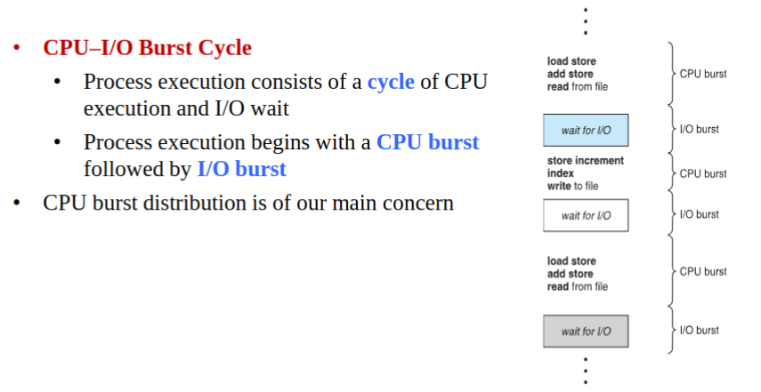

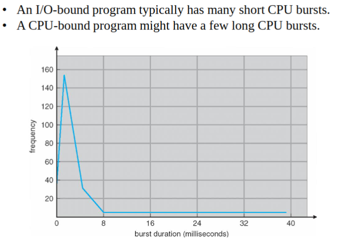

When CPU is **IDLE**, The **Short-Term Scheduler (CPU Sched.)** selects from processes in the Ready Queue, and allocates CPU 
- Queue of PCB (Process Control Blocks), implemented with some of these:
        - FIFO Queue
        - Priority Queue
        - Tree
        - Unordered Linked List

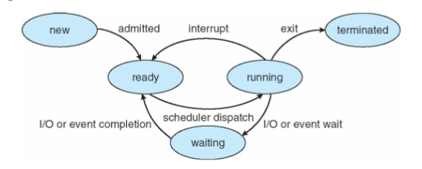

### Pre-Emptive Scheduling

To Pre-empt, is to interrupt whatever is running, and switch it out with the new process in execution (Hot swapping currently running stuff out, systematically)

1. When a process switches from running to ready state
- Process can be pre-empted, stopping execution of `running` into the `ready` state, it's ready to be continued executing after pre-emption is resolved!

2.  When a process switches from waiting to ready
- When it finishes an I/O operation, resume it's operation by pre-empting some lower priority executing *(Do step 1. fo that)*

**Disadvantages**:

*Can result in race conditions:*
- Consider the case of two processes that share data.
» While one process is updating the data is been pre-empted, then the data is in inconsistent state
- **Consider preemption while in kernel mode**: The kernel may be executing a system call that needs to modify some important data structure (queue), what will happen if the process been served is preempted during this system call. *(Race Condition, Data Corruption and larger problems possibly)*


### NON-Pre-Emptive Scheduling

Once CPU is Allocated to Process, it will run it until the process switches into a waiting state

1. Process switches from Running to Waiting State
- `I/O Request` or `Wait()` call on process idling it, so the scheduler can now run another process in ready queue

2. Process Terminates
- Now that the process is over, run another process in ready queue

## Dispatcher:

The dispatcher is a component of the operating system that manages the process of switching the CPU from one process to another. This process is also known as a context switch. Here are some more technical notes about the dispatcher and its role in scheduling within operating systems:

### Context Switching
- **Saving and Restoring Context**: The dispatcher saves the state (context) of the currently running process, so it can be resumed later. The context typically includes the program counter, registers, and memory states.
- **Efficiency**: The context switching process should be efficient because high overhead can lead to significant inefficiencies, especially in systems with many short processes.
- **State Information**: The state of a process is typically stored in the Process Control Block (PCB).

### Transition to User Mode
- **Mode Switching**: Modern operating systems operate in at least two modes: kernel mode and user mode. The dispatcher switches the CPU to user mode before executing a process, as processes run in user mode for security and stability reasons.
- **Protection**: By switching to user mode, the operating system ensures that the process cannot perform harmful operations or access restricted areas of memory.

### Jumping to the Program Counter
- **Program Resumption**: The dispatcher moves the program counter to the location where the process was last interrupted, allowing it to resume execution from the correct place.
- **Instruction State**: The process must resume with the CPU's instruction register set to the next instruction to be executed.

### Dispatch Latency
- **Definition**: Dispatch latency is the time it takes for the dispatcher to switch context, switch to user mode, and jump to the correct location in the user program.
- **Performance Impact**: Dispatch latency is a critical component of system performance. The shorter the latency, the more responsive the system can appear to be.
- **Optimization**: The dispatch latency is often optimized by minimizing the amount of state information that needs to be changed or by using hardware support for context switching.

### Scheduler Interaction
- **Short-term Scheduler**: The dispatcher works closely with the short-term scheduler (also known as the CPU scheduler). The scheduler decides which process to run next, and the dispatcher carries out that decision.
- **Preemption**: In preemptive scheduling, the dispatcher may be invoked when an executing process is interrupted to switch to a higher priority process.

### Additional Considerations
- **Hardware Support**: Some CPUs provide hardware support for switching context, which can significantly reduce dispatch latency.
- **Cache Implications**: Frequent context switches can lead to cache thrashing where the cache is constantly being loaded with new data, reducing cache efficiency.
- **System Calls and Interrupts**: The dispatcher is also involved when handling system calls and interrupts, where a switch from user mode to kernel mode is required, and vice versa.

In summary, the dispatcher is critical in ensuring that the CPU can be efficiently and safely shared among processes. It must work quickly and efficiently to maintain system performance and responsiveness, particularly in systems with high levels of concurrency and frequent context switches.


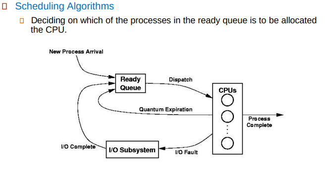

Environment for the Scheduling Algorithms to use, Dispatches ready to execute proccesses into the CPU, upon **time quantum** expiration, pushed back to the end of the ready queue, or an I/O action is needed so that process (PCB) passed thru IO Sub-system and back into the same Ready Queue. *(To be re-executed upon scheduled time)*

---

# Scheduling Criteria with Examples

## CPU Utilization
- **Definition**: The aim is to keep the CPU as busy as possible, making efficient use of its resources. In real systems, the goal is to maintain CPU utilization from 40% to 90%.
- **Example**: If a CPU is engaged in executing processes for 1800 seconds out of a 2000-second interval, its utilization is 90%. This high utilization indicates effective use of the CPU.

## Throughput
- **Definition**: Throughput refers to the number of processes that complete execution per unit of time.
- **Example**: If 10 processes are completed in 100 seconds, the throughput is 0.1 processes per second. High throughput is desirable, indicating that the system can handle a larger load efficiently.

## Turnaround Time
- **Definition**: This is the total amount of time taken from when a process is submitted to when it is completed. It includes all the time spent waiting in the ready queue, executing on the CPU, and doing I/O.
- **Example**: A process arrives at time 0, waits for 5 seconds, executes for 10 seconds, and then completes. Its turnaround time is 15 seconds (5 seconds waiting + 10 seconds executing).

## Waiting Time
- **Definition**: Waiting time is the total amount of time a process has been waiting in the ready queue before it gets a chance to execute.
- **Example**: If a process waits for 5 seconds, then runs for 10 seconds, waits another 2 seconds, and runs for another 3 seconds, its total waiting time is 7 seconds (5 seconds + 2 seconds).

## Response Time
- **Definition**: In a time-sharing environment, response time is the amount of time from when a request is submitted until the first response is produced. It's crucial for interactive applications where user satisfaction depends on quick feedback.
- **Example**: A user submits a database query at time 0, and at time 2, they receive the first piece of data indicating the query is being processed. The response time is 2 seconds, regardless of how much longer it takes to receive all the data.

# Ideal Criterion

- Maximize CPU Utilization
- Maximize Throughput
- Minimize Turn-Arround Time
- Minimize Waiting Time
- Minimize Response Time

---

</details>

# Scheduling Algorithms

<details>
<summary style="font-size: 30px; font-weight: 500; cursor: pointer;"> FCFS (First-Come First-Served)</summary>

- **First-Come, First-Served Basis**: FCFS allocates the CPU to processes based on their arrival time. The earliest request gets the CPU first.
- **FIFO Queue Management**: Implementation of FCFS scheduling is straightforward, utilizing a First In, First Out (FIFO) queue to manage process execution order.
- **Simplicity**: One of the simplest CPU scheduling algorithms to understand and implement, making it a popular choice for basic system designs.
- **No Starvation**: Ensures that every process gets a chance to execute. Since all processes are served in their arrival order, no process is starved.
- **Non-Preemptive**: Once a process starts executing, it runs to completion. The CPU cannot be taken away until the current process finishes or voluntarily releases the CPU.
- **No Context Switch Overhead**: Minimal context switches as processes are not preempted, which can be beneficial in reducing overhead in certain scenarios.

Disadvantages:

- **Potentially Long Waiting Times**: Processes with shorter execution times may have to wait for longer ones to complete, leading to longer average waiting times.
- **Poor Utilization for Time-Sharing Systems**: Not ideal for time-sharing systems where response time is critical, as it can lead to poor system responsiveness.
- **Fairness Concern**: While FCFS is fair in the order of arrival, it can be perceived as unfair in terms of waiting time, especially for short processes that arrive behind long ones.

These points highlight the key characteristics, advantages, and disadvantages of the FCFS scheduling algorithm, providing a clear overview of its operation and suitability for various computing environments.

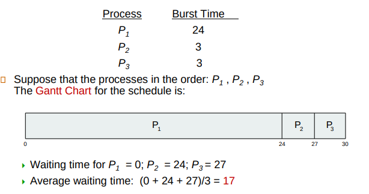

Average Waiting Time Example: ^^^

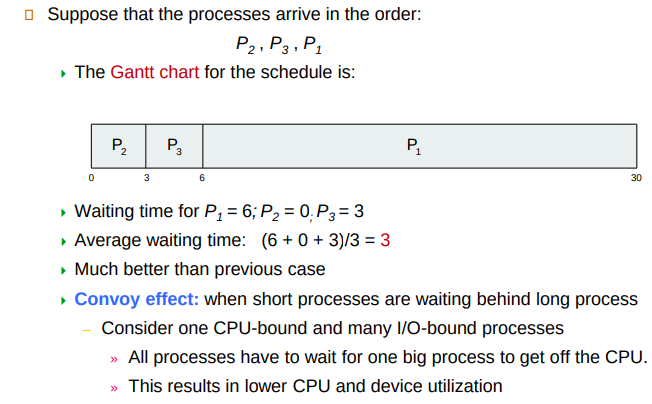

This is an ideal case, and we see how much the Waiting Time is reduced by Shorter processes executing first, Major issue with FCFS

</details>

<details>
<summary style="font-size: 30px; font-weight: 500; cursor: pointer;">Priority Scheduling</summary>

## Priority Scheduling Overview

Priority Scheduling is a method where each process is assigned a priority number, and CPU allocation is determined based on these priority levels. The process with the highest priority (typically represented by the smallest integer) is selected next for execution.

### Characteristics

- **Priority Assignment**: Priorities can be either:
  - **Internally determined** by the operating system based on factors like memory requirements, time limits, the number of open files, etc.
  - **Externally determined** by criteria outside the operating system, such as process importance, sponsoring department, or political considerations.

- **Relation to SJF**: Shortest Job First (SJF) scheduling can be viewed as a form of priority scheduling where the priority is inversely related to the predicted next CPU burst time; shorter jobs have higher priority.

### Types of Priority Scheduling

- **Preemptive**: If a new process arrives with a higher priority than the currently executing process, the CPU is immediately preempted and allocated to the new process.
  
- **Non-Preemptive**: A newly arriving higher priority process is placed at the head of the ready queue but does not preempt the currently running process. The CPU will be allocated to it once the current process completes its execution or yields the CPU.

### Challenges and Solutions

- **Starvation**: A critical problem where low-priority processes may indefinitely wait for CPU time, potentially never executing.
  
- **Aging**: A solution to starvation, aging involves gradually increasing the priority of waiting processes over time to ensure they eventually receive CPU time. For example, the priority of a process could increase by 1 every 15 minutes, making it more competitive for CPU allocation.

### Technical Considerations

- **Dynamic Priority Adjustment**: Systems implementing priority scheduling must have mechanisms to dynamically adjust priorities to manage aging and prevent starvation.
  
- **Priority Inversion**: Situations where lower priority processes hold resources needed by higher priority ones can lead to "priority inversion". Solutions include priority inheritance or priority ceiling protocols.

- **Balance Between Throughput and Fairness**: While priority scheduling can optimize throughput and response times for high-priority processes, careful consideration must be given to overall system fairness and the prevention of starvation.

- **Priority Levels Management**: The definition and management of priority levels, including the number of levels and their granularity, are crucial for the effective operation of priority scheduling. Too many levels can lead to complexity, while too few might not offer sufficient differentiation.

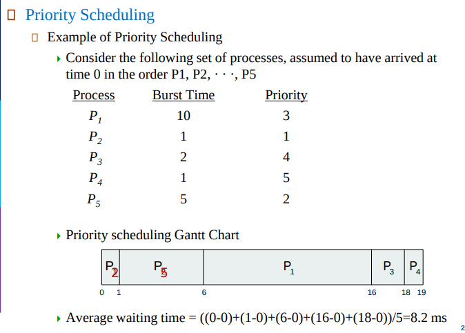


</details>

<details>
<summary style="font-size: 30px; font-weight: 500; cursor: pointer;">Shortest-Job-First (SJF)</summary>

* The SJF algorithm is a special case of the general **priority-scheduling algorithm**

**PRIORITY METRIC:** Algorithm associates with each process the length of its next CPU burst *(Burst Time)*
- Shortest Time First ( Head of Burst Times Queue -> 1,2,3, .. N)
- If 2 processes have same Length, FCFS is a tie-breaker or another inherent priority value associated with process

**SJF is optimal**, it gives a minimum average waiting time for a given set of processes.

Long-term scheduling, also known as job or admission scheduling, is the decision-making process that controls the admission of new jobs into the system. Its main goal is to regulate the number of processes in the ready queue, ensuring that the system is neither overloaded nor underutilized.

- SJF scheduling is used frequently in long-term scheduling due to it's Load Balancing capabilites, preventing scenarios where heavy, long-running processes dominate the CPU, potentially leading to system thrashing.

- **Throughput Optimization:** In environments where job completion is critical, such as batch processing systems, applying SJF can maximize throughput, allowing more jobs to complete in less time.

### Challenges and Considerations

- **Execution Time Estimation**: A significant challenge of applying SJF at any level is accurately estimating the execution time of a process or job. In the long-term scheduling context, this estimation must be done before the job is admitted into the system, relying on historical data or user estimates, which can vary in accuracy.

- **Potential for Starvation**: Longer jobs may suffer starvation, as shorter jobs continually bypass them in the admission queue. This issue requires careful policy adjustments, such as aging techniques, to ensure fairness.

- **Dynamic Workloads**: In systems with highly dynamic workloads, the effectiveness of SJF can fluctuate. Real-time adjustments and monitoring are necessary to maintain system performance and fairness.


---

# Example:

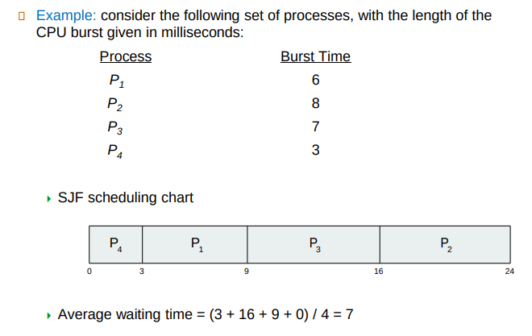

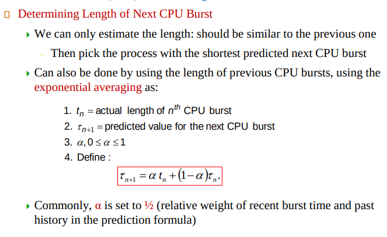

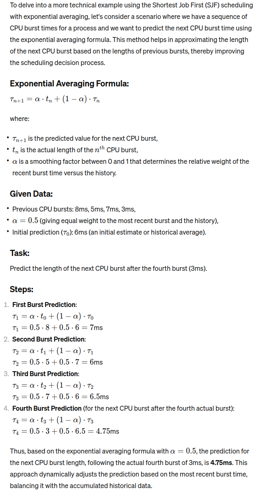

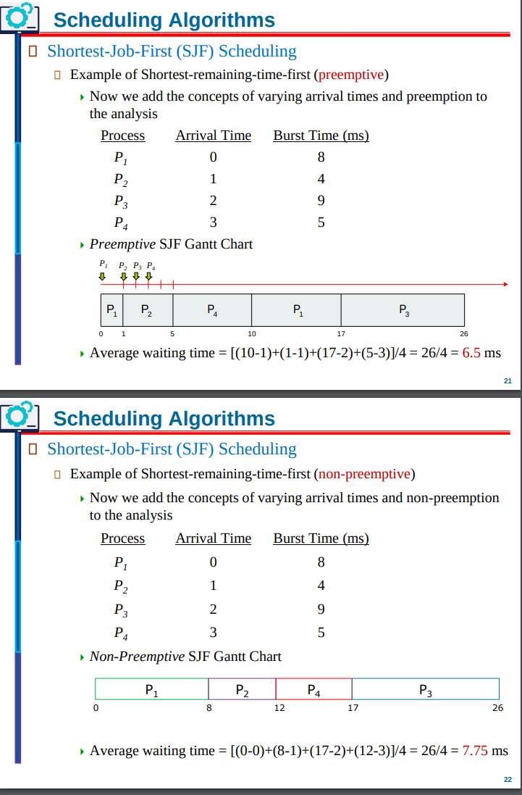


</details>

<details>
<summary style="font-size: 30px; font-weight: 500; cursor: pointer;">Round Robin (RR)</summary>


## Round Robin (RR) Scheduling Overview

Round Robin scheduling is a preemptive scheduling algorithm designed primarily for time-sharing systems. It ensures fair CPU time distribution among processes by allocating a fixed time quantum.

### Key Characteristics

- **Time Quantum (q)**: Each process is allocated a small unit of CPU time, typically ranging from 10-100 milliseconds. This time quantum is crucial to RR's functioning.

- **Preemption and Queueing**: After a process's time quantum expires, it is preempted and placed at the end of the ready queue, regardless of its completion status.

- **Fair CPU Allocation**: In a system with *n* processes in the ready queue and a time quantum of *q*, each process receives 1/*n* of the CPU time in segments of at most *q* time units at once.

- **Maximum Wait Time**: No process waits more than (*n*-1)*q* time units before getting the CPU, ensuring bounded waiting times.

- **Timer Interrupts**: The operating system employs timer interrupts at the end of each quantum to facilitate the scheduling of the next process.

### Performance Considerations

- **Impact of Time Quantum**:
  - **Large *q***: The RR algorithm approximates First-Come, First-Served (FCFS) scheduling, as fewer context switches occur.
  - **Small *q***: The system may experience high overhead due to frequent context switching, negatively impacting overall performance.

### Advantages

- **Fairness**: RR scheduling ensures all processes receive equal attention from the CPU, preventing starvation.

- **Responsiveness**: Suitable for time-sharing environments, RR improves system responsiveness by allowing all processes to make progress.

### Challenges

- **Time Quantum Selection**: Choosing an optimal time quantum is critical. It requires a balance to minimize context switch overhead while maintaining system responsiveness.

- **Overhead**: Frequent context switching in cases of very small time quanta can lead to significant system overhead.

### Conclusion

Round Robin scheduling is an equitable, time-sharing oriented CPU scheduling algorithm that balances fairness and responsiveness through the use of time quanta. Its effectiveness and efficiency are heavily dependent on the appropriate selection of the time quantum size.

---

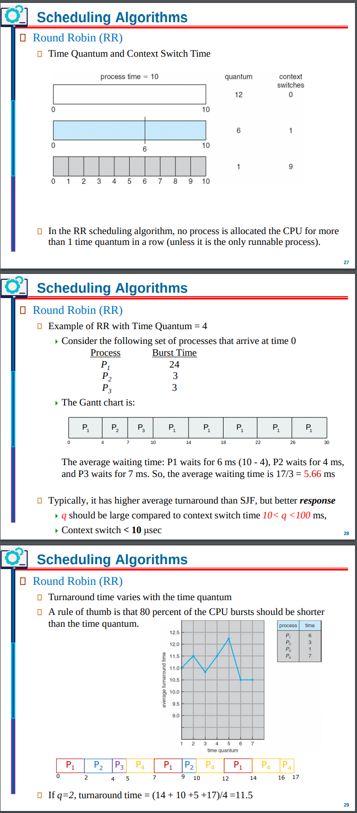


</details>


# Thread Scheduling:

<details>
<summary style="font-size: 30px; font-weight: 500; cursor: pointer;">Thread Scheduling</summary>

Core concepts of thread scheduling in systems that support POSIX threads (Pthreads), focusing on the distinction between user-level and kernel-level threads, contention scope, and the usage of the Pthread scheduling API. Let's dive into an in-depth analysis, incorporating these aspects with illustrative code examples and comments for clarity.

### Understanding Thread Levels

- **User-Level Threads**: Operate in user space, meaning they are managed without kernel intervention. The thread library is responsible for their management, scheduling, and synchronization. They are lightweight and efficient but lack true parallelism on multicore systems since the kernel sees them as a single process.
  
- **Kernel-Level Threads**: Managed by the operating system kernel, thus can leverage multiple processors. The kernel controls scheduling, synchronization, and management. They offer true parallelism but with higher overhead due to system calls for thread management.

### Contention Scope: PCS vs. SCS

- **Process-Contention Scope (PCS)**: Scheduling competition occurs among threads within the same process. User-level threads are scheduled by the thread library onto available Lightweight Processes (LWPs).

- **System-Contention Scope (SCS)**: The competition for CPU resources is among all threads in the system, regardless of their parent process. Kernel-level threads are scheduled by the OS kernel.
- SCS scheduling decisions are made by the OS kernel, taking into account all runnable threads system-wide. This is the level at which the operating system allocates actual "slices" of CPU time to processes *(or more precisely, to the kernel-level threads within those processes)*, based on the overall scheduling policy of the system.

### Pthread Scheduling API

The Pthread API allows setting the contention scope (PCS or SCS) during thread creation, influencing how threads are scheduled.

#### Example Code with Comments:

```c
#include <pthread.h>
#include <stdio.h>
#define NUM_THREADS 5

void *runner(void *param); // Prototype for thread's runnable function

int main(int argc, char *argv[]) {
    pthread_t tid[NUM_THREADS]; // Thread identifiers
    pthread_attr_t attr; // Thread attributes
    int i, scope;

    // Initialize thread attributes to default
    pthread_attr_init(&attr);

    // Inquire the current contention scope
    if (pthread_attr_getscope(&attr, &scope) != 0)
        fprintf(stderr, "Unable to get scheduling scope\n");
    else {
        if (scope == PTHREAD_SCOPE_PROCESS)
            printf("Using PTHREAD_SCOPE_PROCESS\n");
        else if (scope == PTHREAD_SCOPE_SYSTEM)
            printf("Using PTHREAD_SCOPE_SYSTEM\n");
        else
            fprintf(stderr, "Illegal scope value.\n");
    }

    // Set the scheduling scope to System-Contention Scope
    pthread_attr_setscope(&attr, PTHREAD_SCOPE_SYSTEM);

    // Create threads with specified attributes
    for (i = 0; i < NUM_THREADS; i++)
        pthread_create(&tid[i], &attr, runner, NULL);

    // Wait for threads to exit
    for (i = 0; i < NUM_THREADS; i++)
        pthread_join(tid[i], NULL);

    return 0;
}

// Thread function to execute
void *runner(void *param) {
    // Thread-specific work can be performed here
    pthread_exit(0); // Exit the thread
}
```

#### Key Points in the Code:

- **Thread Attributes Initialization**: Attributes like contention scope must be initialized to their defaults with `pthread_attr_init`.
  
- **Contention Scope Inquiry and Setting**: The program checks the current scope with `pthread_attr_getscope` and sets it to `PTHREAD_SCOPE_SYSTEM` using `pthread_attr_setscope`. This makes the threads subject to system-wide scheduling policies.

- **Thread Creation and Joining**: Threads are created with `pthread_create` using the specified attributes. The `pthread_join` call waits for threads to complete, ensuring the main function only terminates after all threads.

## Why Set my PThreads to a System Contention Scope, or change them in a process for threads?

Setting your program's threading to use System-Contention Scope (SCS) can have several benefits, particularly in environments where you need more direct interaction with the system's scheduling policies or when your application's performance is closely tied to how efficiently it can utilize the CPU resources alongside other processes. Here are the key benefits:

### 1. **Improved Responsiveness and Throughput**
- **SCS** allows your threads to be scheduled directly by the operating system's scheduler. This means that high-priority threads in your application can potentially get more CPU time over lower-priority threads from other processes, improving the responsiveness and throughput of critical tasks.

### 2. **Better CPU Utilization**
- By competing directly at the system level, your threads can be allocated CPU time in a manner that's more aligned with their actual needs and priorities. This can lead to better overall CPU utilization, especially in a multi-threaded environment where workloads can vary significantly in their demands.

### 3. **Enhanced Fairness and Priority Handling**
- In environments with multiple processes and threads vying for CPU resources, setting your threads to **SCS** ensures that they are considered equally alongside other system threads. This is particularly useful for applications that perform critical tasks and require timely access to CPU resources to maintain performance levels.

### 4. **Flexibility in Scheduling**
- **SCS** provides your threads with the ability to be scheduled according to the global scheduling policy of the operating system. This can offer more flexibility and dynamic adjustment to runtime conditions compared to PCS, where scheduling decisions are confined within the process boundary.

### 5. **Real-time Applications**
- For real-time applications where meeting specific timing constraints is crucial, **SCS** can offer advantages by allowing threads to be scheduled more aggressively based on system-wide priorities, thereby helping to meet real-time deadlines.

### 6. **Efficient Use of Multi-core Processors**
- Modern operating systems and hardware are designed to efficiently distribute system-level threads across multiple cores. Using **SCS** allows your application to take advantage of this by letting the OS scheduler manage the distribution of threads across cores, potentially improving parallel execution and reducing context switching overhead.

</details>


<details>
<summary style="font-size: 30px; font-weight: 500; cursor: pointer;">Multi-Processor Scheduling</summary>

Here are structured notes on multiple-processor scheduling, detailing different approaches and key issues in managing CPU resources in a multi-processor environment:

## Multiple-Processor Scheduling Overview

- **Homogeneous Processors**: Systems with identical processors, yet complexities arise due to specific hardware configurations, like I/O devices attached to a processor's private bus, necessitating targeted process scheduling.

## Approaches to Multiple-Processor Scheduling

### Asymmetric Multiprocessing (AMP)
- **Centralized Scheduling**: A single processor, the master server, handles all scheduling decisions, I/O processing, and system activities. This approach simplifies the scheduling logic but can create a bottleneck at the master server.

### Symmetric Multiprocessing (SMP)
- **Decentralized Scheduling**: Each processor independently schedules processes, either from a common ready queue or through individual private queues. This approach is prevalent in modern operating systems like Windows, Linux, and macOS due to its scalability and efficiency.

## Issues in Symmetric Multiprocessing

### Processor Affinity

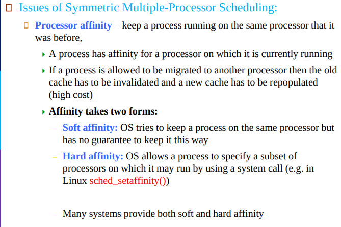

- **Objective**: To keep processes running on the same processor to optimize cache utilization.
  - **Soft Affinity**: The OS prefers but does not guarantee that a process remains on its current processor.
  - **Hard Affinity**: Processes can specify preferred processors, enhancing performance for specific tasks (e.g., using `sched_setaffinity()` in Linux).

### NUMA Considerations
- **Non-Uniform Memory Access (NUMA)**: Memory access speeds vary depending on the memory's physical location relative to the processor. This architecture requires intelligent memory placement to optimize performance.

### Load Balancing
- **Goal**: To evenly distribute workload across all processors to maximize efficiency.
  - **Push Migration**: Actively redistributes tasks from overloaded to underutilized processors.
  - **Pull Migration**: Allows idle processors to take on tasks from busy processors. Both strategies are often used simultaneously to maintain balance.

### Multicore Processors
- **Trend**: Integration of multiple processing cores on a single chip, offering better speed and power efficiency than multiple separate processors.
- **Multi-threading**: Supports multiple threads per core, exploiting idle times (e.g., during memory access) to execute alternate threads, enhancing overall throughput.


</details>


<details>
<summary style="font-size: 30px; font-weight: 500; cursor: pointer;">Algorithm Evaluation</summary>

### Algorithm Evaluation:
- Criteria to Evaluation Algos (scheduling algos)
- Often defined in terms of CPU util, response time, throughput, etc...
- Common Evaluation Models:
  - Deterministic Model 
  - Queueing-network analysis 
  - Simulations
  - Implementations


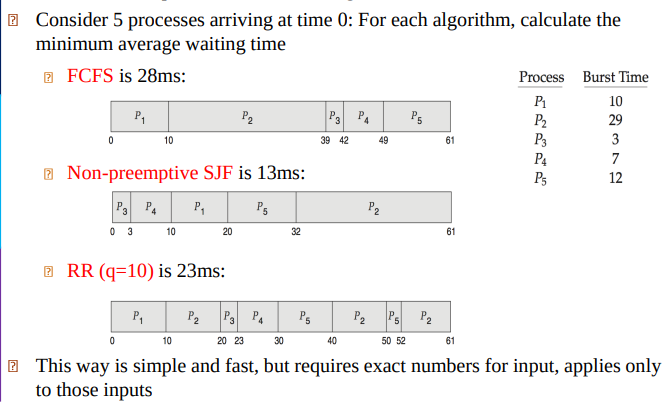

---

# Little's Formula (Queue-Network Analysis)

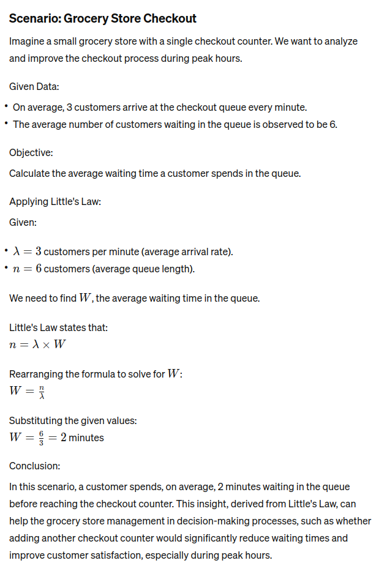

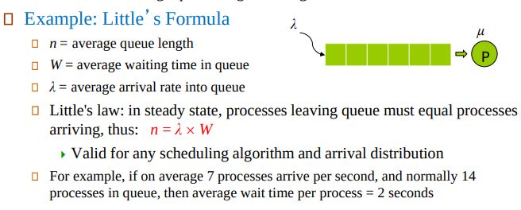

</details>

TODO: Slide 51 & 52 examples