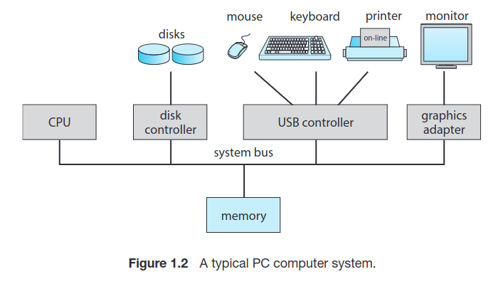
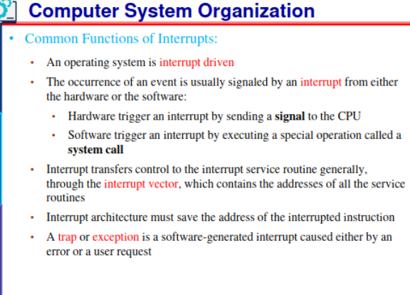
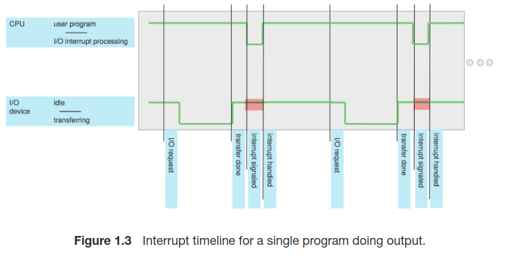
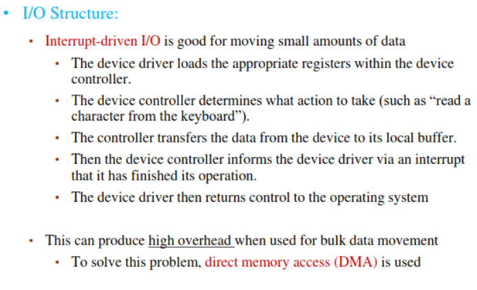
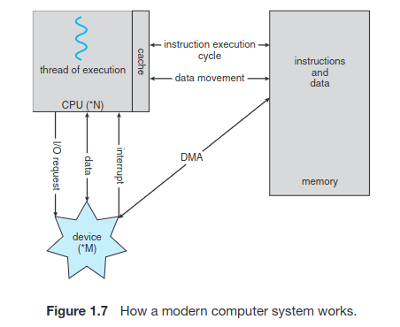
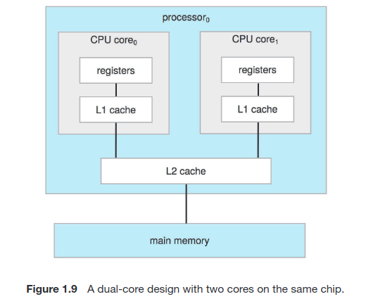

# Operation Systems - Introduction

# 1.2

 --- Comp-Sys Organization 

- Device Controllers are connect thru a common **BUS**
- Each Device is handled by their Controller! (Disk, Audio, Graphics)
- CPU, ^^ Controllers, etc... are also connected to this **BUS**

A Device Controller maintains a local buffer storage & set of special-purpose registers  
A Device Controller is in charge of moving the data between the peripheral devices that it controls aswell as it's own local buffer.
-  Example: Moving Data from Keyboard Input data into it's own Local Buffer, and generate signal to Device Driver so it can Interrupt

Operation Systems have **Device Drivers** for each **Device Controller**
- Device driver understands the Controller, and provides a *UNIFORM* Interface to the device 
- CPU & Device Controller execute in parallel, whilst splitting *Memory Cycles* (RAM Clock cycles)
- Synchronization of Memory Access from all these devices, are actually managed by **Memory Controller**

**System Bus**: Main communications path between Major Components.

---

In a typical I/O operation, the device driver is responsible for generating the interrupt to inform the operating system about the completion of the operation, and the device controller reads its own registers, performs necessary manipulations on the data, and manages the data within its own local buffer.

**Device Driver:**
- Interacts with the operating system.
- Initiates and manages I/O operations on behalf of the program or application.
- Configures the device controller by loading necessary registers.
- Generates an interrupt to notify the operating system when the I/O operation is complete.
- May provide the operating system with information about the status or results of the I/O operation.

**Device Controller:**
- Interacts with the physical device (e.g., keyboard, disk drive).
- Monitors and examines its own registers to determine the action required.
- Manages data transfer between the device and its local buffer.
- May perform manipulations or processing on the data as needed (e.g., error checking).
- Generates an interrupt to signal the device driver when the I/O operation is finished.

 --- Interrupts  

* **Hardware** can trigger an interrupt at any moment, by signalling to the CPU via the System Bus
* Upon Interrupt, the CPU is 'interuppted' and immediately executes the interrupt service, then resumes it's regular computation *(FIGURE 1.3)*
* Interrupts gotta be handled quick as they ALWAYS happen!!
* Generally Low Mem. Address hold Interrupt Service Routines for various devices, this parition in Mem is called **Interrupt Vector**
* Must safe "Before Interruption" State, and restore it, I'm talking Instruction Number & Registers as they might get modified by Interrupt routine

**Implementation Notes**
- CPU has an *"interrupt-request line"* that it checks after each instruction. 
- When a device controller asserts a signal on the interrupt-request line, the CPU detects it.
- CPU reads the interrupt number and jumps to the corresponding **"interrupt-handler routine."** *(Sends NUM of Interrupt Vector, so we know what device)*
- The handler saves state, identifies the cause of the interrupt, processes it, restores state, and returns control to the CPU.
- Device controller initiates an interrupt, CPU handles it via an **interrupt handler**, and the handler clears the interrupt by servicing the device.
- This mechanism allows the CPU to respond to asynchronous events, like a ready device controller.
- Modern operating systems incorporate more advanced interrupt-handling features.

## Note About Modern Interrupt Systems in OS

  

 --- Storage Structure  

**Bootstrap Program** : Loads Operation System upon power-on, is stored in EEPROM *(erasable programmable read-only memory)* as it's NON-volatile !  
- Loads operating system kernel and starts execution
- The kernel then starts providing services to the system and its users.
- ROM or EEPROM also known as **firmware**
- *firmware* isn't changed / rewriten frequently, and shouldn't be anyways...
- *firmware* is commonly used for lighweight & static programs *(iPhone stores serial numbers & hardware info in it)*

### General Storage Notes
- Von Neumann architecture: Fetch, decode, execute, store.
- Memory unit handles a sequence of memory addresses, oblivious to their generation.
- Secondary storage extends main memory for large and permanent data storage.
- Common secondary storage devices: HDDs and NVM (non-volatile mem).
- Secondary storage slower than main memory, vital for computer systems.
- Various storage components: cache, CD-ROM, magnetic tapes, etc.
- Tertiary storage for special purposes, slower and larger.
- All storage systems store and hold data but differ in speed, size, and volatility.

 --- I/O Structure (DMA)  

Device Controllers using local buffers and interrupts to the CPU can be slower for complex I/O operations with large data volumes. DMA (Direct Memory Access) is preferred as it allows data to be transferred directly between devices and memory without CPU intervention, resulting in faster data I/O.

### **DMA** | **Direct Memory Access**
- Initially setting up of Buffers, pointers, and counters for the I/O device.
- Device Controller transfers *ENTIRE BLOCK*(s) directly into Memory *(No CPU intervention)*
- Only **one interrupt per block** is sent to Device Driver *(rather than traditional interrupt per byte)*
- While the device controller is performing these operations, the CPU is available to accomplish other work

# 1.3

 --- Single-Processor & Multiprocessor Systems  

### Single Processor
- Single CPU Core, that manages Disk-controller microprocessor, etc.. 
- Receives a sequence of requests from the main CPU core and implements its own disk queue and scheduling algorithm.
- If there is only one general-purpose CPU with a single processing core, then the system is a single-processor system.

### Multiprocessor Systems: Growing in Use and Importance

Multiprocessor systems, also known as parallel systems or multicore systems, have two or more processors in close communication, sharing computer resources.

Multiple Processors have Single-Core CPU's that often share Computer bus, Memory, Peripherals, Clock and IO Devices *(Occasionally)*

**Advantages of Multiprocessor Systems:**
1. **Increased Throughput:** More work can be done in less time due to parallel processing.
2. **Economy of Scale:** Multiprocessor systems often cost less than equivalent multiple single-processor systems.
3. **Increased Reliability:** They offer graceful degradation or fault tolerance, enhancing system reliability.

---

### Symmetric Multiprocessor (SMP)
- In SMP, each CPU performs all tasks, including OS functions and user processes.
- SMP architecture includes multiple processors, each with its own CPU, registers, and local cache.
- All processors share physical memory via the system bus.
- SMP allows many processes to run simultaneously, equal to the number of CPUs.
- Inefficiencies may occur when one CPU is idle while another is overloaded.
- Sharing data structures can prevent inefficiencies and balance workload among processors.
- This dynamic sharing of processes and resources enhances system performance.

Windows, macOS, and Linux, as well as Android and iOS mobile systems—support multicore SMP systems

### Multi-Core CPUs
- They are more efficient than multiple chips with single cores
- ON-chip communication *(faster)* > BETWEEN-chip communication
- Uses significantly less power than multiple single-core chips
- Appear to OS as *N* standard processors !

**Dual-Core Design**
- Multi-core Processor Architecture
- CPU Cores share the L2 Cache
- Both CPU Cores have their own registers, and L1 caches
- Common in Industry

 --- Clustered Systems  

TODO 25 -> 60