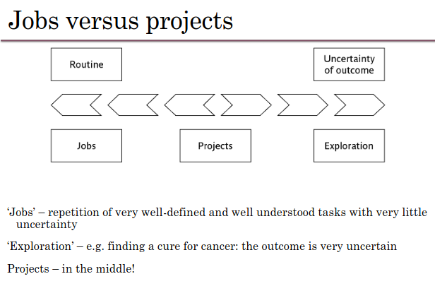
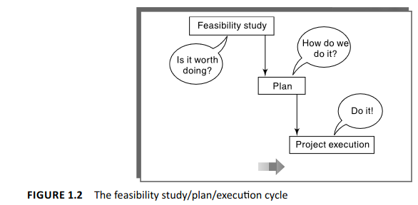
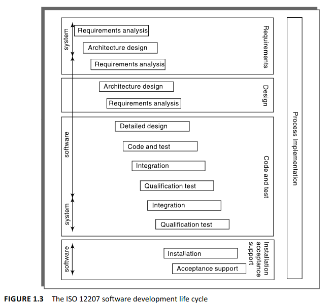
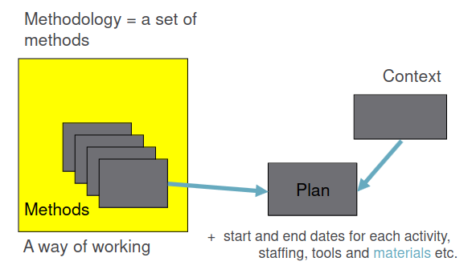

### What is software project management?

- Just like normal projects, it's project that *SATISFY* real needs & goals
- Must Identify project's stakeholders, objectives, etc...

Projects often fail – Standish Group claim only a third of ICT projects are successful. 
**82%** were late and **43%** exceeded their budget.

*Poor project management is a major factor in these failures*

## What is a Project?
- Planned Activity / Undertaking
- A Specific Plan or Design
- A Large undertaking *EX.* Builing a Social Media Platform

**KEY Words**: *Planning* & *Size*

### Distinguishing Project Characteristics:

- non-routine tasks are involved
- planning is required
- specific objectives are to be met or a specified product is to be created
- the project has a predetermined time span
- work is carried out for someone other than yourself
- work involves several specialisms
- people are formed into a temporary work group to carry out the task
- work is carried out in several phases
- the resources that are available for use on the project are constrained
- the project is large or complex.

---

### Exercise 1.1

- *"producing an edition of a newspaper"* 
    - **JOB** well defined & understood task, with lot's of certainty, it's a routine!

- *"Writing an operating system for a new computer"*
    - **PROJECT** Writing an operating system is a complex, planned task with specific objectives and various phases of development. Fairly certain outcome, but not as certain as a Job/Routine.

- *"A research project into what makes a good human-computer interface"* 
    - **EXPLORATION** Although the research might be planned, it still has LOTS of uncertainty for the outcome, and it can go in any direction.

---

## Particular Aspects of Software Projects over Regular Projects

1. **Invisibility**: Software project progress is not immediately visible, unlike physical construction projects where a house is built. Managing software projects involves making the invisible progress visible.

2. **Complexity**: Software products contain higher complexity per unit of currency spent compared to other engineered artifacts.

3. **Conformity**: Unlike traditional engineers who work with consistent physical systems, software developers must conform to the ever-changing requirements of human clients. Organizational challenges can also lead to inconsistencies, and "Organizational Stupidity"

4. **Flexibility**: Software's ease of change is a strength, but it often needs to adapt to other components in physical or organizational systems, making the software system highly subject to change.

---

*ICT (Information and Communication Technology) Development refers to the process of designing, creating, implementing, and maintaining information technology systems and solutions.*

## Contract Management and Technical Project Management

1. **In-House Projects**:
   - Users and developers are part of the same organization.
   - Close collaboration between users and developers.
   - Project manager may be more involved in technical decisions.
   - Detailed estimation of effort for individual software components is often required.
   - *Emphasis* on internal communication and understanding organizational needs.

2. **Outsourced Projects**:
   - External developers or contractors are hired for ICT development.
   - **Client** organization **appoints a project manager** to oversee the contract.
   - Project manager delegates many technical decisions to contractors.
   - Focus on ensuring the overall project stays within budget and on schedule.
   - Technical project managers on the supplier side handle technical issues and deliverables.
   - Emphasis on effective contract management, communication with contractors, and meeting project goals.

**NOTE**: This course leans towards the concerns of these ‘technical’ project managers

---
## Activities Covered by Software Project Management
*Software development activities recommended in the international standard ISO 12207*

**Feasibility Study**
- Evaluates if a project is worth pursuing.
- Gathers information on application requirements.
- Stakeholders may have clear goals but not know how to achieve them.
- Estimates developmental and operational costs.
- Assesses the value of the new system's benefits. *(Is it Worth it?)*
- In large systems, feasibility study can be a project on its own.
- Can be part of a broader strategic planning exercise.
- Organizations may assess a program consisting of multiple projects.

**Project Planning**
- Starts if feasibility study indicates project viability.
- Detailed planning evolves over the project's life.
- Initial outline plan for the entire project.
- Detailed plan for the initial stage.
- Detailed planning for later stages happens closer to their start.
  
**Project Execution**
- Includes **design** and **implementation** sub-phases.
- *Design* involves making decisions about product form.
- *Design* decisions relate to external appearance (user interface) and internal software architecture.
- The plan outlines activities to create these products.
- Detailed planning influenced by design decisions.
- Multiple sets of activities may be needed for a software product with several major components.

---

 GPT Elaborations on Soft. Dev Life Cycle (long) 

### Requirements Analysis Phase
1. **Requirements Elicitation/Gathering**: 
   - Identifying what users and their managers need from the new system.
   - Example: An ambulance dispatch system needs rapid transaction times for emergency calls.

2. **Function and Quality Requirements**: 
   - Defining the functions the system should perform and the quality standards.
   - Example: The system must quickly dispatch ambulances in emergencies, ensuring reliability and speed.

3. **System Requirements**:
   - Including hardware, software, and human operation aspects.
   - Example: Efficient operator training for using the computer system for dispatch.

4. **Resource Requirements**:
   - Relating to development costs, both in terms of software and additional resources.
   - Example: Budgeting for the development of the ambulance dispatch software and necessary hardware.

### Architecture Design Phase
1. **Component Identification**:
   - Identifying new or existing components to fulfill each requirement.
   - Example: Determining if existing software can handle emergency call processing or if new development is needed.

2. **Software and Hardware Components**:
   - Inclusion of both software and potential hardware or work process changes.
   - Example: Evaluating if new hardware is needed to enhance dispatch system performance.

3. **Consideration of Legacy Systems**:
   - Ensuring compatibility and interoperability with existing systems.
   - Example: Integrating the new dispatch system with existing emergency response databases.

4. **System Architecture Design**:
   - Mapping software requirements to software components.
   - Example: Designing how the software will handle emergency call inputs and dispatch outputs.

### Detailed Design Phase
1. **Component Design**:
   - Detailed design of individual software units.
   - Each unit can be seperately coded and tested *(Good for teams)*
   - Example: Designing the user interface for operators in the dispatch system.

2. **Coding and Testing**:
   - Separate coding and testing of each software unit.
   - Example: Coding the algorithm for the fastest ambulance routing and testing it under different scenarios.

3. **Integration**:
   - Combining all software units into a complete system. *(Combining with Hardware modules, software systems, API systems, etc...)*
   - Example: Integrating the routing algorithm with real-time traffic data and operator interfaces.

4. **System / Quality Testing**:
   - Testing the system as a whole to ensure it meets all requirements. *(NOT JUST THE SOFTWARE)*
   - Example: Conducting simulated emergency calls to test system responsiveness and reliability.

---

## Plans, Methods and Methodologies

**Method** : Relates to a type of activity in general, Example methods for testing software: 
- analyse the requirements for the software
- devise and write test cases that will check that each requirement has been satisfied
- create test scripts and expected results for each test case
- compare the actual results and the expected results and identify discrepancies

**Plan** : Takes those method(s) and convert it to a real activity, and identifying the follow:
- its start and end dates;
- who will carry it out;
- what tools and materials – including information – will be needed.

---

## Some Ways of Categorizing Software Projects

**Compulsory Users**
- Engineers using Solidworks or Excel for their job, and profession
- Sales people recording sales, and using Google Meet for project meetings

**Voluntary Users**
- Gamers playing GTA V *Computer Game*, or scrolling on TikTok *Entertainment App*

 

**Information Systems**  
Information Systems (IS) are computer-based systems that gather, store, process, and distribute information to support decision-making and various organizational activities. They include software, hardware, data, procedures, and personnel, all working together to manage data and facilitate effective information flow within an organization.
  

**Embedded Systems**  
Embedded Systems are specialized computer systems designed to perform specific dedicated functions within a larger system or product. They are typically embedded into devices or machines and are responsible for controlling and managing specific tasks, often in real-time. Embedded systems have limited resources and are optimized for efficiency and reliability. *(Controlling Machines for EX)*

### **Objective-Driven Development**; Projects can aim to produce a product or meet specific objectives.

- **Product Creation**: Some projects involve creating a specified product, with the client justifying its need.
- **Objective-Based Projects**: Other projects focus on meeting objectives that could have multiple solutions.
- **Two-Stage Approach**: Many software projects begin with an objective-driven phase, resulting in recommendations *(e.g., need for a new software system)*, followed by product development.

- **EX: Implementing a new pay-roll system**: This is typically **objective-driven** as the goal is to address a specific need or objective within the organization, such as improving payroll processing efficiency or accuracy.

---

### Product Driven Examples *(NOT OBJECTIVE ! )*

- **Switching a database from DB2 to Oracle**: If the focus is on the technical process of migrating from one database system to another, it's **product-driven**.

- **Implementing a new iPhone app**: This is **product-driven** as the focus is on creating a specific product (the iPhone app) based on defined features and requirements, as there isn't an objective, rather a product needing to be built.

---

TODO: Pages 10-18 SPM textbook (finish slides 19-40)

