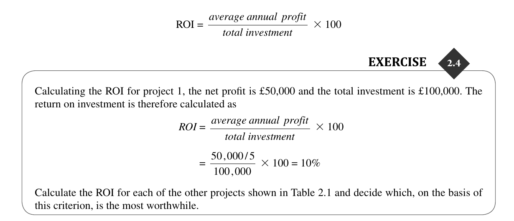

# Project Evaluation and Programme Management (CH2)

---

**Recall:**
- ICT Project: IT / Software Project *(Informations & Communications Technology)*
- The last chapter emphasized that an ICT or software project needed a business case.
- Managers need some way of deciding which projects to select. This is part of **portfolio management**.

 
2.2 & 2.3 | Business Case & Project Portfolio Management

**Business Case** aka. Feasibility Study, Project Justification; Provides a rationelle for if the project's `Benefits > Costs` If the good outweighs the bad.

### Business Case Contains these Elements

1. **Introduction and background**
    This is a description of the current environment of the proposed project. A problem to be solved or an opportunity to be exploited is identified.

2. **The proposed project**
    A brief outline of the proposed project is provided.

3. **Organizational and operational infrastructure**
    This describes how the structure of the organization will be affected by the implementation of the project. This is of most relevance where the project is implementing or modifying an information system as part of a broader business change project. It would also be relevant if a tailored production or distribution system has to be set up when a new product is designed.

    *Example:* New Touch ID login system for ATMEL Corp, this also requires the distribution of the Finger Sensor Edge device

4. **Benefits**
    A financial value should be put on the benefits of the implemented project.
        - For commercial orgs. this can increasing Profits, or making saving on Costs!
        - For Non-Profits, it still needs to be some quantified amount of benefit *(This product will save lots of lives, maybe 100k ?)* that's a huge benefit

5. **Outline Implementation Plan**
    * How the project is going to be implemented.
    
    * This will also detail the management of the implementation. The responsibilities are allocated for the tasks identified in the outline implementation plan. Key decision points or milestones, etc...

    * This should consider the disruption to an organization that a project might cause to the org.

6. **Costs**
    - Schedule of Expected costs associated with the prior steps *(Operations to set up)*
    - There will clearly be some uncertainties about some of the costs especially as the details of the requirements have not yet been worked out.

7. **Financial Analysis**
    Financial analysis: combines costs and benefit data to establish value of project. *(also talked about later in chapter)*

---

## Project Portfolio Management

Portfolio project management provides an overview of all the projects that an organization is undertaking or is considering. It prioritizes the allocation of resources to projects and decides which new projects should be accepted and which existing ones should be dropped. It includes:
-  Identifying which project proposals are worth implementation.
-  Assessing the amount of risk of failure that a potential project has;
-  Deciding how to share limited resources, including staff time and finance, between projects *(Too many projects, with too few resources isn't good)*
- Being aware of the dependencies between projects, especially where several projects need to be completed for an organization to reap benefits;
- Ensuring projects don't duplicate work, and necessary developments aren't missed or overseen.

---

`The three key aspects of project portfolio management are portfolio definition, portfolio management and portfolio optimization.`

### **Project Portfolio Definition**
The project portfolio definition involves consolidating details of all current projects into a single repository. This process requires deciding whether to include projects of all types or limit the repository to specific categories, such as ICT projects or the setup of new infrastructure like a warehouse. The portfolio captures both New Product Developments (NPDs), which are projects aimed at developing products like a computer game for customer sales, and renewal projects, which aim to improve organizational operations, often through information systems. The distinction between NPDs and renewal projects can sometimes blur, as certain information systems may serve customer-facing functions.

**NPD Definition**: New Product Developments (NPDs) refer to projects focused on the continuous development of new goods and services for sale to customers. These projects typically have a direct relationship between project execution and income generation, making them attractive for funding. *(Like video games)*

### **Project Portfolio Management**
After establishing the portfolio, detailed project costings and expected value generation are documented. This enables tracking actual project performance against these indicators, facilitating rigorous screening for new projects. Effective project portfolio management ensures that resources are allocated efficiently across projects, balancing the portfolio to align with organizational strategy and goals.

### **Project Portfolio Optimization**
Project portfolio optimization involves regular high-level management reviews to achieve a balanced mix of projects. This balance considers the profitability potential against associated risks. For example, an e-commerce project may offer high returns but faces significant market competition risks, while automation projects might offer modest benefits with lower risks. The goal of optimization is to thoughtfully balance risk and reward across the portfolio, ensuring strategic alignment and maximizing organizational benefits.

**Note:** Sometimes smaller projects (*under a certain budget*) wont be on the Project Portfolio, as it's easier to just do some Ad-hoc development and management at lower levels, then letting a High-Level Manager deal with relatively insignificant projects/tickets.

 
2.4 | Evaluation of Individual Projects

We will now look more closely at how the feasibility of an individual project can be evaluated.

Even for projects where `Benefits > Costs` it's necessary still consider other things like:  Not all projects can be undertaken at any one time and, in any case, the **most valuable projects should get the most resources.**

The costs of the technology adopted must be taken into account in the cost–benefit analysis.

## Cost-Benefit Analysis - CBA - *(2 steps)*:

### 1. Identifying all of the costs and benefits of carrying out the project and operating the delivered application:
- **Costs Examples**:
  - **Development Costs**: Costs associated with the initial creation of the project, including software development, hardware procurement, and human resources.
  - **Operational Costs**: Ongoing costs to maintain and operate the application, such as hosting fees, support staff salaries, and software licenses.
  - **Training Costs**: Expenses related to training staff to use the new application effectively.

- **Benefits Examples**:
  - **Increased Efficiency**: Reduction in time and resources required to complete certain tasks due to automation or streamlined processes.
  - **Improved Customer Satisfaction**: Enhancements in service delivery or product quality leading to higher customer satisfaction and retention.
  - **Revenue Growth**: Direct or indirect increase in revenue, such as through new product features enabling market expansion or through enhanced data analysis capabilities leading to better decision-making.

### 2. Expressing these costs and benefits in common units:
- **Quantifying Costs and Benefits in Monetary Terms**: Assign a monetary value to both tangible and intangible costs and benefits. For instance, operational cost savings can be quantified by the reduction in labor hours, while benefits like improved customer satisfaction can be estimated through potential increases in sales or customer lifetime value.
- **Net Present Value (NPV)**: Calculate the present value of future net cash flows from the project, discounting future benefits and costs to their present value. This helps in understanding the project's value over time.
- **Return on Investment (ROI)**: Calculate the ROI by dividing the net benefits (benefits minus costs) by the project's costs. This ratio provides a direct measure of the return expected from the investment in the project.

By systematically identifying and quantifying the costs and benefits, organizations can make informed decisions about which projects to pursue, ensuring resources are allocated to projects that offer the greatest value.

## CBA Example 2.1

  

Answer:

  

## Cash Flow Forecasting:

Cash flow forecasting is a critical financial management tool that helps organizations plan for future expenditures and income related to a project. 

1. **Timing of Expenditure and Income**: Cash flow forecasting provides detailed predictions about when expenditures (e.g., staff wages, material costs) and income (from in-house use or sales) will occur, allowing organizations to ensure they have sufficient funds to cover development costs before any project income is received.

2. **Necessity for Early Planning**: It is crucial to perform cash flow forecasting early in the project's life cycle, before committing to significant expenditures. This early planning is challenging due to the need to estimate many future financial items, including benefits that may only materialize years later.

3. **Ignoring Inflation**: In forecasting future cash flows, the effects of inflation are typically excluded due to the uncertainty of future inflation rates and the assumption that income and expenditure will increase proportionately if inflation occurs. This simplification helps focus on the real value of cash flows over the project's life cycle.

**Figure 2.1** illustrates the typical cash flow during a product's life cycle: 
- Initial period of significant expenditure before any income is generated. This expenditure includes costs like staff wages, necessary for project development, which occurs before the receipt of any project-related income.   
- Shows a transition from a phase of negative cash flow, where expenses exceed income, to a phase where the project starts generating income, eventually leading to a positive cash flow. Then after some time, income goes down, and stuff breaks leading to another Expense.

 
2.5 | Cost-Benefit Evaluation Techniques

We now take a look at some methods for comparing projects on the basis of their cash flow forecasts.

*DISADVANTAGES:*
- Net Profit doesn't account for Payback Period, therefore if it net's 50K, doesnt matter if it's in 2 Days, or 2 Years.
- Some projects make lots of money short term, but aren't reliable long term, at a given point *Net Profit* doesn't account for this!
 

## Payback Period

- **Definition**: The payback period is the duration required to recoup the original investment made in a project.
- **Preference**: Projects with shorter payback periods are often preferred as they minimize the time the investment is not yet recovered.
- **Example**: If a project requires an initial investment of $50,000 and generates $10,000 annually, the payback period is 5 years.

## Return on Investment:

*DISADVANTAGES:*
- **Ignores Cash Flow Timing**: Does not consider when cash flows occur within the payback period, treating all inflows equally regardless of timing.
- **Disregards Interest Rates**: Fails to account for interest rates and compounding, making comparisons with bank interest rates or other investment returns misleading.
- **Potentially Misleading**: Can give a skewed view of a project's financial attractiveness and risk by not considering the value of money over time or the opportunity cost of capital.

## Net Present Value (NPV):

Similar to Eng Econ:

 

**Formula:**

- **t** Time in Years *(Into the Future where Cashflow Occurs)*
- **r** Discount Rate *(Decimal Value so from 0.00 to 1.00)*

## Discount Rate & Factors
- It's **Much Easier** for the present value of a cash flow may be calculated by multiplying the cash flow by the appropriate discount factor!

 

The figure of $618 means that
$618 more would be made than
if the money were simply
invested at 10%. An NPV of £0
would be the same amount of
profit as would be generated by
investing at 10%.

- Main difficulty with NPV for deciding between projects is selecting an appropriate discount rate.

the key factor here is the time value of money, which is taken into account through the discount rate in the NPV calculation.

### ANSWER:

- For **Project C**, despite having the highest net profit, the cash flows come in later compared to Projects A and B. When you apply a higher discount rate (like 10% or 12%), the value of these later cash flows is reduced more significantly. This makes Project C less attractive under higher discount rates because the money earned later in the project's life is worth less today than money earned earlier.

- For **Project A and B**, they have earlier cash inflows, which means their earnings start to accrue sooner. Even though these projects may have a lower total net profit, they start paying back the initial investment earlier, and those early payments are not discounted as heavily. This is why, especially at higher discount rates where the penalty for later money is greater, projects with earlier returns can end up having a higher NPV.

In essence, a project with earlier cash inflows can be more valuable in present terms because the money can be reinvested sooner, potentially earning interest or returns elsewhere. This is why the "best" project can change with the discount rate: the rate affects the present value of future cash flows, tipping the scales in favor of projects with different cash flow profiles.

## Internal Rate of Return

One disadvantage of *NPV as a measure of profitability* is that, although it may be used to compare projects,
it might not be directly comparable with earnings from other investments or the costs of borrowing capital.

Let's approach the concept of Internal Rate of Return (IRR) with a more intuitive example.

Imagine you are considering investing in a new cafe. You calculate that to open this cafe, you will need to invest $100,000 upfront. You expect that the cafe will generate profits (after all expenses) as follows:

- Year 1: $20,000
- Year 2: $30,000
- Year 3: $40,000
- Year 4: $30,000
- Year 5: $20,000

The total profit over 5 years would be $140,000. But simply adding up these profits doesn't account for the time value of money – the idea that money available now is worth more than the same amount in the future because of its potential earning capacity.

This is where the IRR comes in. The IRR is the rate (expressed as a percentage) that makes the net present value (NPV) of all cash flows (both positive and negative) from the investment equal to zero. In other words, it's the break-even interest rate that equates the cost of the investment ($100,000) with the present value of its returns *($20,000 in Year 1, $30,000 in Year 2, etc.)*

If you calculate the IRR for the cafe investment, you might find it to be, say, 12%. This means that the cafe investment is expected to generate an average annual return of 12% over its lifespan.

How do you use this information? If your alternative is to put the money in a savings account with a 3% interest rate, or if you can borrow money at a 6% interest rate, the cafe investment would be attractive because its IRR of 12% beats both of these rates. However, if you have another potential investment that has an IRR of 15%, then the cafe might not look as appealing because the other investment would be expected to generate a higher return on your capital.

**NOTE**: You can think of the Internal Rate of Return (IRR) somewhat like a breakeven point, but specifically for the net present value (NPV) of cash flows from an investment, and it does include the concept of discounting future cash flows.

 
2.6 | Risk Evaluation & Decision Trees

Here we focus on Business Risk; risk of delivered products not being profitable enough... *Bad Idea that's been put into existance lol*

## Project Risk Matrix
Another thing they do, with importance rating, and Likelihood of risk occurance

## Risk and NPV. (net present value)

Basically, we add percentage on the discount, as a premium of risk, like OK well I want this project to make 5% + 2% Risk premium 7% investment on **100K $** the extra 2% is to make sure it's forsure feasible enough to take at 5%.

This risk premium might, for example, be an additional 2% for a reasonably safe project or 5% for a fairly risky one. Projects may be categorized as high, medium or low risk using a scoring method and risk.

## Risk Profile Analysis

Another Technique used, basically tweaks parameters of success in different areas, to see if 1 area is very prone to this business failing: YouTube fails if target ads get banned. By studying the results of a sensitivity analysis we can identify those factors that are most important to the
success of the project. We then need to decide whether we can exercise greater control over them or otherwise
mitigate their effects. If neither is the case, then we must live with the risk or abandon the project.

## Decision Trees

**The absolute best** we can do is to reject over-risky projects or choose those with the best risk profile. 

### Sample Problem and Decision Tree Diagram:

ANSWER: 

 
2.7 | Programme Management & Strategies

## Definitions:

It's important for organizations to take a broad view of all its projects to ensure that while some projects may disappoint, organizational developments overall will generate substantial benefits.

`Programme`: " *a group of projects that are managed in a coordinated way to gain benefits that would not be possible were the projects to be managed independently* "

**Types of Programmes** They can vary greatly depending on their objectives in the org, the resources they share, and the outcomes they aim to achieve. Here are some of the primary types of programmes:

## Strategic Programmes

- **Description**: These programmes consist of several projects that together aim to implement a single strategy. An example could be the merging of Information Systems (IS) of two organizations to achieve a unified operational framework.
- **Objective**: To achieve broad, strategic goals of an organization through coordinated projects.

## Business Cycle Programmes

- **Description**: This refers to a portfolio of projects scheduled to take place within a specific timeframe, such as the next financial year.
- **Objective**: To align project execution with business cycles and financial planning, ensuring resources are allocated efficiently throughout the business cycle.

## Infrastructure Programmes

- **Description**: Involves multiple ICT-based applications that share the same hardware/software infrastructure. These programmes focus on creating or upgrading shared infrastructure to support various organizational needs.
- **Objective**: To ensure a scalable, efficient, and secure infrastructure that supports the diverse applications and services within an organization.

## Research and Development Programmes

- **Description**: Characterized by a focus on developing new products in innovative environments. These programmes may include projects that range from very speculative and high-risk to those with lower risk but also lower returns.
- **Objective**: To strike the right balance between risk and reward, contributing to the organization's long-term success through innovation.

## Innovative Partnerships

- **Description**: Involves pre-competitive cooperation among companies to develop new technologies that could be exploited by a broad range of industries.
- **Objective**: To foster innovation and technological advancement through collaboration, sharing the risks and rewards of developing groundbreaking technologies.

Remember, the success of these programmes depends on effective project evaluation and programme management, ensuring that projects are aligned with strategic objectives, efficiently resourced, and well-coordinated.

 
2.13 Benefits Management & Quantification

# Chat GPT Benefits Management Example *(pretty good)*:

Benefits management is a crucial aspect of project and program management, ensuring that the intended advantages of a business change are not only identified but also realized and sustained over time. Here's a detailed example to illustrate how benefits management works in practice:

### Example: Implementing a New Customer Relationship Management (CRM) System

#### Background
A company decides to implement a new Customer Relationship Management (CRM) system. The primary goals are to improve customer satisfaction, increase sales team efficiency, and ultimately boost sales revenue. The project involves the selection, customization, and deployment of the CRM software, training for staff, and integration with existing systems.

#### 1. **Identification of Expected Benefits**
- **Improved Customer Satisfaction**: By providing better and faster responses to customer inquiries and issues.
- **Increased Sales Team Efficiency**: Through better management of customer interactions and information, reducing time spent on administrative tasks.
- **Boosted Sales Revenue**: By leveraging customer data to identify upselling and cross-selling opportunities and improving lead management.

#### 2. **Planning and Optimization of Benefits**
- **Training Programs**: Develop comprehensive training for the sales team to ensure they can fully utilize the CRM's features.
- **Integration with Marketing**: Ensure the CRM system is integrated with email marketing tools to automate and track campaigns, facilitating targeted marketing efforts.
- **Customer Feedback Loop**: Implement a process to regularly gather customer feedback on service quality, feeding this information back into the CRM to continually improve customer service processes.

#### 3. **Execution and Implementation**
- The CRM system is selected based on its ability to meet the identified needs and its compatibility with existing systems.
- Customizations are made to tailor the CRM to the company's specific processes.
- Staff are trained, and the system is rolled out in phases to ensure smooth adoption.

#### 4. **Tracking and Realizing Benefits**
- **Performance Metrics**: Establish KPIs (Key Performance Indicators) such as customer satisfaction scores, sales team response times, and monthly sales figures to measure the impact of the CRM system.
- **Regular Reviews**: Conduct monthly review meetings to assess the CRM's performance against the expected benefits. Adjust training, processes, or CRM functionalities as needed based on these reviews.
- **Feedback Mechanisms**: Use customer feedback collected through the CRM to make continuous improvements, ensuring that the system evolves to meet changing customer needs and business objectives.

#### 5. **Sustaining Benefits**
- **Ongoing Training**: Implement regular training updates for the CRM system to ensure that all users are proficient and can adapt to any updates or changes in the system.
- **Technology Updates**: Keep the CRM software updated to benefit from new features and improvements that could further enhance business processes and customer satisfaction.

Through this example, it's clear that benefits management is a comprehensive process that spans from the initial planning stages of a project through to its execution and beyond. It ensures that the project's goals align with the organization's strategic objectives and that those benefits are effectively realized and sustained over time.

---

## Quantifying Benefits:

1. **Quantification and Valuation of Benefits**: Benefits can be directly financial, quantifiable without a direct financial value (*e.g., reduced customer complaints)*, or recognized but not easily quantifiable *(e.g., public approval)*.

2. **Acknowledgement of Disbenefits**: Recognizing that certain activities might lead to negative outcomes, such as increased costs from overtime due to higher sales.

3. **Validation of Claimed Benefits**: To ensure benefits are genuine, they must be precisely explained, observable, attributable directly to the change, and measurable.

4. **Benefit Profiles and Responsibility Assignment**: Creating benefit profiles to predict when and how benefits will occur, with specific staff (often business change managers) responsible for realizing these benefits.

5. **Post-Project Benefits Monitoring**: Benefits often emerge after the project closure, highlighting the joint responsibility of developers and users in delivering project benefits, requiring monitoring outside the traditional project environment.

