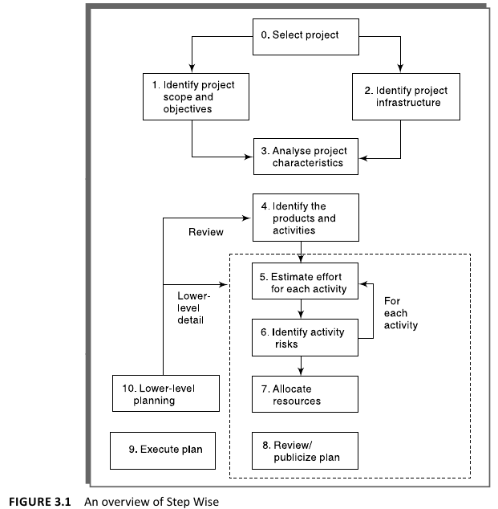
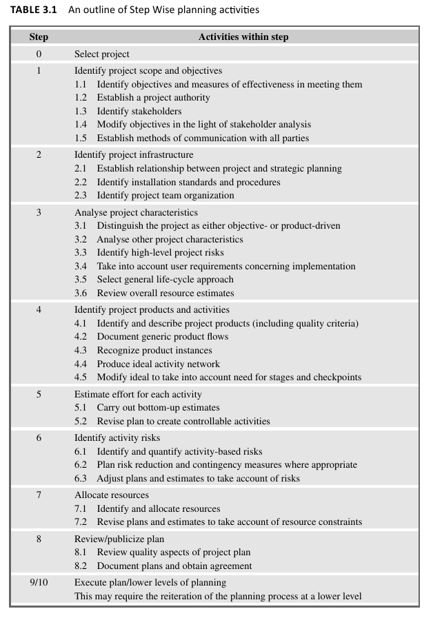
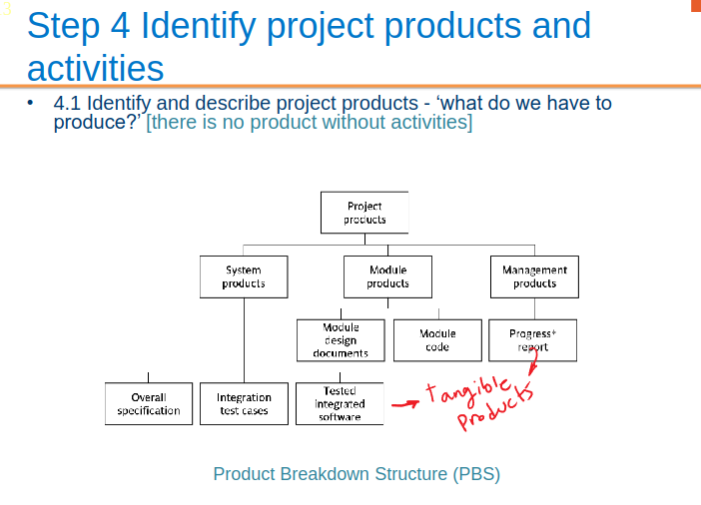
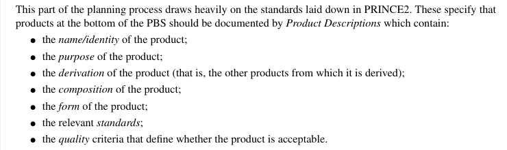
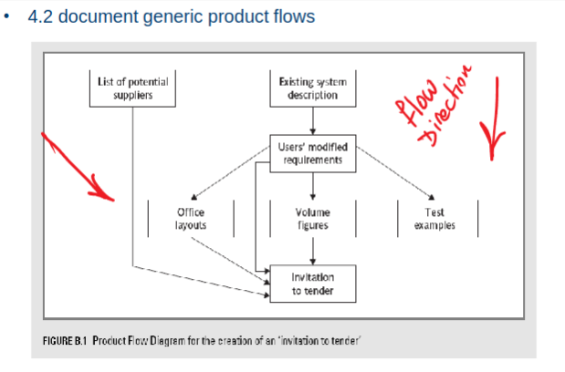
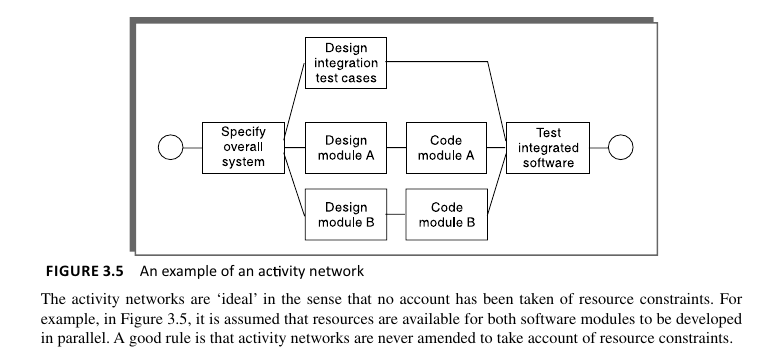
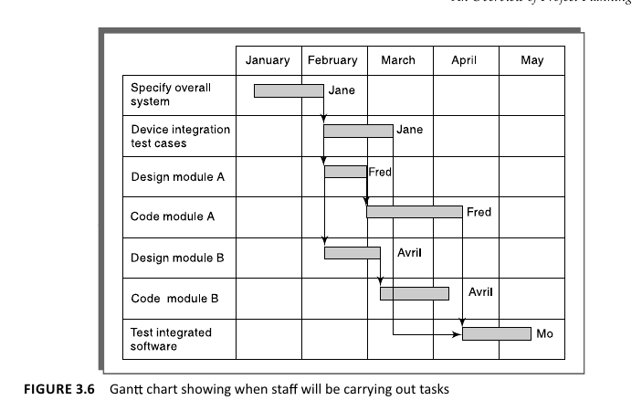
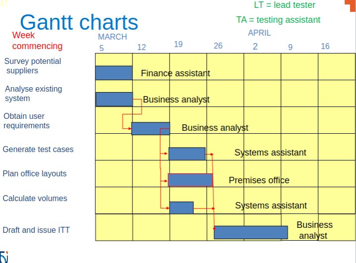

# An Overview of Project Planning (Step-Wise Approach)

- Introduces the Step Wise method for project planning, differentiating it from PRINCE2, focusing on planning stages and compatible with PRINCE2 standards, which are widely used in UK government and non-government projects.
- Emphasizes the standardization brought by PRINCE *(PRojects IN Controlled Environments)*, contrasting with traditional flexible project planning approaches, and mentions that PRINCE2 offers best practice guidance in project management.
- Uses parallel examples of two former Computing and Information Systems students with software development experience to illustrate the application of the Step Wise approach in varying project circumstances.

## Step Wise (Diagram & Steps)

**General Approach using Step-Wise for planning projects**

- After Selection of Project, **Steps 1 & 2** can be done in parallel. *(‘Identify project scope and objectives’ and ‘Identify project infrastructure’)*

- **Steps 5 & 6** will need to be repeated for each activity in the project. *(Effort & Risk Assessments)*

- **Major Principle:** Plan High-level first, then more in detailed as plan is carried out. Hence the lists of products and activities that are the result of Step 4 will be reviewed when the tasks connected with a particular phase of a project are considered in more detail. This will be followed by a more detailed iteration of Steps 5 to 8 for the phase under consideration.

---

---

Here are concise notes for the steps 0 to 9/10 in the Step-wise project planning process, incorporating information from the provided image and simplified with an example of *organizing a community book fair:*

###  Step 0: Select Project
Proposed projects do not appear out of thin air – *(Like Chapter 2's Project Evaluation process?)* some process must decide to initiate this project rather than some other!

### Step 1: Establish Project Scope and Objectives
- Define clear goals for the book fair, like fostering community engagement.
- Appoint a project leader, say the head librarian.
- Identify stakeholders: library staff, local authors, book clubs, and visitors.
- Adjust objectives after stakeholder input, ensuring alignment with community needs.
- Set up communication channels, such as regular meetings and a project communication app.

### Step 2: Establish Project Infrastructure
- Link the project to the library's mission of promoting literacy.
- Determine standards for setting up stalls and safety measures.
- Outline the team structure with roles for volunteers and staff.

### Step 3: Analyze Project Characteristics *(discussed more in ch.4)*
- Decide if the fair is driven by a specific objective (e.g., fundraising) or product (e.g., promoting local authors).
- Assess project specifics, like the need for space and diversity of books.
- Identify risks such as weather or low attendance.
- Consider user needs, like accessibility for all community members.
- Choose a project management approach, like agile for flexibility.
- Review resource needs, including budget and personnel.

#### 3.4: Take into account user requirements concerning implementation

The clients may have their own procedural requirements. For example, an organization might mandate the
use of a particular development method.

such as development methodologies such as Scrum, Agile, and Extreme Programming (XP). These methodologies are examples of procedural requirements that a client or an organization might mandate for the implementation of a project. 

Agile is a broad umbrella term for a set of frameworks and practices based on the values and principles expressed in the Agile Manifesto. Scrum and XP (Extreme Programming) are two specific methodologies that fall under this Agile umbrella. Each has its own set of rules, practices, and rituals designed to help teams work more effectively and responsively to change, which can be particularly important in environments where requirements evolve rapidly or are not fully defined at the outset of a project.

- **Agile**: A philosophy that promotes flexibility, collaboration, and customer centricity. It emphasizes adaptive planning, evolutionary development, early delivery, and continual improvement, and it encourages rapid and flexible response to change.

- **Scrum**: A framework within the Agile methodology that focuses on delivering value in short cycles called Sprints, which are typically 2-4 weeks long. Scrum roles (Product Owner, Scrum Master, and Development Team) and ceremonies (Sprint Planning, Daily Stand-up, Sprint Review, and Sprint Retrospective) help organize the work and ensure continuous improvement.

- **Extreme Programming (XP)**: A methodology that emphasizes technical excellence and high customer involvement. XP practices include pair programming, test-driven development (TDD), continuous integration, and frequent releases to improve productivity and introduce checkpoints where new customer requirements can be adopted.

When a client specifies the use of a particular development methodology, it's usually because they believe that methodology will best help manage the complexities of the project, align with their business goals, or fit within their organizational culture. Adhering to these methodologies can help ensure that the development process is structured in a way that meets the client's expectations for collaboration, quality, and adaptability.

### Step 4: Identify Project Products and Activities

4.1

**Product Breakdown Structure (PBS)**

The more detailed planning of the individual activities now takes place. The longer-term planning is broad
and in outline, while the more immediate tasks are planned in some detail.

- Define products such as a variety of book genres and related activities like book readings.
- Document the flow from book collection to setup and fair operation.
- Recognize instances where specific authors or genres are highlighted.
- Map out activities necessary to prepare and run the book fair.
- Set milestones and check-in points to track progress.

**Product Flow Diagram (PFD)**

PFDs should not have links between products which loop back iteratively. This is emphatically not because
iterations are not recognized

### Step 5: Estimate Effort for Each Activity

Step 5.1: Carry out bottom-up estimates

Step 5.2: Revise plan to create controllable activities

- Conduct detailed estimates of effort for tasks like book sorting and advertising.
- Revise plans to manage and distribute work effectively among team members.

### Step 6: Identify Activity Risks
- Recognize risks such as delayed book deliveries.
- Develop risk reduction strategies like having backup suppliers.
- Adjust plans to mitigate identified risks.
    - **e.g.** add new activities which reduce risks
associated with other activities e.g. training, pilot
trials, information gathering

### Step 7: Allocate Resources
- Assign resources, including volunteers for different fair sections.
- Update plans based on resource availability, like rescheduling if a key participant is unavailable.

#### 7.1 Identify and allocate resources to activities

#### 7.2 Revise plans and estimates to take into account resource constraints
* e.g. staff not being available until a later date
* non-project activities

### Step 8: Review/Publicize Plan
- Ensure quality aspects of the plan meet standards.

#### Step 8.2: Document plans and obtain agreement
It is important that the plans be carefully documented and that all the parties to the project understand and agree to the commitments required of them in the plan.

- Document and gain approval from the library board.

### Step 9/10: Execute Plan/Lower Levels of Planning
- Begin execution with a clear understanding of the objectives and infrastructure.
- Initiate lower-level planning for day-to-day operations of the book fair.

This structured approach ensures that the community book fair is well-planned, resources are allocated efficiently, and potential risks are mitigated, leading to a successful event.
