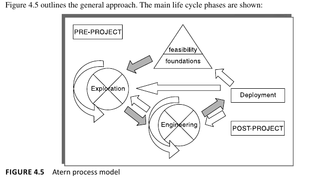

# Selection of an Appropriate Project Approach:

Developers & Organizations are familiar with certain kinds of dev. processes and usually stick to that

**Project Analysis**: is the need to review the methodologies and technologies to be used for each individual project. This decision-making process has been called *technical planning* by some!

 
General Info.

In the Step Wise approach, here in *Step 3: Analyse Project Characteristics* we select process model, then use it in Project Breakdown Structure

## Outsourced. VS. Inhouse

| Criteria | Outsourced | In-house |
|----------|------------|----------|
| **Project Organization** | Developers and users are in different organizations, potentially on different continents. | Developers and users are in the same organization. |
| **Recruitment of Technical Staff** | Not required as the contracting company provides technical and project expertise. | May require recruitment of technical staff who will no longer be needed after project completion. |
| **Executive Leadership** | External IT development company may already have executives qualified to lead the effort. | Lack of executives qualified to lead unique new development efforts. |
| **Management Effort** | Considerable management effort needed to establish and manage the contract. | Management effort focused on project execution within the organization. |
| **Cost** | Can be attractive due to the contracting company's ability to spread development costs over various clients. | Potentially higher due to the costs associated with recruiting and employing technical staff for the project duration. |
| **Software Examination and Trial** | Dependent on the agreement with the external company; may not be as flexible. | Possibility to directly examine and perhaps even trial the development process and outcomes. |
| **Delay in Software Availability** | Software development timeline depends on the contract; potential delays in starting the project. | Immediate start but depends on the availability of in-house resources and capabilities. |
| **Software Reliability** | Relies on the external company's expertise and previous experiences. | Dependent on in-house development practices and quality assurance processes. |
| **Competitive Advantage** | Outsourcing may not provide a unique competitive advantage due to potential similarity of solutions provided to other clients. | Potential for a unique solution tailored specifically to the organization's needs, offering a competitive advantage. |
| **Customization and Flexibility** | Customization dependent on contract terms and may incur additional costs. | Greater control over customization and flexibility to adapt to internal needs. |
| **Software Ownership** | No ownership of software code, limiting modifications in response to organizational changes. | Full ownership of software code, allowing for modifications as needed. |
| **Dependence on Supplier** | Risk of becoming reliant on the external company for updates and support, potentially at inflated costs. | Dependence is minimized as the organization controls the software and its development. |

## Choosing Methodologies and Technologies

In the context of ICT system development and software engineering, **the term methodology describes a collection of methods.**

**Techniques** tend to involve the application of scientific, mathematical or logical principles to resolve a particular kind of problem.
    - They often require the practice of particular personal skills

**Project analysis** should select the most appropriate methodologies and technologies for a project., Methologies like:
* Unified Software Development Process (USDP)
* Structured Systems Analysis Design Method (SSADM)
* Human-Centred Design
* And Technologies like Automated Testing Environments

## Analyse other project characteristics

| Project Characteristic | Definition/Consideration |
|------------------------|--------------------------|
| **Data-oriented vs. Process-oriented System** | Data-oriented systems focus on managing substantial databases, while process-oriented systems are centered around embedded control systems. A mix of both is common. Object-oriented (OO) approaches may be more suited for process-oriented systems where control is a priority over systems dominated by relational databases. |
| **General Tool vs. Application Specific** | General tools, like spreadsheets or word processing packages, serve broad purposes across various domains. Application-specific packages, such as an airline seat reservation system, are designed for specific operational needs. |
| **Availability of Specific Tools for Application Type** | Consider whether the software requires concurrent processing, is knowledge-based (e.g., expert systems), or makes heavy use of computer graphics. Each of these characteristics suggests the need for specialized development tools and techniques. |
| **Safety Criticality** | Determines if a system malfunction could endanger human life, indicating that rigorous testing and safety certifications are essential components of the development process. |
| **Predefined Services vs. Engagement and Entertainment** | Software intended for entertainment needs a different design and evaluation approach compared to conventional software products designed to perform predefined services. |
| **Hardware/Software Environment** | The environment where the software will operate might differ from the development environment, affecting choices related to development tools, languages, and methodologies. This is especially relevant for embedded software, which is developed on high-capacity machines but deployed on devices with more limited processing power. |

## high-level project risks 

- **Product Uncertainty**:
  - **Understanding of Requirements**: Unclear or evolving user requirements can significantly impact the project's direction and outcomes. Users may not fully understand what they need from a proposed information system.
  - **External Changes**: External factors such as government regulations or market conditions can change rapidly, making previously valid requirements outdated.

- **Process Uncertainty**:
  - **Adoption of New Methodologies**: Using new project management or development methodologies (e.g., Extreme Programming) for the first time introduces uncertainty due to lack of experience and potential for unexpected challenges.
  - **Use of New Tools**: Implementing new application-building tools or technologies can lead to uncertainty due to unfamiliarity and potential technical issues.

- **Resource Uncertainty**:
  - **Availability of Skilled Staff**: Finding and retaining staff with the required skills and experience for the project can be uncertain, especially for large or long-term projects.
  - **Resource Allocation**: The larger the number of resources needed or the longer the duration of the project, the higher the risk related to resource management and allocation.

These uncertainties highlight the importance of early risk identification and management strategies in project planning and execution to mitigate potential impacts on project success.

 
Unified Process

The Unified Process (UP) is a software development process that is architecture-centric, iterative, and incremental. It is designed to enable teams to efficiently develop high-quality software that meets user requirements. Here's a concise elaboration suitable for your notes:

### Architecture-Centric
- The architecture of the software is a primary focus throughout the development process. It guides the team's efforts in shaping the system, ensuring that the system's structure meets the project's requirements and constraints.

### Iterative and Incremental
- The development is carried out in iterations, with each iteration providing a portion of the functionality. This approach allows for continuous assessment and adaptation, facilitating flexibility in responding to changing requirements and risks.
- The incremental aspect means that each iteration builds on the previous ones, progressively enhancing the software until the full system is completed.

### Consists of 4 P's
- **People:** Recognizes the crucial role of the development team and stakeholders involved in the project.
- **Process:** Refers to the structured sequence of activities and practices tailored to the project's needs.
- **Product:** Focuses on the outcome, ensuring that the software meets quality standards and user requirements.
- **Project:** Encompasses the management aspects, including planning, scheduling, and resource allocation.

### Focus on Risk
- Emphasizes identifying and addressing critical risks early in the project life cycle. This proactive approach to risk management helps to avoid potential pitfalls and ensures smoother project execution.

The Unified Process is highly adaptable, making it suitable for a wide range of projects and organizational environments. Its structured yet flexible approach helps teams to manage complexity and deliver software effectively.

 
Waterfall & Spiral Models

# Waterfall Method:

The Waterfall model is one of the earliest methodologies used in software development, characterized by its linear and sequential approach. It is designed to be simple and straightforward, where each phase of the development process must be completed before the next phase can begin, with little to no overlap between phases. This model emphasizes meticulous planning, scheduling, and project tracking. The name *"Waterfall"* itself reflects the cascading effect from one phase to the next.

### Key Characteristics of the Waterfall Model

- **Sequential Phases**: The model is divided into distinct phases such as requirements gathering, system design, implementation, testing, deployment, and maintenance.
- **Limited Iteration**: Once a phase is completed, there is limited scope for revisiting it. This constraint is seen as a strength, ensuring that the project avoids constant revisions which can disrupt schedules and budgets.
- **Milestones and Stage-Gates**: Provides natural checkpoints at the end of each phase for project review, allowing stakeholders to assess progress and the ongoing viability of the project.
- **Predictability**: Ideal for projects with well-defined requirements and clear objectives, where the path to delivery is straightforward and unlikely to change.

### Advantages of the Waterfall Model

- **Simplicity and Clarity**: Easy to understand and manage due to its linear progression.
- **Defined Milestones**: Makes it easier to measure progress and apply quality control.
- **Documentation Focus**: Requires thorough documentation at each phase, ensuring clarity and a well-documented basis for future maintenance.

### Limitations of the Waterfall Model

- **Inflexibility**: Struggles to accommodate changes in requirements after the project has begun.
- **Late Testing**: Testing is conducted late in the cycle, which can lead to the discovery of issues too late for easy correction.
- **Risk and Uncertainty**: Not well-suited for projects where requirements are unclear or likely to evolve.

### Relationship with the V-Model

The V-Model expands on the Waterfall model by emphasizing the importance of testing at each stage of development. It is often described as the Waterfall model with rigorous testing, where each development phase has a corresponding testing phase. This model visualizes the relationships between each phase of the development cycle and its associated testing phase, forming a "V" shape.

- **Enhanced Focus on Testing**: The V-Model integrates testing more thoroughly throughout the development process, rather than leaving it as a final phase.
- **Verification and Validation**: Each left-side development stage (e.g., requirements, design) is mirrored by a right-side testing activity, ensuring that every aspect of the project is tested and validated.
- **Early Error Detection**: By integrating testing into every phase, errors are detected earlier, reducing the cost and complexity of fixes.

### Conclusion

The Waterfall model offers a structured approach to software development with clear phases and milestones, making it suitable for projects with well-defined requirements. However, its rigidity can be a drawback in projects where requirements are uncertain or likely to change. The V-Model builds upon the Waterfall model by incorporating testing at each stage, aiming to address some of its limitations by ensuring quality and reliability throughout the development process.

---

# Spiral Model:

### Spiral Model Overview

The Spiral model is a sophisticated software development methodology that combines iterative development with the systematic aspects of the traditional waterfall model. It aims to embrace the flexibility of iteration while ensuring rigorous validation and planning at each stage. This model is particularly effective in managing risks and uncertainties inherent in software projects. The Spiral model is visualized as a series of loops, each representing a phase in the development process, with the project becoming more detailed and closer to completion with each loop.

### Key Characteristics of the Spiral Model

- **Risk Management**: Central to the Spiral model is its focus on early, continuous, and systematic risk management. Each loop begins with the identification and analysis of potential risks, followed by strategies to mitigate these risks, often through prototyping and validation.
- **Iterative and Incremental**: Unlike the linear progression of the Waterfall model, the Spiral model is both iterative and incremental. Each loop through the spiral produces a more complete version of the software, allowing for refinement and expansion in detail and scope with each iteration.
- **Flexibility**: Offers the flexibility to adapt to changing project requirements and ensures that feedback is incorporated at various stages of development.
- **Customer Involvement**: Encourages active customer involvement throughout the development process, with regular reviews and evaluations at the end of each loop.

### Comparison with the Waterfall Model

- **Handling of Changes and Uncertainty**: While the Waterfall model is structured and sequential, making it challenging to incorporate changes once the project has begun, the Spiral model's iterative nature allows for adjustments based on learned outcomes, feedback, and evolving requirements.
- **Risk Management**: The Waterfall model does not inherently focus on risk management; risks are typically addressed as they arise. In contrast, risk assessment is a fundamental part of every phase in the Spiral model, making it more proactive in identifying and mitigating risks.
- **Project Complexity and Scale**: The Waterfall model is well-suited to projects with well-defined requirements and low uncertainty. The Spiral model, with its emphasis on iterations and risk management, is better suited for large, complex projects where requirements are expected to evolve or are not fully understood from the start.
- **Flexibility and Adaptability**: The Spiral model is inherently more flexible and adaptable, designed to accommodate changes and ensure that the final product is more closely aligned with user needs and expectations.

### Iteration and Complexity

Indeed, the Spiral model is characterized by its iterative nature, where each phase expands in complexity and detail. This iterative process allows for:

- **Continuous Refinement**: Each iteration refines the project's scope and depth, based on risk analysis, prototyping, and feedback.
- **Expansion in Detail**: With each loop, the project's details become more refined and comprehensive, allowing for a gradual build-up of the system's complexity in a controlled manner.
- **Adaptation to Changes**: The model supports adapting to changes by incorporating new information and feedback into the next iteration, allowing the project to evolve naturally over time.

### Conclusion

The Spiral model offers a robust framework for managing complex software development projects, with a strong emphasis on risk management, flexibility, and customer involvement. Its iterative approach allows for continuous improvement and adaptation, making it a compelling alternative to the more rigid Waterfall model for projects with high levels of uncertainty or those that require significant customer interaction and feedback.

 
Incremental Delivery

This approach breaks the application down into small components which are then implemented and delivered in sequence.

*Time-Boxing* is associated with the Incremental Approach:
- Scope of deliveries is heavily constrained to **Agreed upon Deadline**
    - Deadline has to be met, despite dropping some functionality in the wrong-case scenario

### Advantages of Incremental Delivery

- **Early Feedback**: Incremental delivery allows for feedback on early increments to inform and improve later stages of the project.
- **Reduced Requirement Changes**: The short time span between the design and delivery of components reduces the likelihood of changes in requirements.
- **Early User Benefits**: Users gain access to useful components of the software earlier than in traditional development models.
- **Improved Cash Flow**: Early delivery of software components can improve cash flow by providing a return on investment sooner.
- **Easier Project Management**: Smaller sub-projects or increments are simpler to control and manage than large projects.
- **Minimized Gold-Plating**: Users are less likely to request unnecessary features, knowing these can be included in subsequent increments.
- **Flexible Project Prioritization**: Projects can be paused for more urgent work, offering flexibility in project management.
- **Increased Job Satisfaction**: Developers experience greater satisfaction from seeing their work utilized and appreciated in shorter intervals.

### Disadvantages of Incremental Delivery

- **Software Breakage**: Later increments may necessitate modifications to earlier ones, leading to potential issues with software integrity.
- **Productivity Concerns**: Developers might be more productive working on a single, large system rather than multiple smaller projects.
- **Conceptual Integrity**: As noted by Grady Booch, projects focused on incremental delivery may compromise on scalability, extensibility, portability, or reusability due to a lack of cohesive requirements.
- **Fragmented Functions**: There is a risk of developing a large number of discrete functions with little shared infrastructure, potentially complicating the overall system architecture.

# Open Technology Plan Notes

**Objective**: Ensure the system is extendible, portable, and maintainable to accommodate continual addition of new components.

**Requirements**:
- **Standard High-Level Language**: Utilize a universally recognized programming language to facilitate maintainability and support.
- **Standard Operating System**: Adopt a widely used OS to ensure portability and ease of integration with various hardware.
- **Small Modules**: Design the system in modular fashion for easier updates, maintenance, and scalability.
- **Variable Parameters**: Use a parameter file for easily adjustable variables (e.g., names, rates) without needing programming changes.
- **Standard Database Management System (DBMS)**: Employ a common DBMS for data consistency, reliability, and support.

**Strategic Consideration**:
- Consider creating an initial logical data model or object model for the entire system, as hinted by Booch, to lay a solid foundation for incremental planning.

# Incremental Plan Notes

**Objective**: Define the scope and sequence of project increments following the open technology framework.

**Guidelines**:
- **Increment Size**: Steps should represent 1–5% of the total project to manage complexity and ensure focus.
- **Inclusion of Non-Computer Steps**: Incorporate steps that might not involve direct software development, like optimizing clerical processes.
- **Duration**: Aim for each increment to not exceed one month, with a maximum cap of three months to maintain momentum and ensure quick wins.
- **User Benefit**: Ensure each increment delivers tangible benefits to users to sustain engagement and support.
- **Dependency Management**: Recognize physical dependencies among increments to prioritize development logically.

- (IMPORTANT) **Value-to-Cost Ratios**: Use value *(rated 1–10 by customers)* and cost *(rated 0–10 by developers)* scores to prioritize increments based on 'value for money'.

**Practical Application**:
- Early increments might leverage components from an existing system, e.g., using data from an old system’s database as a starting point.
- Determine the sequence of development steps based on prerequisite dependencies and value-to-cost ratios to maximize impact and efficiency.

**Summary & Comparison**:
The Open Technology Plan establishes a framework for creating a flexible, sustainable system architecture, while the Incremental Plan outlines a pragmatic approach to project development, ensuring continuous delivery of value and adaptability to changing requirements.

 
Prototyping (software)

One way in which we can buy knowledge and reduce uncertainty. A prototype is a working model of one or more aspects of the projected system.

| Aspect | Throw-away Prototypes | Evolutionary Prototypes |
|--------|-----------------------|-------------------------|
| **Definition** | Prototypes designed to test ideas and then discarded. | Prototypes developed incrementally until they become the final system. |
| **Environment** | May use a different software/hardware environment for prototyping than for the final system. | Developed with the same standards as the final system to ensure smooth evolution. |
| **Examples** | - User interface mockups developed with desktop application builders. | - Agile software development where the prototype evolves through continuous user feedback. |
| **Benefits** | - Quick to test ideas or concepts. - Can lead to faster identification of design issues. | - Continuously refined based on feedback, leading to a potentially more user-aligned system. - Reduces the gap between prototype and operational system. |
| **Drawbacks** | - Effort invested in prototypes is not directly utilized in the final product. - Risk of not fully capturing user requirements for the final system. | - May lead to scope creep due to continuous changes. - Potential for reduced efficiency if not managed properly. |

### Reasons for Prototyping

- **Learning by Doing**: Identifying mistakes early through hands-on experimentation.
- **Improved Communication**: Prototypes give a tangible feel of the system, enhancing user comprehension.
- **User Involvement**: Facilitates active user participation in the design process.
- **Clarification of Requirements**: Helps in understanding user needs, especially when no direct system reference is available.
- **Specification Validation**: Useful in detecting inconsistencies or missing elements in the specifications.
- **Reduced Documentation Need**: Working prototypes can decrease the necessity for extensive documentation.
- **Maintenance Cost Reduction**: Early user feedback can minimize post-deployment changes.
- **Feature Constraint**: Encourages consideration of features that are feasible within the prototype's development tools.

### Drawbacks of Prototyping

- **Misunderstanding the Prototype's Role**: Users might have unrealistic expectations regarding performance and functionality.
- **Lack of Standards**: Risk of an unstructured development approach in evolutionary prototyping.
- **Control Challenges**: Difficulty in managing the cycle of prototype refinement based on user demands.
- **Additional Costs**: Though prototyping incurs costs, these can be balanced against the savings from reduced rework.
- **Machine Efficiency**: Prototypes may prioritize user needs over system efficiency.
- **Developer Proximity**: May necessitate close collaboration between developers and users, affecting outsourcing strategies.

This table provides a structured overview of prototyping in software development, highlighting key differences between throw-away and evolutionary prototypes, their respective advantages and disadvantages, and reasons for choosing prototyping as a development strategy.

 
Atern / DSDM Framework

In the UK, SSADM used to be very popular, especially because the government supported it. But lately, people find it too rigid and formal. Instead, there's more interest in flexible methods that change and grow step by step. This led to the creation of the Dynamic Systems Development Method (DSDM), now known as Atern. You can even take courses and get certified in Atern.

# DSDM : Dynamic Systems Development Method

### Core Atern Principles Summarized

1. **Focus on Business Need**: Always make decisions that directly benefit the business goals, avoiding getting lost in the minor details at the expense of achieving project objectives.

2. **Deliver on Time**: Use time-boxing to ensure timely delivery of the most valuable products, even if it means postponing less critical ones.

3. **Collaborate**: Foster a unified team culture that includes user representatives as an integral part of the project team.

4. **Never Compromise Quality**: Set and adhere to realistic quality standards from the start, with a continuous emphasis on early and ongoing testing.

5. **Develop Iteratively**: Employ a prototyping approach to refine and enhance the product through successive iterations.

6. **Build Incrementally from Firm Foundations**: Adopt an incremental delivery model, building upon a solid base to gradually introduce new features.

7. **Communicate Continuously**: Ensure ongoing communication with users through workshops and prototype demonstrations to gather feedback and keep them engaged.

8. **Demonstrate Control**: Utilize a structured set of plans and reports to clearly communicate project plans and progress to sponsors and stakeholders.

 
Agile Methods

* Are used to overcome the disadvantages of Heavyweight Implementation Methodologies

* Feature requirements are decomposed into several small parts that can be incrementally developed.
    * Adopts an Iterative Approach, each incremental part is developped over 1 iteration.

* Per Iteration, product is deployed onto Customer's Site, for incremental feedback also
    * No long-term plans are made.

* Difficulty of the Heavyweight is: "*Hard to adapt to rapidly changing Requirements, during the development of the project*"

### Types of Agile Development:
* Crystal Technologies
* Atern *(formerly DSDM)*
* Feature-Drive Development
* Scrum
* Extreme Programming *(XP)*

---

### Agile Methods Explained Simply

- **Designed for Change**: Agile is great for projects that change a lot. It’s like planning a road trip with the flexibility to change the route anytime.

- **Small Steps**: Instead of building the whole thing at once, Agile breaks the work into small, manageable pieces. Think of it like eating a pizza slice by slice instead of trying to eat the whole pizza in one bite.

- **Feedback Loop**: After each small piece is built, it’s shown to the people who asked for it (the customers). It’s like showing a sketch before finishing a painting to make sure it’s what they wanted.

- **Quick Delivery**: Agile focuses on delivering these small pieces quickly, one at a time. Imagine sending out invitations for a party one by one, instead of waiting to send them all together.

- **Team Talks**: People working in Agile talk a lot with each other and with the customer, instead of writing everything down. It’s like calling a friend to get their opinion instead of sending a letter.

- **Small Teams**: Agile teams are usually small, so everyone can stay on the same page easily. It’s like having a group project with just a few friends instead of the whole class. *(5-9 People)*

- **Customer as Team Member**: There’s always someone from the customer side working with the team to help guide the project. It’s like having a friend in the kitchen with you, telling you how spicy they want their food while you cook.

- **Working in Pairs**: Sometimes, two programmers work together on the same task to catch mistakes early and come up with better ideas. It’s like doing a puzzle with a friend, where one finds the pieces and the other places them.

In summary, Agile is all about flexibility, teamwork, and making sure the customer gets exactly what they need, even as their needs change. It’s like planning a surprise party, but constantly checking to make sure the surprise is still what the guest of honor actually wants.

 
Extreme Programming ( XP )

Published in **1999**, updated in **2004**.

The ideas were largely developed on the C3 payroll development project at Chrysler.

**4 Core Values:**
1. **Communication and feedback**. It is argued that the best method of communication is face-to-face communication. Also, the best way of communicating to the users the nature of the software under production is to provide them with frequent working increments. Formal documentation is avoided.

2. **Simplicity.** The simplest design that implements the users’ requirements should always be adopted. Effort should not be spent trying to cater for future possible needs – which in any case might never actually materialize.

3. **Responsibility**. The developers are the ones who are ultimately responsible for the quality of the software – not, for example, some system testing or quality control group.

4. **Courage.** This is the courage to throw away work in which you have already invested a lot of effort, and to start with a fresh design if that is what is called for. It is also the courage to try out new ideas – after

### Prioritize Small Releases
- The time between releases of functionality to users should be as short as possible.

## Key Practices
- **Small Releases:** Deliver functionality frequently to reduce time between releases.
- **Testing:** Integrate testing with coding through continuous, automatic tests and Test-Driven Development.
- **Refactoring:** Regularly rewrite code to maintain simplicity and adaptability without fear.
- **Collective Ownership:** Encourage team-wide responsibility for code, supporting pair programming.
- **Continuous Integration:** Run integrated tests frequently, at least daily, to ensure cohesive component operation.
- **Forty-Hour Weeks:** Limit work to 40 hours per week to prevent burnout, with necessary overtime not extending into consecutive weeks.
- **On-Site Customers:** Facilitate direct communication with users through on-site domain experts.
- **Coding Standards:** Adopt common coding standards for shared understanding and easier code modification.

**Limitations and Challenges:**
- XP relies on close user involvement and co-located teams, which may not always be feasible.
- It suits projects that can be broken into small, independent components, facing difficulties with large or complex systems requiring substantial initial architecture.
- The methodology's success depends on highly skilled developers and can be compromised by significant staff turnover.
- Over-reliance on tacit knowledge over documentation could hinder maintenance and adaptation of the system by new team members.
- XP's emphasis on continuous code refinement may conflict with environments prioritizing code reuse for productivity. don't get introduced as the system changes *(get's rewritten)*

 
Scrum

Scrum is an agile framework that breaks down projects into small, manageable chunks known as sprints, typically lasting a few weeks. This iterative approach allows for incremental development and delivery, with regular reviews at the end of each sprint involving stakeholders and team members to assess progress and suggest changes.

**Key Roles in Scrum:**
- **Product Owner:** Represents the customer's vision to the development team, ensuring the product aligns with user needs and business goals.
- **Scrum Master:** Acts as a facilitator between the product owner and the development team, ensuring Scrum practices are followed and addressing obstacles.
- **Team Member:** Collaborates on tasks to achieve sprint goals, contributing to the development and delivery of product increments.

**Scrum vs. XP:**
- **Sprints:** Both Scrum and XP organize work in short cycles, but Scrum's sprints are fixed periods for delivering a potentially shippable product increment, while XP focuses on continuous delivery with frequent releases.
- **Roles and Responsibilities:** Scrum defines specific roles (Product Owner, Scrum Master, Team Member), whereas XP emphasizes collective ownership and responsibilities shared among all team members.
- **Practices:** XP incorporates practices like pair programming, test-driven development (TDD), and continuous integration tightly into its methodology. Scrum is more flexible regarding technical practices, focusing on the framework to manage the work.
- **Flexibility in Changes:** XP is more rigid about changes during iterations, preferring to wait until the next iteration. Scrum allows for more flexibility, with the product backlog being refined and prioritized at the start of each sprint.

Booch's concept divides development into two distinct levels:

- **Macro Process:**
  - Aligns closely with the traditional waterfall model.
  - Involves coordination among various specialist groups.
  - Requires setting specific dates for the completion of major activities to plan resource allocation for subsequent tasks.
  - Represents the overarching project lifecycle, focusing on sequential progress and milestone achievements.

- **Micro Process:**
  - Encapsulates iterative working activities within the macro process.
  - Can include practices like systems testing, which inherently involves repeated cycles of testing and feedback.
  - Allows for flexibility and iterative improvement within the confines of a more rigid macro structure.
  - Demonstrates how agile methodologies (iterative and incremental work) can be integrated within a traditional, sequential framework.

