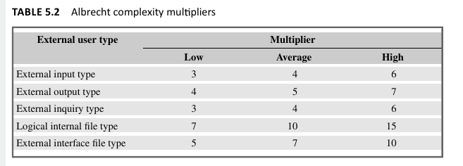
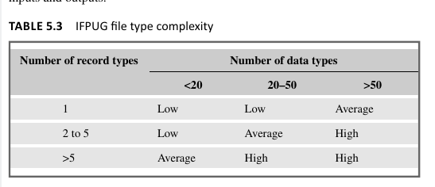
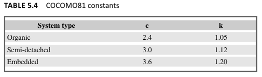
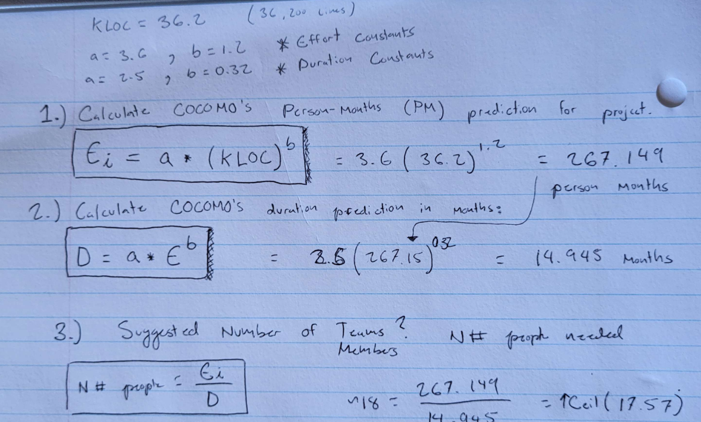
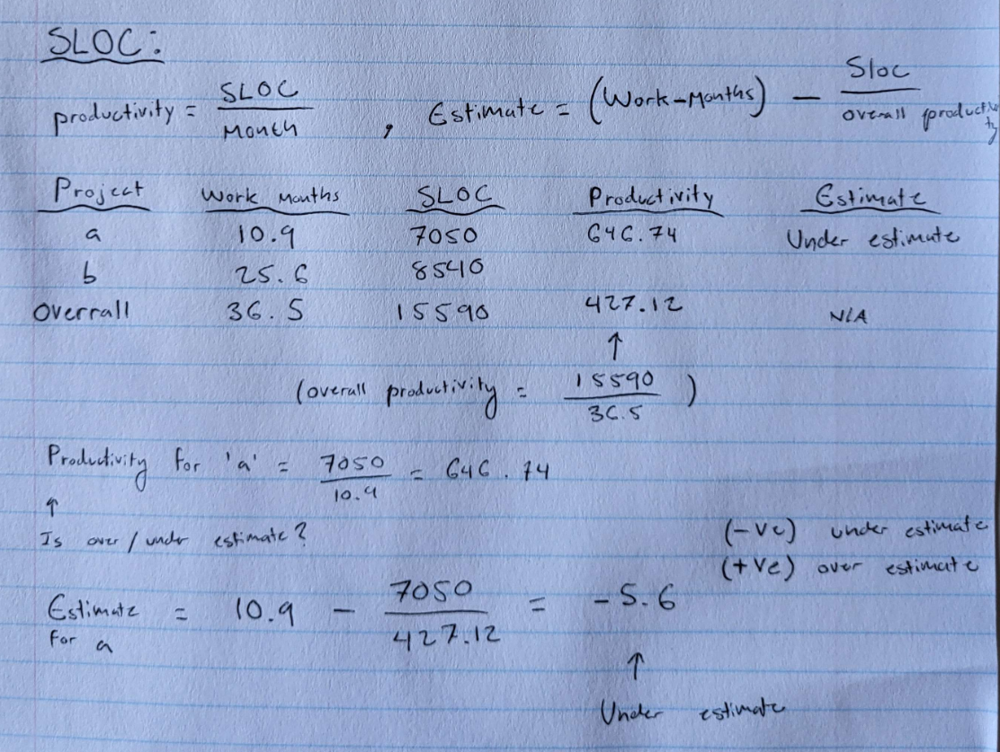

# Software Effort Estimation

Estimates in software projects are crucial for planning and managing resources throughout the project's lifecycle. 

- **Strategic Planning:**
  - To decide on project priorities by estimating costs and benefits.
  - Influences decisions on development staff recruitment.

- **Feasibility Study:**
  - To confirm that the expected benefits outweigh the costs.

- **System Specification:**
  - To estimate the effort needed for different design proposals.
  - Ensures the project remains feasible in terms of effort and cost.

- **Evaluation of Suppliers’ Proposals:**
  - When considering outsourcing, to evaluate bids from contractors.
  - Ensures contractors understand the requirements and offer realistic bids.

- **Project Planning:**
  - For detailed planning and allocation of staff to specific tasks.
  - Helps refine initial estimates with more detailed breakdowns as the project progresses.

As the project advances, the accuracy of estimates should improve due to increased knowledge about the project. Initial stages focus on understanding user requirements, with later stages providing more detailed estimates as the design and implementation plan becomes clearer. Estimating is a recurring activity, with high-level estimates early on and more detailed estimates for specific tasks as the project definition becomes more refined.

## Definitions & Abreviations:

- **Function Points (FP):** This method measures the functionality delivered to the user, based on the number and complexity of inputs, outputs, user interactions, files, and external interfaces the software has. It's a way to gauge the size of the system based on what it can do, rather than how it's coded. Think of it like estimating the size of a house based on the number of rooms, bathrooms, and other features, rather than measuring every inch of lumber used in its construction.

- **Lines of Code (LOC):** This is a more direct measure, literally counting the number of lines of programming code written to create the software. It's like measuring the amount of wood or bricks used in the construction of a house. 

- **KLOC** Thousands of Lines of code: `KLOC = LOC/1000`

The idea of converting *Function Points to an LOC equivalent* involves using a factor that estimates how many lines of code are typically needed per function point for a given programming language. Since some languages are more concise than others *(meaning you can do more with fewer lines of code)*, the factor varies by programming language. This conversion is useful for estimating how much coding work will be involved based on the software's intended functionality.

# Cost Estimating Approaches

 
Bottom-Up Estimating Approach

Bottom-up estimating in software development involves detailed planning and assessment, focusing on tasks and subtasks to create a comprehensive project estimate. 

- **Task Decomposition:**
  - The project is divided into smaller, manageable tasks.
  - Each task is further broken down into subtasks, iteratively, until they are small enough to be assigned to an individual, typically for completion in a week or two.

- **Work Breakdown Schedule (WBS):**
  - Initially involves a top-down analysis to create a WBS, detailing all tasks and subtasks.
  - This step is separate from but essential to the bottom-up estimating process.

- **Effort Calculation:**
  - Estimates the effort for each activity individually.
  - Sums up the effort required for all tasks and subtasks to produce the overall project estimate.

- **Suitability:**
  - Most effective in the later stages of project planning when details are clearer.
  - Requires assumptions about the system and project work methods if used early in the planning phase.

- **Used in Novel Projects:**
  - Particularly useful for projects without historical data or precedent, where estimators must rely on the detailed analysis of envisioned tasks and their execut

 
Albrecht's Function Point Analysis

- Top-down approach invented by Allan Albrecht, *who worked for IBM*

The Albrecht method, also known as Function Point Analysis (FPA), is a technique for estimating the size and complexity of software projects. Here's a simplified outline:

- **Purpose:** To quantify the functional size of software independently of the programming language used.
  
- **Components:** Software systems are analyzed based on five major components, or 'external user types', beneficial to users:
  1. **External Input Types:** Input transactions updating internal files.
  2. **External Output Types:** Transactions where data is output to the user, typically reports.
  3. **External Inquiry Types:** User-initiated transactions providing information without updating internal files.
  4. **Logical Internal File Types:** Standing files used by the system, akin to data stores or relational tables.
  5. **External Interface File Types:** Data exchanges with other applications.

- **Complexity Weighting:** Each component is classified as high, average, or low complexity. Specific multipliers are applied to each based on their complexity level to calculate Function Points (FPs).

- **Function Points Calculation:** The counts of each external user type, weighted by complexity, are summed to obtain an overall FP count, indicating the system's information processing size.

- **Adjustments:** Additional factors, such as the operational environment and technical complexity, can influence the final effort estimate. However, the use of Technical Complexity Adjustment (TCA) has been debated for its accuracy.

- **Conversion to LOC:** Function Points can be converted to *Lines of Code (LOC)* for various programming languages using predetermined conversion rates, facilitating effort estimation based on historical data.

In summary, the Albrecht method provides a structured approach to estimate software size and complexity through Function Points, allowing for language-independent analysis and facilitating project planning and resource allocation.

 
COCOMO 2 | Parametric Productivity Model

**Example Table:**

**Organic Mode:**
- Typically the case when Small Teams develop software in a Familliar & In-house Environment
- Small System developed, quite flexible Requirements

**Embedded Mode:**
- Product being generated (system) needs to operate in very tight constraints
- Changes to this system with strict requirements is very costly

**Semi-detached Mode:** 
- This combined elements of the organic and the embedded modes or had characteristics that came between the two.

---

### Cocomo Accomodates:

- *Application composition*: Here the external features of the system that the users will experience are
designed. Prototyping will typically be employed to do this. With small applications that can be built
using high-productivity application-building tools, development can stop at this point.

- *Early design*: Here the fundamental software structures are designed. With larger, more demanding
systems, where, for example, there will be large volumes of transactions and performance is important,
careful attention will need to be paid to the architecture to be adopted.

- *Post architecture*: Here the software structures undergo final construction, modification and tuning to
create a system that will perform as required.

 
SLOC

**SLOC, or Source Lines of Code**, is a software metric used to measure the size of a software program by counting the number of lines in its source code. 

The primary goal of using SLOC in software project estimation is to provide a *quantitative basis* for comparison, budgeting, staffing, and scheduling in software development projects.

**Limitations**: Reliance on SLOC for project estimation has its limitations, as it does not account for the quality of code, the complexity of algorithms, or non-coding tasks such as documentation and user interface design. Moreover, it may encourage writing unnecessarily verbose code if used as a primary measure of productivity.

