# Activity Planning

 
Introduction / Context

### Objectives for Project Planning and Scheduling
- **Produce an Activity Plan:** Detailing all tasks necessary for project completion.
- **Estimate Overall Duration:** Calculating how long the project will take from start to finish.
- **Create a Critical Path and Precedence Network:** Identifying the sequence of dependent tasks that determine the project's shortest completion time.

### Scheduling
Scheduling is crucial for allocating start and end times to each project activity, ensuring not everything happens simultaneously. It involves:
- Methodology development for the project.
- Task identification.
- Time assessment for each task.

### Activity Networks
Activity networks assist in:
- Assessing project completion date feasibility.
- Resource deployment timing.
- Cost incurrence timing.
They enhance coordination and motivation within the project team.

### Defining Activities
Assumptions for activity networks include:
- Projects comprise numerous activities.
- Projects start when any activity is ready and conclude when all activities are finished.
- Activities have clear start/end points, forecastable resource requirements, predictable durations, and may depend on the completion of other activities (forming precedence networks).

### Identifying Activities
Activities can be identified through:
1. **Work-Based Approach:** Creating a Work Breakdown Structure (WBS) to list all necessary work items.
2. **Product-Based Approach:** Listing deliverables and intermediate products using a Product Breakdown Structure (PBS), determining their creation order, and identifying required activities.

### Hybrid Approach
The IBM MITP approach suggests five levels:
1. **Project:** The overarching effort.
2. **Deliverables:** High-level outcomes or products.
3. **Components:** Key work items for producing deliverables.
4. **Work Packages:** Task groups needed for components.
5. **Tasks:** Individual activities.

### Abbreviations Explained
- **WBS:** Work Breakdown Structure - A hierarchical decomposition of the total scope of work to be carried out by the project team.
- **PBS:** Product Breakdown Structure - A hierarchical structure of all the products to be produced during a project.
- **MITP:** Managing the Implementation of the Total Project - IBM's project management methodology focusing on delivering project components systematically.

This summary encapsulates the foundational steps in planning and scheduling for software project management, emphasizing systematic breakdown and scheduling of tasks to ensure project success.

 
Activity Diagrams & Critical Path (Sequencing)

Sequencing in project management refers to the process of arranging tasks or activities in the order they need to be completed. Here are key points about sequencing:

- **Identify Dependencies:** Determine which tasks must be completed before others can start.
- **Logical Order:** Arrange tasks based on their logical relationships and dependencies, not on resource availability.
- **Critical Path Method (CPM):** Often used to analyze task sequences, identifying the longest path of planned activities to the end of the project.
- **Precedence Diagramming Method (PDM):** A technique for creating a project schedule network diagram that uses boxes or rectangles, referred to as nodes, to represent activities, and connects them with arrows that show the dependencies.

Can use Bar Charts

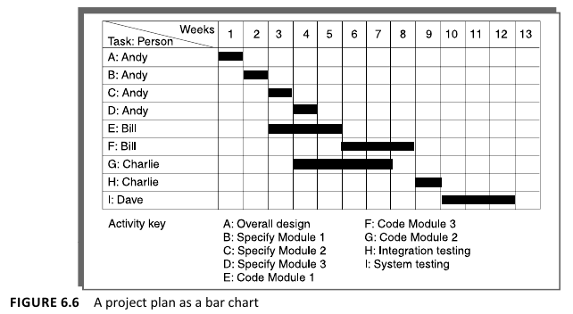

Time flows Left to Right in the graph ---->

When the text mentions "specify Module N." (1,2,3, etc.), it likely refers to:

- **Modular Sequencing:** Breaking down the project into smaller, manageable modules or components (Module 1, Module 2, etc.).
- **Sequential Order:** Each module is specified in a sequence, indicating a progression or a hierarchy in the project tasks or phases.
- **Module Dependency:** Highlighting dependencies between modules, where the completion of Module N is necessary before starting Module N+1.

 
Network Planning Models

**CPM (Critical Path Method):**
- **Objective:** Identifies the longest path of planned activities to the completion of a project and the shortest possible project duration.
- **Deterministic:** Assumes fixed time estimates for each activity.
- **Focus:** Emphasizes minimizing project duration and understanding impacts of schedule changes.
- **Steps:** 
  1. List all activities.
  2. Determine the sequencing and dependencies.
  3. Estimate duration for each activity.
  4. Identify the longest path through the network (the critical path).
  5. Calculate the earliest and latest start and finish times for each activity.
- **Application:** Suitable for projects with well-defined activities and time estimates.

**PERT (Program Evaluation Review Technique):**
- **Objective:** Designed to analyze and represent the tasks involved in completing a project.
- **Probabilistic:** Incorporates uncertainty by using three time estimates for each activity: optimistic, pessimistic, and most likely.
- **Focus:** Manages uncertainties in project scheduling by estimating the likelihood of meeting deadlines.
- **Steps:** 
  1. Identify tasks and milestones.
  2. Establish dependencies.
  3. Estimate time using three scenarios: optimistic (O), pessimistic (P), and most likely (M).
  4. Calculate the expected time for each activity. idk formula
  5. Determine critical path and float times to analyze task flexibility.
- **Application:** Best for research and development projects, where time estimates are uncertain.

**Drawing PERT**
- No Looping back is allowed *(Deal with Iterations, by hiding them in a single high-level activity)*

- Milestones *Activites* such as the start and end of Project don't have a duration. **I start Instantly, and upon End, it's instant also** dura = 0

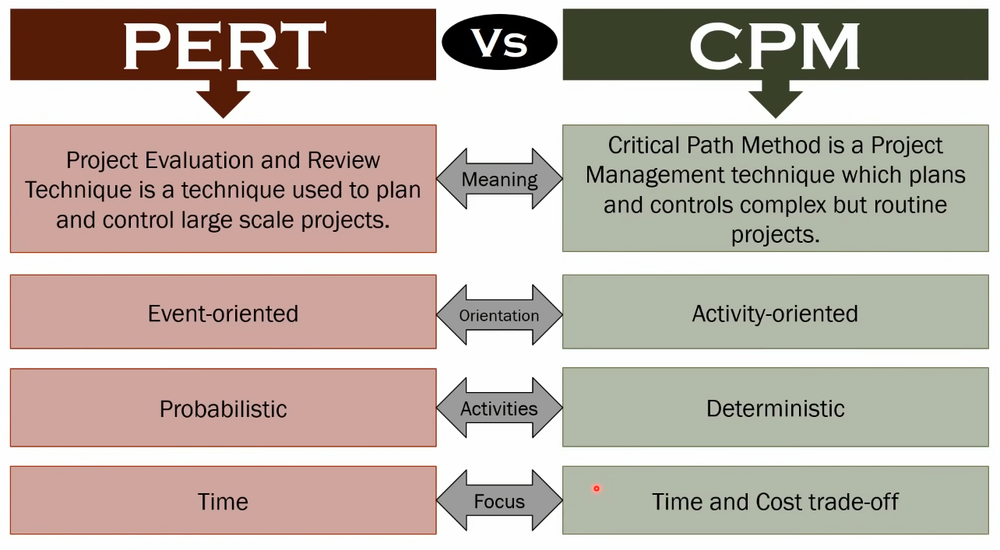

# Links Between Activities

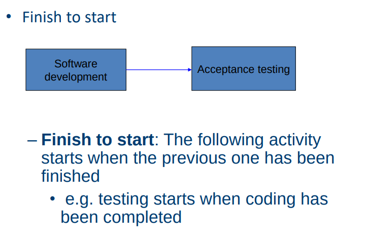

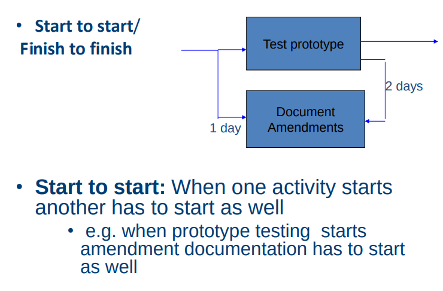

**Finish to finish:** when one activity finishes the other must finish too
- e.g. when the testing of the prototype is completed so is the documentation of any amendments 
- e.g. documentation of the changes to the prototype starts 1 day after the testing and finishes 2 days after testing has been completed

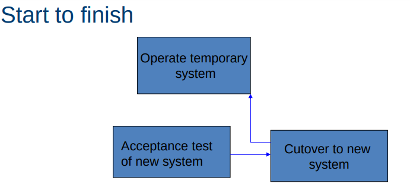

**Start to finish** – in the example when the cutover to the new system
takes place, the operation of the temporary system is no longer needed.
Although the cutover depends of the acceptance testing to be
completed, the implication is that the cutover might not start straight after
acceptance testing.

 
Labelling & Activity stuff

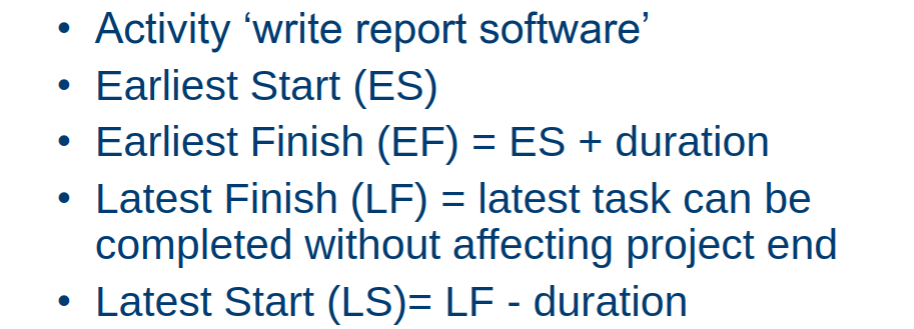

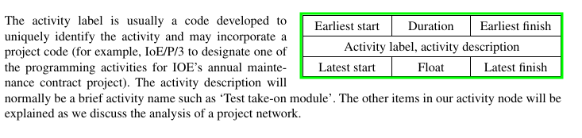

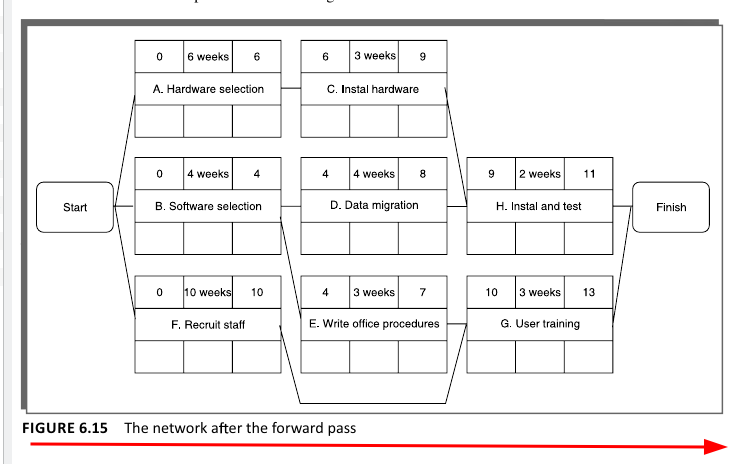

If multiple nodes are connected (C.D to H) take the largest number *(Longest time)* as the start to H

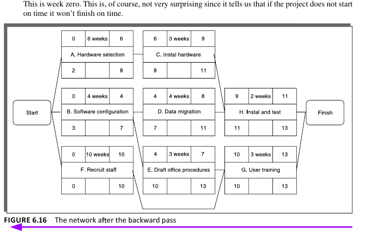

Backward Pass, Given finish is connected to G. and H. take G's final number as it's bigger (13 > 11) as the **Latest Finish** aka bottom right corner, and propagate back.

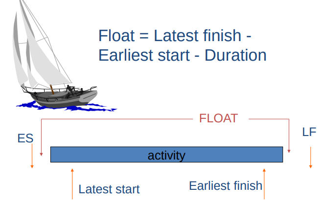

**Float**:
- *Float (total float)*: Difference between activity Earliest Start, and Latest Start
- *Free Float:* Measure of how much the **start or completion of an activity might be delayed, without affecting end date** of project. 

Formulas:
- Float *(aka total float)* = LF - ES - Duration
- Free Float = **ES** of next activity - **EF** for this activity
- Interfering Float = Total Float - Free Float

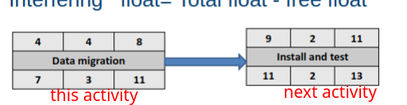

Diagram for Free Float, for an Idea ^^

The filled in Float values below are just the **Total Floats**:
- H. Example: **13** *bottom right* - **10** *top left* - **3** *top middle* = 0

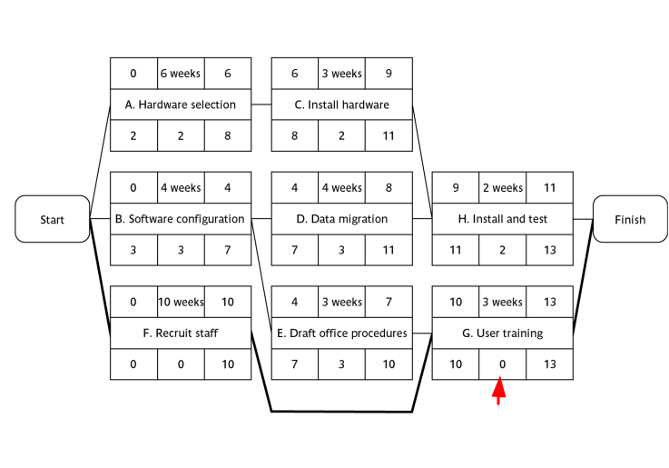

- Any activity with a **float of zero is critical** in the sense that any delay in carrying out the activity will delay the completion date of the project as a whole.
---

# Critical Path
- Defines the Duration of the Project
- Any delay to any activity on this critical path will delay the completion of the project.

-  In managing the project, we must pay particular attention to monitoring activities on the critical path
so that the effects of any delay or resource unavailability are detected and corrected at the earliest
opportunity.

- In planning the project, it is the critical path that we must shorten if we are to reduce the overall
duration of the project.

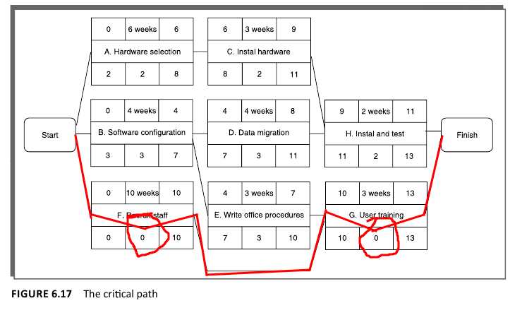

As we can see the Critical path here is from `START -> F -> G -> FIN` as F and G have Float values of zero!

**If the project needs to be shortened, we must shorten Critical Path!!!** Non, critical path shortening won't have an impact on project duration. 

- As we shorten Critical Path, we always need to re-check and make sure no new critical paths have emerged!

-  As soon as the activities along a particular path use up their total float then that path will become a critical path and a number of hitherto non-critical activities will suddenly become critical. That's why it's sometimes good to look at *Near-Critical* paths also

 
Activity-on-Arrow Networks & More Critical Path

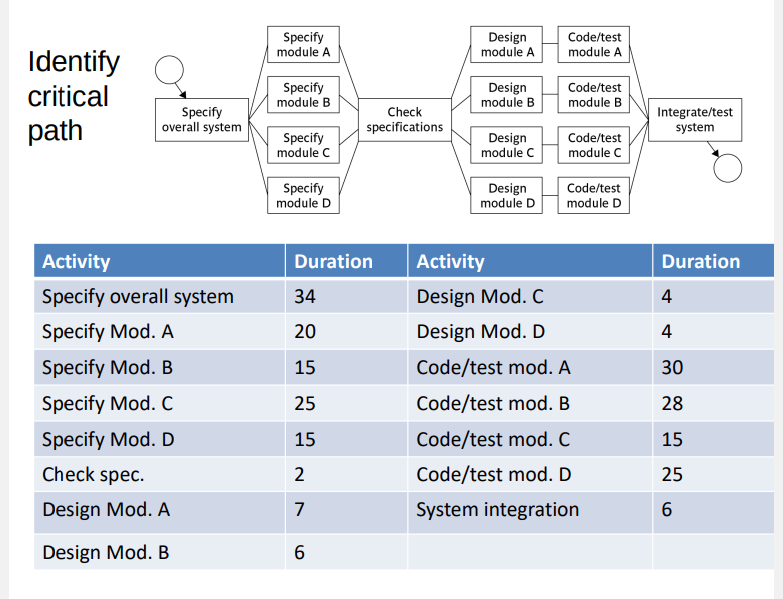

Assume Specify Mod. C's Duration is actually **18** *(I messed up my example)*

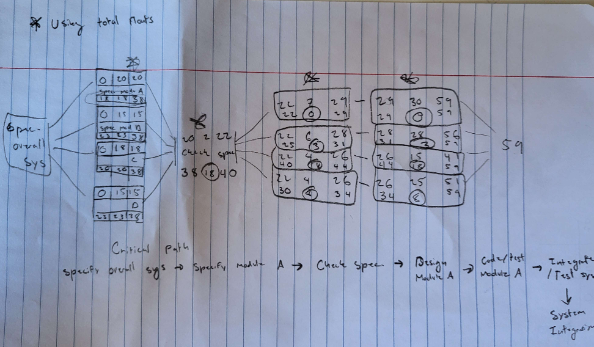

For simplicitiy, I started off the Specify Modules at *0* but technically they start at 34.

**Duration:** 34+59+6 = 99 days

---

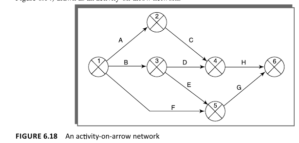

* Nodes Represent Events (Group of Activities)
* Edges Represent by Dependencies on different events (Path kinda)

