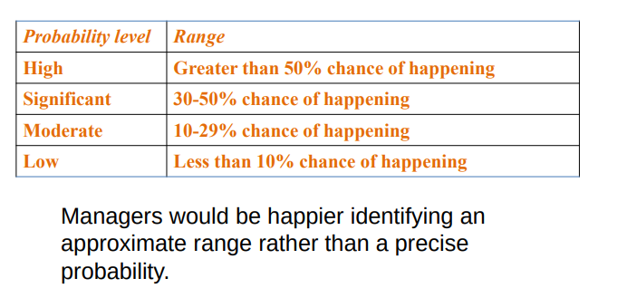
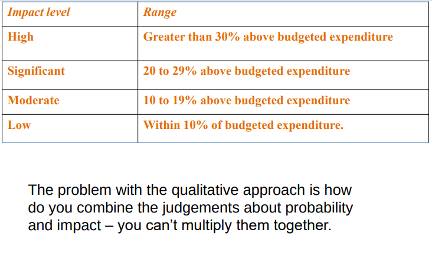
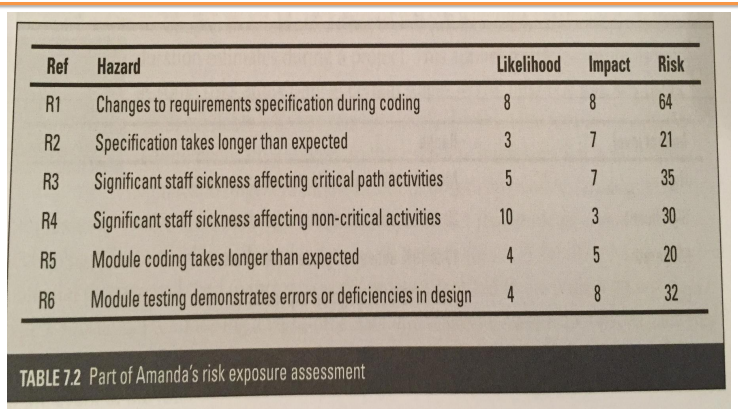
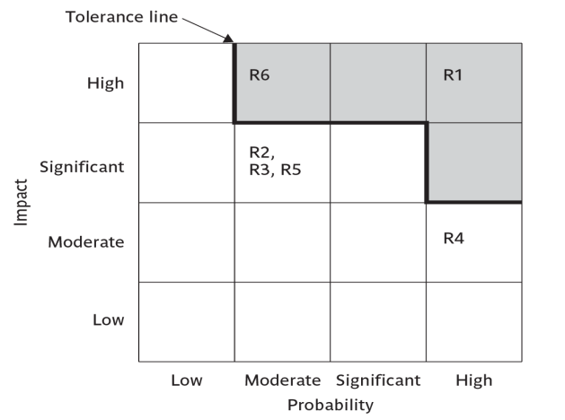
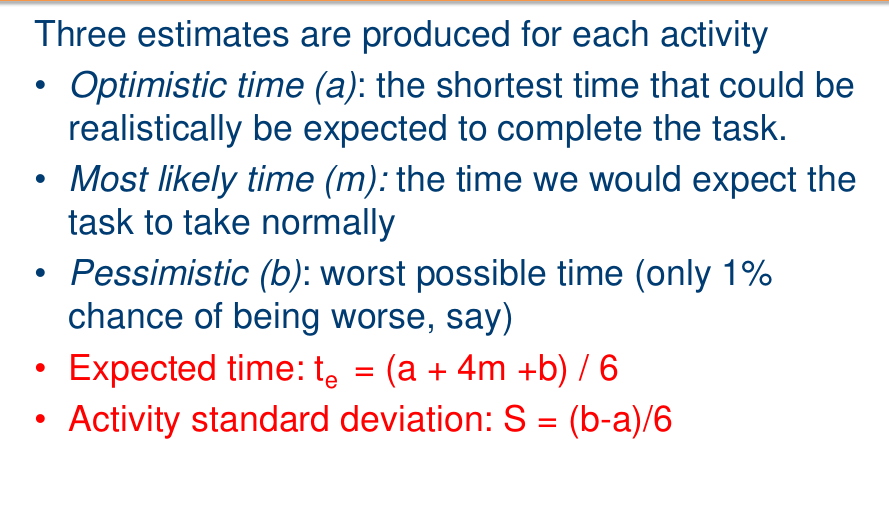
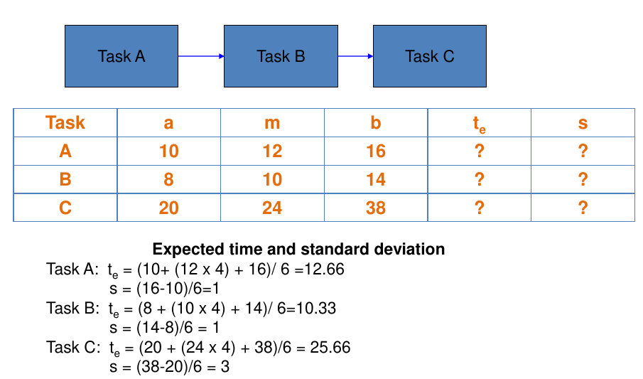
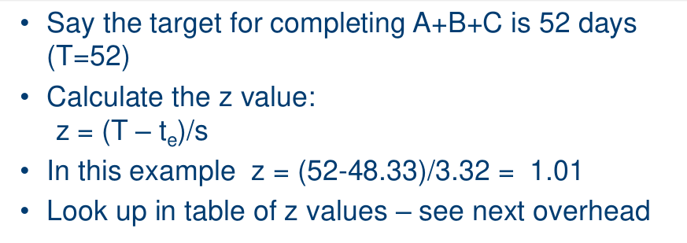
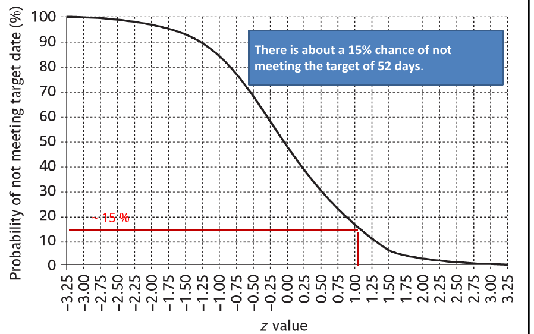

# Risk Management

<details>
<summary style="font-size: 30px; font-weight: 500; cursor: pointer;"> 
Risks, Vocabulary & Context
</summary>

### Definition of Risk and Risk Management

- **Risk**: The chance of exposure to the adverse consequences of future events. (PRINCE2)
- **Risk Management**: The process of identifying, analyzing, planning, and monitoring uncertain events that may affect the project’s objectives. (PM-BOK)
- Risks can be categorized by their nature, origin, or potential impact, Risks relate to *Possible Future Problems* not current ones.
- They often have a potential cause and one or more effects. For example, if a developer leaves *(Risk)*, a task may be delayed.

*On a positive note:*
- Effective risk management can also uncover potential opportunities, such as a task being less difficult than anticipated, which can be capitalized on.

### The Risk Management Process

1. **Risk Identification**: Determining what the risks to a project are.
2. **Risk Analysis**: Assessing which risks are particularly serious.
3. **Risk Planning**: Deciding on how to address the risks.
4. **Risk Monitoring**: Checking if the risk planning has been effective.

### Additional Concepts

- **PERT (Program Evaluation Review Technique)**: A technique that highlights risk and critical paths.
- **Critical Chains**: A focus on resource constraints and scheduling.

---

**PART 6 In Step Wise** Software Project MGMT process

## Categories of Risk:

*All of these Categories are related to each-other somehow*

**Actors:** All those involved; Devs, Users, Managers *E.G:  a risk could be that high staff turnover leads to information of importance to the project being lost.*

**Technology:** Stack used, and Deliverables produced with Stack *E.G: We used a shitty stack for our Huge Heavy Traffic API that doesn't scale !!!*

**Structure:** Management Procedures; Lack of Communication or Organization, Team Structure, Project Structure.

**Tasks:** Work Carried out; Usually under-estimate of Effort for the Work that needs carrying-out leading to issues.

---

## Risk Framework (Dealing with Risk)

1. **Risk Identification**
   - What risks might impact the project?
   
2. **Risk Analysis and Prioritization**
   - Determining the severity and impact of each risk.
   
3. **Risk Planning**
   - Strategies and actions to mitigate the identified risks.
   
4. **Risk Monitoring**
   - Ongoing assessment of risk status and plan effectiveness.

## Risk Identification Approaches:

- **Use of Checklists**
  - Employing checklists based on historical data from past projects.

- **Brainstorming**
  - Engaging knowledgeable stakeholders to discuss and record potential risks.

- **Causal Mapping**
  - Charting out cause and effect to anticipate risk chains.

---

## Risk Analysis and Prioritization:

Risk Exposure (RE) = (potential damage **$**) * (Probability **0 to 1** float)

EX: Half a million in damages due to a flood, with a 0.01 chance of happening (1/100th)

**RE** = 0.5 * 0.01 = $5000 *Rough Insurance Premium for this for ex.*

### Managers are Happy with Ranges of Risk, rather than figures:





### Risk Tables Are Used, and a Risk Value is Assigned, also view Risk Matrix Below

- Ultimate purpose of Risk Score is to Quantify how Risky a Risk is



## Probability Impact Matrix:



**Above Tolarence Line**: Risks that appear within this zone have a degree of seriousness that calls for particular attention.

---

# Risk Reduction Leverage Notes

## Understanding Risk Reduction Leverage (RRL)

Risk Reduction Leverage is a concept used to assess the cost-effectiveness of actions taken to mitigate risks.

### Example 1: Insurance Premium and Fire Alarm

- An insurance company offers to lower the fire insurance premium from $2,000 to $1,000 if a fire alarm system is installed.
- The cost of installing the fire alarm is $500.
- The insured customer would save $1,000 annually by making a one-time investment of $500.
- This is a practical example of risk reduction where the benefits clearly outweigh the costs.

### Example 2: Calculating Risk Exposure

- Before taking a risk reduction action, the "risk exposure" can be estimated as a financial value.
- **Risk Exposure Before (RE_before)**: For instance, there's a 1% chance of a fire causing $200,000 in damage.
- **Risk Exposure After (RE_after)**: After the installation of a fire alarm worth $500, the probability of fire damage reduces to 0.5%.

### Formula for Risk Reduction Leverage

```plaintext
RRL = (RE_before - RE_after) / Cost of risk reduction
```

### Application of RRL Formula

- Using the provided example:
  
  ```plaintext
  RE_before = 1% of $200,000 = $2,000
  RE_after = 0.5% of $200,000 = $1,000
  Cost of Risk Reduction = $500
  
  RRL = ($2,000 - $1,000) / $500
  RRL = $1,000 / $500
  RRL = 2
  ```
  
- Since the RRL is greater than **1.00**, it indicates that the risk reduction action *(installing a fire alarm in this case)* is cost-effective and worth implementing.

### RRL (Risk Reduction Leverage) Extra:

- Not all risk reduction actions are financially justifiable.
- We calculate RRL to determine whether the potential reduction in risk exposure justifies the cost.
- When the RRL is greater than 1, it means the reduction in risk exposure is greater than the cost of the risk reduction measure, making it a worthwhile investment.

</details>

<details>
<summary style="font-size: 30px; font-weight: 500; cursor: pointer;"> 
Barry Boehm's Top 10 Development Risks
</summary>

---

---

# Boehm’s Top 10 Development Risks and Reduction Techniques

## Risks and Corresponding Risk Reduction Techniques:

1. **Personnel Shortfalls**
   - **Techniques**: Staffing with top talent, job matching, team building, training and career development, early scheduling of key personnel.

2. **Unrealistic Time and Cost Estimates**
   - **Techniques**: Using multiple estimation techniques, design to cost, incremental development, recording and analyzing past projects, standardizing methods.

3. **Developing the Wrong Software Functions**
   - **Techniques**: Enhanced software evaluation, formal specification methods, user surveys, prototyping, creating early user manuals.

4. **Developing the Wrong User Interface**
   - **Techniques**: Prototyping, task analysis, user involvement.

5. **Gold Plating**
   - **Techniques**: Requirements scrubbing, prototyping, designing to cost.

6. **Late Changes to Requirements**
   - **Techniques**: Implementing change control, incremental development.

7. **Shortfalls in Externally Supplied Components**
   - **Techniques**: Benchmarking, inspections, formal specifications, contractual agreements, quality controls.

8. **Shortfalls in Externally Performed Tasks**
   - **Techniques**: Quality assurance procedures, competitive design, etc.

9. **Real-Time Performance Problems**
   - **Techniques**: Simulation, prototyping, tuning.

10. **Development Technically Too Difficult**
    - **Techniques**: Technical analysis, cost-benefit analysis, prototyping, training.

</details>

<details>
<summary style="font-size: 30px; font-weight: 500; cursor: pointer;"> 
Risk Management with PERT (project eval. review technique)
</summary>

* Project Evaluation Review Technique or PERT is used to identify the time it takes to finish a particular task or activity.



## Likelihood of Meeting Targets: (Steps Below)

- Calculate Standard Deviation of each project **(s)**
- Calculate Z Values for each event with date **(Z)**
   - Z is equivalent to number of STD DEV between Task Expected & Target Times
- Convert Z Values to Probabilities

### Explained with a Chain of Activites



Calculating Expected Time & Standard Deviation

**What would be the expected duration of the chain A + B + C?** = 48.65
- Ans: 12.66 + 10.33 + 25.66 = 48.65

**What would be the standard deviation for A + B+ C?** = 3.32
- Ans: square root of (1^2 + 1^2 + 3^2) = 3.32 
   - *(All **s** values squared than added, than rooted by 2)*





Advantages of PERT:
- PERT focuses attention on the uncertainty of forecasting
- Can be used to calculate the STD for each activity and rank them according to degree of risk.
- Using Expected Times and Standard Deviations, we can get a Probablistic estimate of Likelihood, this gives us a more realistic Idea.

</details>