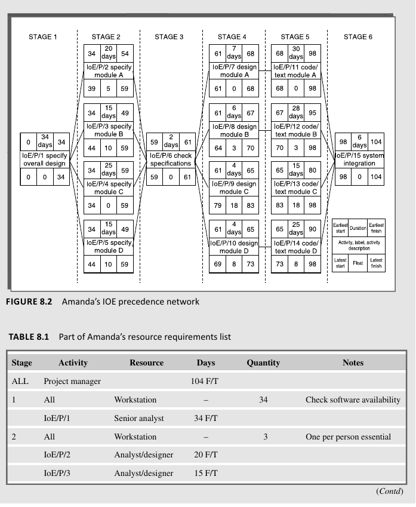
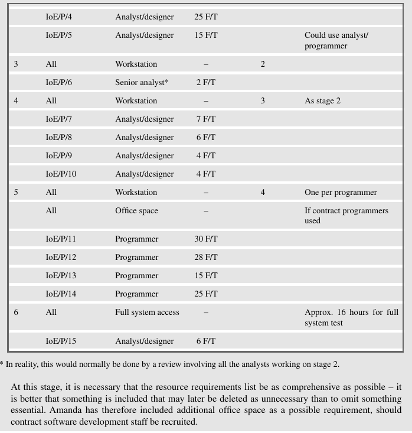
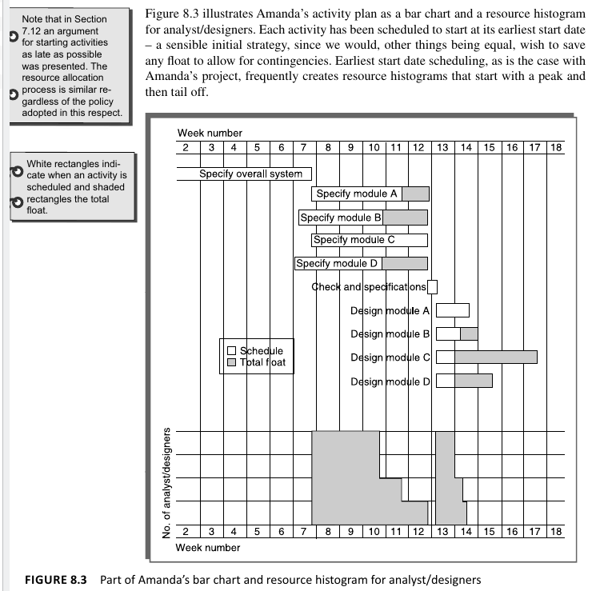
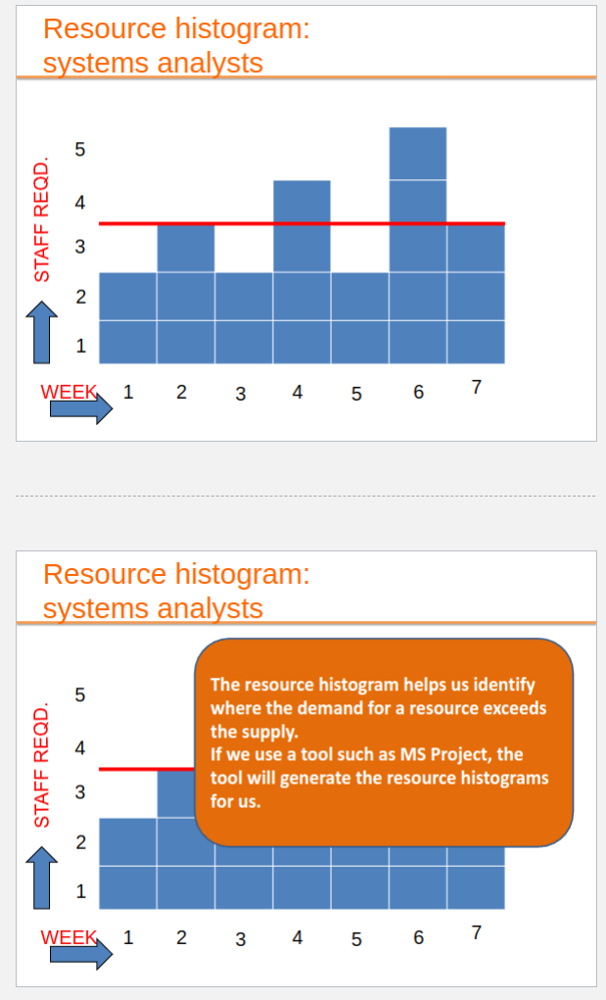
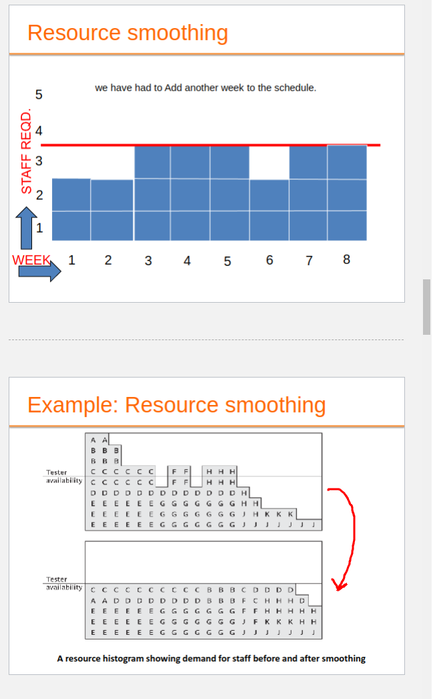
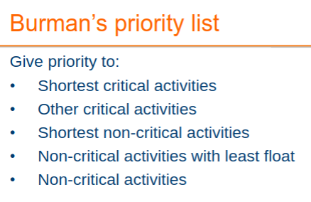
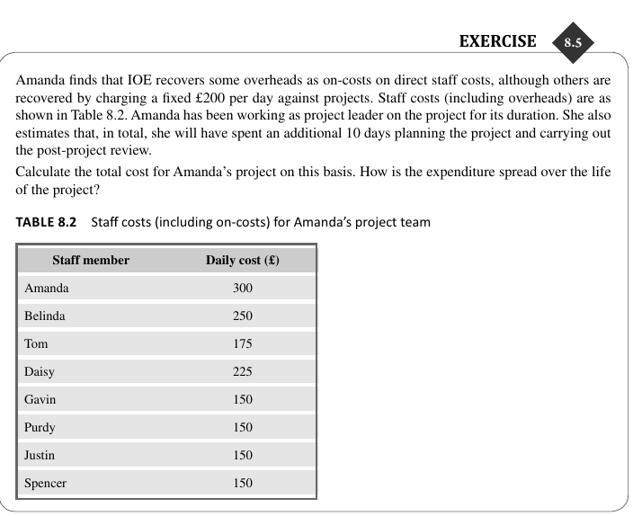
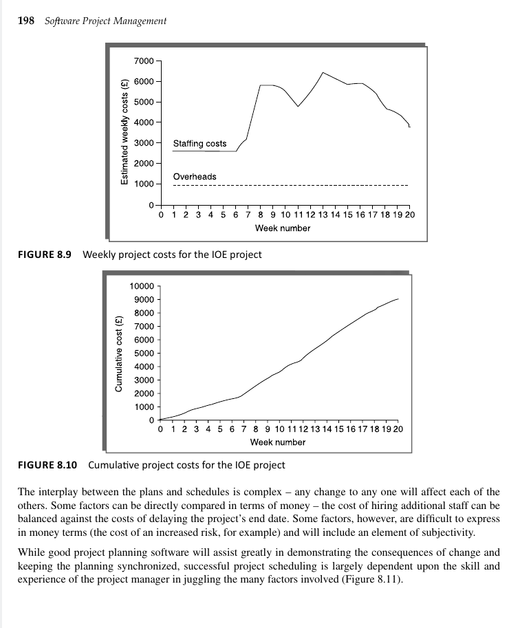
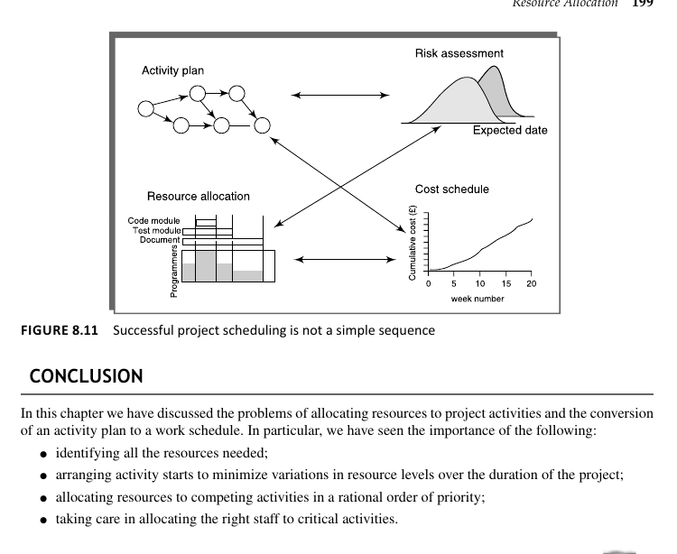

# Resource Allocation:

 
Resources, Scheduling, Critical Path

A Ressource can be material stuff (Papers or PCs) to Key Personal (SR. Graphics Engineer) 

### Identifying Resource Requirements in Project Management

#### Key Resource Categories:

1. **Labor:** This includes the development project team (e.g., project manager, systems analysts, software developers), quality assurance team, support staff, and any client organization employees involved in specific activities.

2. **Equipment:** Necessary items such as workstations, computing and office equipment, along with basic needs like desks and chairs.

3. **Materials:** Consumables distinct from equipment. Important in some projects, for example, those requiring distribution might need disks.

4. **Space:** Often available for projects with existing staff, but additional office space may be needed for new or contracted staff.

5. **Services:** Specialist services procurement, such as telecommunications for a wide area distributed system.

6. **Time:** A primary resource offset against others, where project timelines can be adjusted based on the availability of resources.

7. **Money:** A secondary resource used to purchase other resources, available at the cost of interest charges. Considered in DCF (Discounted Cash Flow) evaluations.

#### Steps to Identify Resource Requirements:

- **Step 1:** List all required resources with expected demand levels by reviewing each project activity. Include resources not tied to specific activities but essential for the project's infrastructure or supporting other resources, like office space for contract software developers.

In the context provided, "F/T" likely stands for "Full-Time." This indicates that the individual(s) in the specified role (*e.g., project manager, senior analyst)* is expected to be dedicated to the project on a full-time basis for the duration mentioned in days. For instance, when it says "104 F/T" for the project manager, it means the project manager is allocated to work full-time on the project for 104 days.

- **Step 2** Scheduling: Map Table onto Activity Plan to assesss distribution of resources required over the project's duration. Good repr: Bar chart for a Resource Histogram!

Changing the level of resources on a project over time, particularly personnel, generally adds to the cost of
a project. Recruiting staff has costs and, even where staff are transferred internally, time will be needed for
familiarization with the new project environment.

# Ressource Smoothing
- We can't get specialist to work Odd Weeks and stuff, not viable
- Instead we smooth out the demand per week, by stretching the project duration our and keeping the amount of weekly work consistant
- Staff often have to be employed for a continuous block of time
- Therefore it is desirable to employ a constant number of staff on a project – who as far as possible are fully employed

*The different letters represent staff working on a series of module testing tasks, that is, one person working on task A, two on tasks B and C etc.*

By Delaying the Start of some Activities *(Selected Strategically)*, We can smooth a weekly need for labor, so this smooths out the timeline for people working on a specific thing, this way we can have a more even amount of Tasks done a day, which corrolates to keeping a constant number of employees.

- To split a task or activity, it has to be on non-critical path.
- Unfortunately, splitting tasks in software projects is difficult without increasing the time they take.

# Ressource Usage

There is a nuanced approach required for resource allocation in software projects, contrasting it with simpler scenarios like allocating laborers in construction projects. In software development, individual skills and experience significantly influence project timelines and outcomes. Thus, it's recommended to assign specific staff members to tasks early on to refine duration estimates. Key factors in this process include:

1. **Availability:** Ensuring individuals are available when needed, considering the potential impact of delays in other projects.
2. **Criticality:** Preferentially assigning experienced personnel to critical path activities to mitigate duration and overrun risks.
3. **Risk:** Identifying high-risk activities and allocating experienced staff to these can reduce overall project uncertainties.
4. **Training:** Assigning junior staff to non-critical tasks where they can gain skills without impacting the project negatively, potentially benefiting from training budget allocations.
5. **Team Building:** Considering how individuals will fit into and contribute to the project team dynamics and overall success.

The passage highlights the complexity of staff allocation in software projects, underlining the importance of strategic decision-making to balance risk, cost, and team development.

# Priotizing Activites:

- Where more than one activity is competing for the same limited resource at the same time then those activities need to be **prioritized.**

- Resources have to be allocated to a project on an activity-by-activity basis
- Finding the best allocation can be time consuming and difficult
- As soon as a team member is allocated to an activity, that activity requires a scheduled start and finish date and the team member will become unavailable for other activities for that period.
- Allocating a resource to one activity limits the flexibility for resource allocation and scheduling of other activities.
- This is why we need to prioritize the activities.

**How to Prioritize (2 ways)**

- *Total float priority* - Smallest Floats -> Highest Priority.
- *Ordered List Priority* - Takes in accoutn duration of activity aswell as float.

Or use this list for priority orderings

# Ressource Usage

- Need to maximize % usage of ressources *(EX: Reduce Idle periods between tasks)* 
- Balance cost against early completion date
- Need to allow for contingency

 
Cost Stuff

Understanding the categorization of costs is crucial for effective project management, particularly in fields like software development, construction, and any other project-based work. The three primary categories of costs mentioned—staff costs, overheads, and usage charges—each play a unique role in project budgeting and financial planning. Here’s a closer look at each, with examples to clarify their impact on projects:

### 1. Staff Costs
These are costs directly associated with employing staff. This category includes not only the salaries of the employees but also additional employment-related expenses. Examples include:
- **Salaries:** The direct pay received by employees.
- **Social Security Contributions:** Payments made by the employer to government social security funds.
- **Pension Scheme Contributions:** Payments into retirement benefit plans for employees.
- **Holiday Pay and Sickness Benefit:** Compensation for holidays and illness-related absences.

For instance, if a software developer earns $80,000 annually, and the employer pays an additional 20% in social security and pension contributions, the total staff cost for this employee would be $96,000 per year.

Contract staff are a special consideration. They may be paid a fixed rate regardless of the hours worked, including periods when they are not actively engaged in a project task.

### 2. Overheads
Overheads are costs incurred by the organization that cannot be directly attributed to any single project or activity. These costs include:
- **Space Rental:** Costs associated with leasing office space.
- **Interest Charges:** Costs incurred from borrowing funds.
- **Costs of Service Departments:** Expenses from supporting departments such as Human Resources or IT support.

An example of overhead allocation could be an organization that incurs $100,000 in annual rental costs for its office space. If the company operates 10 projects in a year, it might allocate $10,000 in space rental overheads to each project.

### 3. Usage Charges
These are direct charges for the use of specific resources by a project. Unlike overheads, these costs are directly attributable to the project and vary according to the level of resource utilization. Examples include:
- **Computer Time:** Costs related to the use of computer resources or server time.
- **Equipment Rental:** Fees for using special equipment that the project does not own.

For instance, if a project requires specialized software that costs $500 per month to license, this would be considered a usage charge directly attributable to the project's budget.

In sum, effective cost management requires understanding these categories to accurately forecast, track, and control project expenses. By doing so, project managers can make informed decisions, estimate project costs more accurately, and ensure financial efficiency throughout the project lifecycle.

To calculate the total cost for Amanda's project, we'll consider both the direct staff costs (including overheads as on-costs or fixed charges) and the additional planning and post-project review days that Amanda will spend on the project. 

First, we need to sum the daily costs for all staff members, including Amanda, to understand the daily expenditure. Then, we multiply this daily total by the number of project days to get the total staff cost. For the additional days Amanda spent on planning and post-project review, we'll add the cost of these days separately.

The daily cost for each staff member (Amanda, Belinda, Tom, Daisy, Gavin, Purdy, Justin, Spencer) is provided, so we sum these costs to find the daily total cost. Amanda's additional days are charged at her daily rate.

### Calculation:

- **Daily total cost for all staff members** = \(300 + 250 + 175 + 225 + 150 + 150 + 150 + 150\) = £1,350.
- **Cost for Amanda's additional 10 days** = \(10 x 300\) = \(£3,000\).
- **Total project cost for n days** = 1,350 * **n** + 3,000 + 200 * **n** *(assuming the £200 per day fixed charge is in addition to staff costs)*.

The expenditure spread over the life of the project depends on the daily burn rate (the total daily cost of \(£1,350\) plus the £200 fixed overhead charge) and the additional £3,000 for Amanda's planning and review days. This formula gives a linear expenditure over time, with a slight bump for the additional planning and review costs.

Given **N** Days for the Project Duration, we can approximate a Cost for the project.

Creating clear and structured notes on cost schedules, focusing on staff costs, overheads, and usage charges, can significantly aid in understanding how each contributes to the total project cost. Here's a refined version of the provided information, followed by an example timesheet table.

### Cost Schedules Notes (Similar repeating info)

#### Staff Costs
- **Includes**: Salary, employer's social security contributions, holiday pay, and other direct costs of employment.
- **Tracking**: Timesheets are commonly used to record the actual hours an individual spends on each project. 
- **Challenges**: Managing and accounting for times when staff members are allocated to a project and available for work but are not actively working on project tasks.

#### Overheads
- **Types**: Can include space rental, service charges, and other non-direct costs.
- **Attribution**: 
  - Some overheads may be directly attributable to specific projects.
  - Alternatively, a percentage of departmental overheads may be allocated to projects based on various factors.

#### Usage Charges
- **Nature**: Charges that apply on a 'pay as you go' basis.
- **Examples**: Telephone charges, postage, car mileage.
- **Application**: Directly attributed to the project, varying based on actual usage.

### Timesheet Table Example

The following is an example of how a timesheet could be structured to track staff hours across different projects. This can help in accurately allocating staff costs to projects.

| Date       | Staff Member | Project ID | Task                | Hours | Rate (£) | Total Cost (£) |
|------------|--------------|------------|---------------------|-------|----------|----------------|
| YYYY-MM-DD | John Doe     | XYZ123     | Coding Feature A    | 4     | 30       | 120            |
| YYYY-MM-DD | Jane Smith   | XYZ123     | Testing Module B    | 3     | 25       | 75             |
| YYYY-MM-DD | John Doe     | XYZ123     | Code Review         | 2     | 30       | 60             |
| YYYY-MM-DD | Jane Smith   | XYZ456     | Project Planning    | 5     | 25       | 125            |
| ...        | ...          | ...        | ...                 | ...   | ...      | ...            |

**Note**: Each row represents hours logged by a staff member for specific tasks given for a day.
- Totel Cost = Rate * Hours
- Ensures accurate budgetting

---

