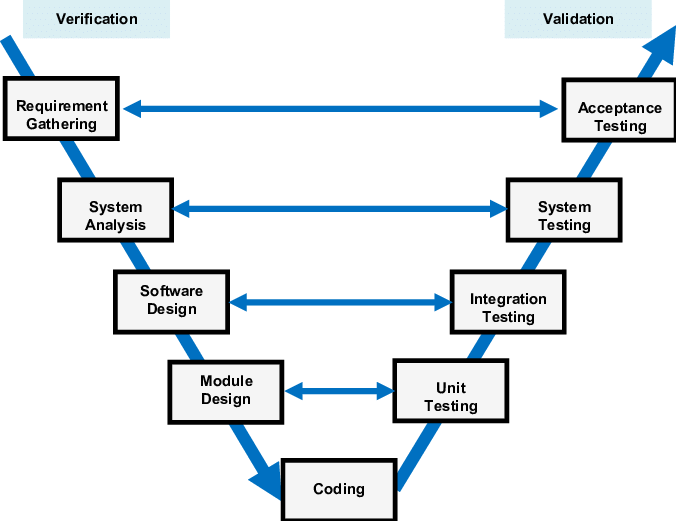
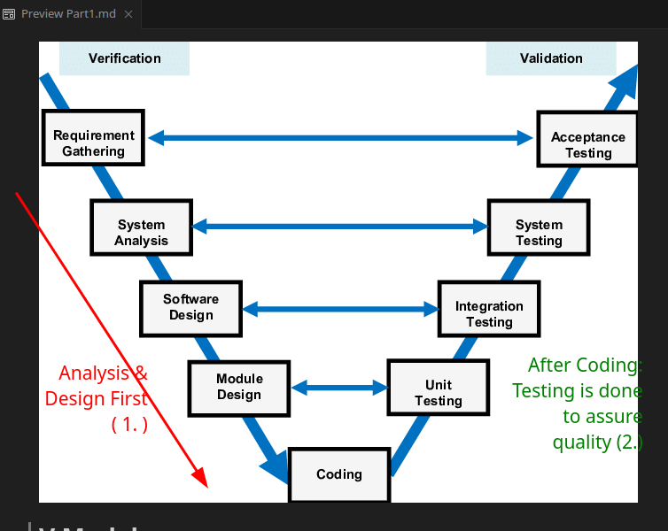

# V Model: 

Each Verification Step has an Equivalent Validation Step:

**Requirement Gathering - Acceptance Testing**:
- System needs to meet client expectation, this is an accepted and agreed upon requirements in verification.

**System Analysis - System Testing**:
-  System Testing phase should be on the construction of the tests based on the system design itself. Given a System design, we have methods testing the integrity of this system, flaws, procedures *(high level)*

**Software Design - Integration Testing**
- A blueprint for Integration Test of each component and their architectural design will be planned at the same time, as in the Software Design phase we make up these software modules, with their respective functionality.

**Module Design - Unit Testing**
- A lower level design to help guarantee that the basic component in each module works properly
- Prevents Functionality Flaws, which higher-abstraction components depend on.
- Test Design for Unit Testing: Tests every unit of the code, to ensure all components are integre, it can be high/low abstracted methods from any modules aswell

**Coding**
- Implementation, based on the design from the above processes, given some rough components and module definitions aswell to complete the above steps.



### Flow of the V Model

Left Side is done first (1.) Design & Analysis *(blueprints to our software)*, then the coding part is done *(Construction)*, finally the testing is done after implementatio is there (2.)

 The V Model is a sequential path of execution of processes, emphasizing the importance of verification and validation at each stage of development, from requirements gathering to coding to testing.

 ---

 <details>
<summary style="font-size: 30px; font-weight: 500; cursor: pointer;"> Note on Quality Assurance, and Software Engineer's Methodology for Q.A  </summary>

The V Model, also known as the Verification and Validation Model, is intrinsically linked to Quality Assurance (QA) in software engineering. It provides a structured approach that ensures quality is built into the software from the very beginning of the development process. Here's an in-depth look at how the V Model links with Quality Assurance and the methodologies applied in software engineering to assure quality.

### V Model and Quality Assurance

The V Model enhances quality assurance by explicitly linking development phases with corresponding testing phases. This ensures that each phase's deliverables are verified and validated, reducing the risk of defects and enhancing the quality of the final product.

1. **Requirement Gathering and Acceptance Testing**: Quality assurance starts with a clear, detailed understanding of client expectations and requirements. Rigorous acceptance testing criteria are defined based on these requirements, ensuring the system meets client expectations.

2. **System Analysis and System Testing**: During system analysis, QA focuses on understanding the system's architecture and behaviors. System testing then validates the system against its intended design, checking for integrity, performance, and compliance with specifications.

3. **Software Design and Integration Testing**: QA methodologies are applied to design processes to ensure modularity, scalability, and testability of components. Integration testing then ensures that these components work together as expected, validating the architecture and design decisions.

4. **Module Design and Unit Testing**: This phase focuses on designing detailed module specifications. Unit testing is closely tied to module design, allowing for early detection of defects at the lowest levels of the software. This is critical for ensuring the reliability of individual components before integration.

5. **Coding**: The coding phase is where the actual software is developed. QA methodologies here include code reviews, static code analysis, and adherence to coding standards. These practices ensure that the code is not only functional but also maintainable, efficient, and secure.

### Software Engineer's Methodology for Quality Assurance

Software Engineers employ a methodology for Quality Assurance that spans across the SDLC, integrating practices that ensure quality at every phase:

- **Preventive QA**: Focuses on preventing defects before they occur. This includes the use of design patterns, adherence to coding standards, and the implementation of best practices in software development.

- **Static QA**: Involves reviewing software artifacts without executing the code. Techniques include peer reviews, walkthroughs, and static analysis tools to identify potential issues in code, design, and requirements.

- **Dynamic QA**: Involves executing the software to validate its functionality against the requirements. This includes various forms of testing (unit, integration, system, and acceptance testing) as outlined in the V Model.

- **Continuous Integration (CI) and Continuous Deployment (CD)**: Integrates QA practices into the CI/CD pipeline, allowing for automatic testing and deployment. This ensures that new changes are automatically tested and validated, facilitating early detection of defects.

- **Risk Management and Mitigation**: Identifies potential risks in the software development process and implements strategies to mitigate these risks. This includes risk-based testing where testing efforts are focused on the most critical and high-risk areas of the software.

- **Feedback Loops**: Implementing feedback mechanisms from testing phases back to development phases. This ensures continuous improvement in the development process and helps in early detection and correction of errors.

By integrating these QA methodologies into the V Model, software engineers can ensure that quality is not just a final checkpoint but a continuous process that starts from the very beginning of software development. This holistic approach to quality assurance is fundamental to delivering high-quality software that meets or exceeds client expectations.
</details>

# Automation:

The use of software to control the execution of tests, the comparison of actual outcomes to predicted outcomes, the setting up of test preconditions, and other test control and test reporting functions.

- Reduces Cost
- Reduces Human Error 
- Reduces variance in Test Quality (Always 100%, no human factor)
- Reduces cost of Regression Testing

**JUnit** Automated test framework

Absolutely, diving into JUnit is both exciting and rewarding, given its robustness in the Java ecosystem for writing and maintaining tests. Here’s a guide to help you understand the core annotations and assertions in JUnit, particularly focusing on JUnit 5, which brought significant improvements and features over its predecessors.

### Core JUnit Annotations

#### @Test
This annotation denotes that a method is a test method. In JUnit 5, you don't need to prefix the method name with `test`, which was a common practice in earlier versions.

**Example:**
```java
import org.junit.jupiter.api.Test;

class ExampleTest {
    @Test
    void shouldBeTrue() {
        assertTrue(true);
    }
}
```

#### @ParameterizedTest
`@ParameterizedTest` is used for running the same test multiple times with different arguments. It's powerful for covering a wide range of input values and scenarios with a single test method. (Like CSV FILES)

**Example:**

Certainly! Parameterized tests in JUnit are quite useful for running the same test with different inputs. When it comes to reading inputs from a CSV file for parameterized tests, JUnit 5 provides an elegant solution through the `@CsvFileSource` annotation.

Below is an example that demonstrates how you can use JUnit 5 to write a parameterized test that reads data from a CSV file. Let's assume we're testing a simple method that calculates the area of a rectangle. Our CSV file will contain rows of data with length and width of the rectangle, and the expected area.

1. **First, prepare your CSV file (`rectangles.csv`):**
   
   ```
   length,width,expectedArea
   10,5,50
   8,3,24
   7,2,14
   ```

2. **Next, here's the example test class:**

   ```java
   import org.junit.jupiter.params.ParameterizedTest;
   import org.junit.jupiter.params.provider.CsvFileSource;
   import static org.junit.jupiter.api.Assertions.assertEquals;

   public class RectangleAreaCalculatorTest {

       @ParameterizedTest
       @CsvFileSource(resources = "/rectangles.csv", numLinesToSkip = 1)
       void testRectangleArea(int length, int width, int expectedArea) {
           Rectangle rectangle = new Rectangle(length, width);
           assertEquals(expectedArea, rectangle.calculateArea(), 
               "The area calculation should match the expected value.");
       }
   }
   ```

3. **Implement the Rectangle class (if not already done):**

   ```java
   public class Rectangle {
       private final int length;
       private final int width;

       public Rectangle(int length, int width) {
           this.length = length;
           this.width = width;
       }

       public int calculateArea() {
           return length * width;
       }
   }
   ```

### Key Points:

- **@ParameterizedTest**: Marks the method as a parameterized test.
- **@CsvFileSource**: Specifies the CSV file to use as the source of parameters. The `resources` attribute points to the CSV file in your resources folder. `numLinesToSkip` is set to 1 to skip the header row.
- **assertEquals**: Asserts that the expected area matches the calculated area from the `Rectangle` class.

### Setup:

- Ensure your CSV file (`rectangles.csv`) is placed in the `src/test/resources` folder of your project so that it's correctly found by the `@CsvFileSource` annotation.
- This example assumes you're using JUnit 5. Make sure your project is set up to use JUnit 5 to take advantage of these features.

This approach allows you to easily add more test cases by simply appending them to the CSV file, making your tests more maintainable and scalable.

### Common Assertions

Assertions are fundamental to testing in JUnit, allowing you to validate the code's behavior against expected outcomes.

#### assertTrue / assertFalse
- `assertTrue` checks if a condition is true.
- `assertFalse` checks if a condition is false.

**Example:**
```java
import static org.junit.jupiter.api.Assertions.assertTrue;
import static org.junit.jupiter.api.Assertions.assertFalse;

class AssertionTest {
    @Test
    void testAssertions() {
        assertTrue(1 < 2, "1 is less than 2");
        assertFalse(1 > 2, "1 is not greater than 2");
    }
}
```

#### assertEquals
Checks if two values are equal. If not, the test fails.

**Example:**
```java
import static org.junit.jupiter.api.Assertions.assertEquals;

class AssertionTest {
    @Test
    void testEquality() {
        assertEquals(4, 2 + 2, "Optional failure message");
    }
}
```

#### assertThrows
Used to assert that executing a specific operation throws an expected exception.

**Example:**
```java
import static org.junit.jupiter.api.Assertions.assertThrows;

class AssertionTest {
    @Test
    void testExpectedException() {
        assertThrows(NullPointerException.class, () -> {
            throw new NullPointerException("Example");
        });
    }
}
```

#### assertNotNull
Verifies that an object is not null.

**Example:**
```java
import static org.junit.jupiter.api.Assertions.assertNotNull;

class AssertionTest {
    @Test
    void testNotNull() {
        Object object = new Object();
        assertNotNull(object, "The object should not be null");
    }
}
```

### Organizing Tests
JUnit 5 introduced nested testing, allowing you to group related tests within a single test class, enhancing readability and structure.

**Example:**
```java
import org.junit.jupiter.api.Nested;
import org.junit.jupiter.api.Test;
import static org.junit.jupiter.api.Assertions.assertTrue;

class NestedExampleTest {
    @Nested
    class WhenTrue {
        @Test
        void shouldBeTrue() {
            assertTrue(true);
        }
    }
}
```

This guide provides a snapshot into JUnit's testing capabilities. Remember, the key to effective testing is not just about writing tests but writing meaningful and comprehensive tests that add value and improve the reliability of your software.

### Lifecycle Annotations

#### @BeforeEach / @AfterEach
- `@BeforeEach` annotates methods that should run before each `@Test` method in the current class. It's useful for setting up test environments.
- `@AfterEach` is used for cleanup actions that should be performed after each `@Test` method.

- Will do it for each `@Test` useful for Resettng Testing Environment

**Example:**
```java
import org.junit.jupiter.api.BeforeEach;
import org.junit.jupiter.api.AfterEach;
import org.junit.jupiter.api.Test;

class LifecycleTest {
    @BeforeEach
    void setUp() {
        System.out.println("Setting up before each test.");
    }

    @AfterEach
    void tearDown() {
        System.out.println("Cleaning up after each test.");
    }

    @Test
    void testMethod1() {
        System.out.println("Test Method 1 executed.");
    }

    @Test
    void testMethod2() {
        System.out.println("Test Method 2 executed.");
    }
}
```

#### @BeforeAll / @AfterAll
- `@BeforeAll` annotates static methods that run once before any of the test methods in the class. It's ideal for initializing expensive resources.
- `@AfterAll` annotates static methods that run after all test methods in the class have been executed, suitable for cleaning up resources.

**Example:**
```java
import org.junit.jupiter.api.BeforeAll;
import org.junit.jupiter.api.AfterAll;
import org.junit.jupiter.api.Test;

class LifecycleTest {
    @BeforeAll
    static void initAll() {
        System.out.println("Initializing once before all tests.");
    }

    @AfterAll
    static void tearDownAll() {
        System.out.println("Cleaning up once after all tests.");
    }

    @Test
    void testMethod1() {
        System.out.println("Test Method 1 executed.");
    }
}
```

### Filtering and Tagging Tests

#### @Tag
`@Tag` allows you to tag tests and selectively run subsets of tests. This is particularly useful in larger projects where you might want to categorize tests into groups like "fast", "slow", "integration", etc.

**Example:**
```java
import org.junit.jupiter.api.Tag;
import org.junit.jupiter.api.Test;

class TaggedTest {
    @Test
    @Tag("fast")
    void fastTest() {
        System.out.println("Fast test executed.");
    }

    @Test
    @Tag("slow")
    void slowTest() {
        System.out.println("Slow test executed.");
    }
}
```

### Other Useful Annotations

#### @Disabled
`@Disabled` is used to temporarily disable a test or test class, preventing its execution without having to comment out the code.

**Example:**
```java
import org.junit.jupiter.api.Disabled;
import org.junit.jupiter.api.Test;

class DisabledTest {
    @Test
    @Disabled("Disabled until bug #42 has been resolved.")
    void testWillBeSkipped() {
        // This test will not run
    }
}
```

#### @DisplayName
`@DisplayName` allows you to declare a custom name for your test class or test method, making your test reports more readable.

**Example:**
```java
import org.junit.jupiter.api.DisplayName;
import org.junit.jupiter.api.Test;

@DisplayName("Example of Display Names")
class DisplayNameTest {
    @Test
    @DisplayName("Custom test name containing spaces")
    void testWithCustomName() {
        System.out.println("Test with a custom display name executed.");
    }
}
```

#### @Nested
`@Nested` enables you to express the relationship among several groups of tests, allowing for more structured and expressive test suites.

**Example:**
```java
import org.junit.jupiter.api.Nested;
import org.junit.jupiter.api.Test;
import org.junit.jupiter.api.DisplayName;

@DisplayName("When running the application")
class NestedTest {
    @Nested
    @DisplayName("When logged in")
    class LoggedIn {
        @Test
        @DisplayName("User profile is accessible")
        void userProfileCanBeAccessed() {
            System.out.println("User profile accessed.");
        }
    }
}
```

---

**Extra:**

 If you annotate methods with `@BeforeEach` and `@AfterEach` in a test class that contains 10 `@Test` cases, JUnit will execute these `@BeforeEach` and `@AfterEach` methods before and after each of the 10 test cases, respectively.

This means the setup code in the `@BeforeEach` method will run 10 times (once before each test), and the cleanup code in the `@AfterEach` method will also run 10 times (once after each test). This is particularly useful for resetting the environment to a known state before each test runs, ensuring that tests are independent of each other. Similarly, `@AfterEach` is useful for cleanup activities that need to happen after each test case, like closing connections or resetting test data.

Here's a simplified visualization of the execution order for a class with 10 `@Test` methods:

1. `@BeforeEach`
2. `@Test` (Test Case 1)
3. `@AfterEach`
4. `@BeforeEach`
5. `@Test` (Test Case 2)
6. `@AfterEach`
7. ...
8. `@BeforeEach`
9. `@Test` (Test Case 10)
10. `@AfterEach`

Each `@Test` method gets its own pair of `@BeforeEach` and `@AfterEach` executions. This pattern helps maintain isolation between tests, which is a key principle of unit testing to ensure that tests don't interfere with each other, leading to more reliable and predictable test outcomes.